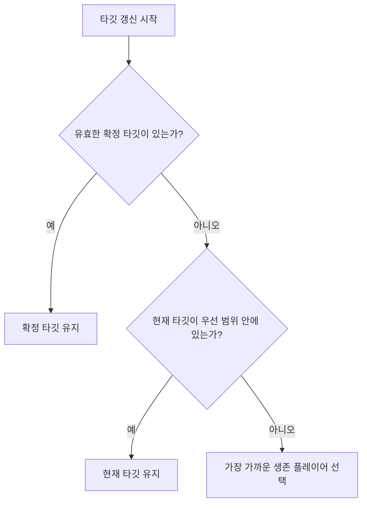
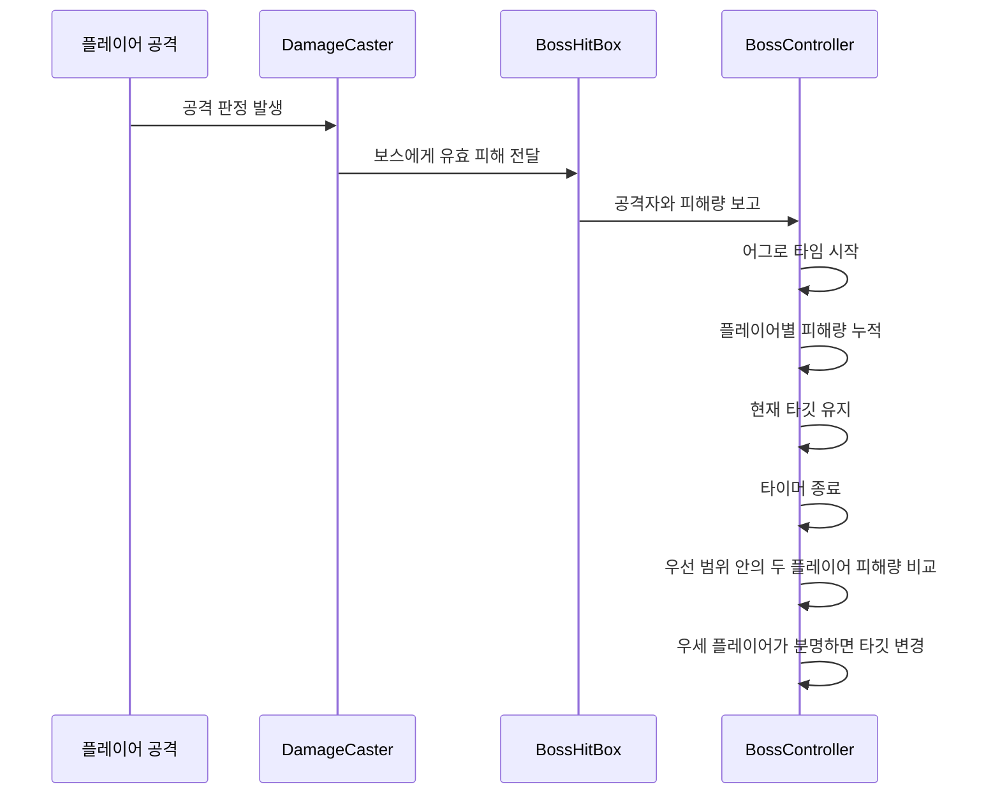

# [Portfolio] 멀티플레이 보스 어그로 설계: 거리, 유지, 피해량 비교를 함께 다루는 방법

## 1. 개요

멀티플레이 보스전에서 어그로는 단순히 "누굴 바라보는가"의 문제가 아니다.
어그로 규칙이 어색하면 아래 문제가 바로 보인다.

* 보스가 공격 직전에 타깃을 바꾼다.
* 공격 후에 가까운 플레이어 쪽으로 다시 홱 돌아선다.
* 두 플레이어가 붙어 있을 때 보스가 제자리에서 흔들린다.
* 플레이어 입장에서 "왜 지금 나를 보는지"를 이해하기 어렵다.

이번 글은 Boss Raid Portfolio에서 현재 사용 중인 멀티플레이 보스 어그로 규칙을 정리한 글이다.
핵심은 아래 3가지다.

* 거리 기반 기본 규칙
* 우선 범위 안에서의 현재 타깃 유지
* 짧은 시간 동안의 피해량 비교를 통한 타깃 변경

즉, 단순 최근접 추적이 아니라 "거리 + 유지 + 피해량"을 함께 쓰는 구조다.

---

## 2. 왜 최근접 추적만으로는 부족했는가

처음에는 가장 가까운 플레이어를 계속 다시 고르는 방식이 단순하고 직관적으로 보인다.
하지만 멀티플레이 보스전에서는 이 방식이 금방 흔들린다.

예를 들어 아래 상황을 생각해 볼 수 있다.

1. 보스가 Host를 보고 회전한다.
2. Client가 살짝 더 가까워진다.
3. 보스가 타깃을 다시 계산한다.
4. 회전이 바뀐다.
5. 공격 직전 또는 공격 직후에 다시 타깃이 흔들린다.

이 과정이 반복되면 플레이어는 보스를 "똑똑한 적"이 아니라 "지속적으로 흔들리는 적"으로 느낀다.

그래서 이 프로젝트에서는 어그로를 아래처럼 다시 정의했다.

* 기본적으로는 거리로 시작한다.
* 하지만 우선 범위 안에서는 현재 타깃을 유지한다.
* 플레이어가 실제로 보스를 때렸을 때만 어그로 타임을 시작한다.
* 어그로 타임이 끝나면 그동안 더 많은 피해를 준 플레이어에게 타깃을 넘긴다.

이렇게 하면 보스의 의도는 더 읽기 쉬워지고, 화면상 흔들림은 줄어든다.

---

## 3. 현재 어그로 규칙

현재 멀티플레이 보스 어그로 규칙은 아래와 같다.

1. 보스는 항상 생존한 플레이어만 타깃 후보로 본다.
2. 현재 타깃 유지나 확정 타깃 조건이 없으면, 가장 가까운 생존 플레이어를 기본 대체 타깃으로 고른다.
3. 현재 타깃이 `AggroPriorityRange` 안에 있으면 거리만으로는 타깃이 바뀌지 않는다.
4. 보스가 현재 타깃을 공격해도 타깃은 계속 유지된다.
5. 플레이어가 보스에게 실제로 유효 피해를 준 순간 `AggroTime`이 시작된다.
6. `AggroTime` 동안 보스는 현재 타깃을 유지하고, 플레이어별 누적 피해만 기록한다.
7. `AggroTime`이 끝났을 때 두 플레이어가 모두 `AggroPriorityRange` 안에 있고 한쪽이 더 많은 피해를 줬다면, 보스는 그 플레이어로 타깃을 한 번 바꾼다.
8. 피해량이 같거나, 피해가 없거나, 대상이 죽었거나, 대상이 유효하지 않으면 피해 기반 타깃 변경은 열리지 않고 현재 유지 또는 거리 기반 대체 규칙으로 돌아간다.

짧게 요약하면 아래 한 문장으로 정리할 수 있다.

> 보스는 거리로 타깃을 시작하지만, 우선 범위 안에서는 흔들리지 않고, 짧은 시간 동안 더 많이 때린 플레이어에게만 타깃을 넘긴다.

---

## 4. 어그로 규칙의 핵심 개념

### 4.1. `AggroPriorityRange`

이 값은 단순한 거리 원이 아니다.
현재 설계에서는 두 가지 역할을 함께 가진다.

* 현재 타깃을 유지하는 범위
* 어그로 타임 종료 뒤 피해량 비교를 여는 범위

즉, 이 원 안에서는 보스가 쉽게 흔들리지 않고,
두 플레이어가 함께 이 원 안에 있을 때만 "누가 더 많이 때렸는가" 비교가 열린다.

### 4.2. `AggroTime`

`AggroTime`은 최근접 대상을 다시 고르는 시간이 아니다.
이 시간은 "누가 더 많이 때렸는지 세는 시간"이다.

중요한 점은 시작 조건이다.

* 공격 버튼 입력만으로는 시작하지 않는다.
* 공격이 빗나가도 시작하지 않는다.
* 보스에게 실제 유효 피해가 들어갔을 때만 시작한다.

이렇게 해야 어그로 주기가 실제 전투 사건과 맞는다.

### 4.3. 확정 타깃

어그로 타임이 끝났을 때 피해량 우세 플레이어가 분명하면,
보스는 그 플레이어를 확정 타깃으로 잡는다.

이 확정 타깃은 "계속 최근접을 다시 보는 상태"가 아니라,
"이번 비교 결과로 한 번 결정된 상태"에 가깝다.

---

## 5. 어그로 로직 흐름

이제 실제 흐름을 순서대로 보자.

### 5.1. 타깃 갱신 흐름

이 흐름은 매우 단순하다.

1. 먼저 확정 타깃을 본다.
2. 확정 타깃이 없으면 현재 타깃 유지 조건을 본다.
3. 둘 다 아니면 가장 가까운 생존 플레이어를 고른다.

즉, 거리 규칙은 완전히 사라진 것이 아니라,
우선순위가 낮아진 "기본 대체 규칙"으로 남아 있다.

### 5.2. 플레이어 공격부터 타이머 종료까지

여기서 중요한 점은 보스가 타이머가 도는 동안 "가장 가까운 대상을 계속 다시 고르지 않는다"는 점이다.
이 시간이 있어야 피해량 기반 어그로가 읽히고, 공격 직전 흔들림도 줄어든다.

### 5.3. 왜 공격 중에는 타이머를 멈추는가

타이머는 아래 두 상황에서 잠깐 멈춘다.

* `AttackState`
* 페이즈 인트로 애니메이션

이유는 단순하다.
타이머 만료가 애니메이션 전환과 같은 프레임에 겹치면,
보스가 공격 시작 또는 페이즈 전환 순간에 타깃을 바꿔 버릴 수 있기 때문이다.

즉, 이 정지 규칙은 "보기 좋은 연출"이 아니라 "타이밍 충돌 방지"에 가깝다.

---

## 6. 구현 관점에서의 데이터 구조

현재 어그로 로직은 아래 데이터를 중심으로 동작한다.

| 데이터 | 역할 |
| --- | --- |
| `playerTransform` | 현재 타깃 |
| `AggroPriorityRange` | 현재 타깃 유지와 피해량 비교를 여는 범위 |
| `AggroTime` | 현재 주기의 피해량 누적 시간 |
| `_isAggroTimerRunning` | 현재 어그로 주기 진행 여부 |
| `_lockedAggroTarget` | 타이머 종료 후 확정된 타깃 |
| `_aggroContributorBuffer` | 이번 주기에 피해를 준 플레이어 목록 |
| `_aggroContributorDamageBuffer` | 플레이어별 누적 피해량 |
| `_aggroCandidateBuffer` | 우선 범위 안의 비교 후보 목록 |

여기서 중요한 포인트는 "후보를 모으는 단계"와 "누굴 선택하는 단계"를 나눴다는 점이다.

최근 내부 리팩터링에서는 타깃 갱신 흐름을 아래처럼 분리했다.

* `ShouldRefreshClosestLiveTarget(...)`
* `ScanLiveTargets(...)`
* `ResolveTargetByAggro(...)`
* `ApplyTargetIfChanged(...)`

이 분리는 규칙을 바꾸기 위한 것이 아니라,
같은 규칙을 더 읽기 쉽게 유지하기 위한 구조 정리다.

---

## 7. 이 설계의 장점

### 7.1. 보스가 덜 흔들린다

가장 직접적인 장점이다.
현재 타깃이 우선 범위 안에 있으면 거리만으로 타깃이 바뀌지 않기 때문에,
보스의 시선과 몸 회전이 더 안정적으로 보인다.

### 7.2. 플레이어가 어그로 의도를 읽기 쉽다

플레이어 입장에서 중요한 것은 "왜 지금 내가 타깃인가"를 이해할 수 있느냐다.

현재 규칙은 그 질문에 비교적 분명하게 답한다.

* 가까워서 먼저 타깃이 됨
* 우선 범위 안이라 유지됨
* 어그로 타임 동안 더 많이 때려서 타깃을 가져옴

즉, 결과가 설명 가능하다.

### 7.3. 멀티플레이 권한 구조와 잘 맞는다

이 프로젝트는 호스트 권한 기반이다.
보스 어그로도 호스트가 최종 결정한다.

이때 "짧은 시간 동안 피해량 누적 -> 종료 시 한 번 결정" 구조는
네트워크에서도 설명하기 쉽고,
클라이언트 입장에서도 결과가 덜 튄다.

### 7.4. 튜닝 포인트가 분명하다

디자이너 관점에서 보면 조절 포인트가 비교적 분명하다.

* `AggroPriorityRange`
* `AggroTime`

즉, "얼마나 쉽게 흔들릴지"와 "얼마나 오래 피해를 비교할지"를 분리해서 조정할 수 있다.

---

## 8. 예시 시나리오

### 시나리오 1. 호스트가 현재 타깃일 때

1. 호스트가 보스 근처에 있어 타깃이 된다.
2. 클라이언트가 살짝 더 가까워진다.
3. 하지만 호스트가 아직 `AggroPriorityRange` 안에 있다.

결과:

* 보스는 호스트를 계속 본다.

### 시나리오 2. 클라이언트가 더 많이 때렸을 때

1. 보스는 현재 호스트를 보고 있다.
2. 두 플레이어가 모두 우선 범위 안에 있다.
3. 클라이언트가 `AggroTime` 동안 더 많은 유효 피해를 넣는다.
4. 타이머가 끝난다.

결과:

* 보스는 클라이언트로 타깃을 한 번 넘긴다.

### 시나리오 3. 피해량이 같을 때

1. 두 플레이어가 모두 보스를 때린다.
2. 타이머가 끝났을 때 총 피해량이 같다.

결과:

* 우세 플레이어가 없으므로 피해 기반 타깃 변경은 일어나지 않는다.

### 시나리오 4. 현재 타깃이 우선 범위를 벗어났을 때

1. 현재 타깃이 `AggroPriorityRange` 밖으로 나간다.
2. 현재 타깃 유지 조건이 풀린다.

결과:

* 보스는 다시 가장 가까운 생존 플레이어를 기본 대체 타깃으로 고를 수 있다.

---

## 9. 디버깅과 확인 포인트

현재 디버그 라벨에서는 어그로 상태를 아래처럼 읽을 수 있다.

| 모드 | 의미 |
| --- | --- |
| `TimerHold` | 어그로 타임 동안 현재 타깃을 유지하는 상태 |
| `DamageLock` | 타이머 종료 뒤 우세 플레이어가 확정된 상태 |
| `TargetHold` | 현재 타깃이 우선 범위 안이라 그대로 유지되는 상태 |
| `Distance` | 유지/확정 상태가 없어서 거리 기반 대체 규칙을 쓰는 상태 |

플레이 테스트 때는 아래를 확인하면 좋다.

1. 전투 시작 시 보스가 생존 플레이어 중 하나를 정상적으로 잡는가
2. 현재 타깃이 우선 범위 안에 있을 때 다른 플레이어가 조금 더 가까워져도 바로 흔들리지 않는가
3. 공격 직전과 직후에 보스가 불필요하게 회전하지 않는가
4. 실제 유효 피해가 들어갔을 때만 어그로 타임이 시작되는가
5. 타이머 종료 뒤에만 피해량 기반 타깃 변경이 일어나는가
6. 피해량이 같으면 어색한 타깃 변경이 없는가

---

## 10. 마무리

이번 어그로 설계에서 중요한 점은 "복잡한 규칙을 추가했다"가 아니다.
오히려 반대로, 플레이어가 이해할 수 있는 기준을 만들기 위해 규칙을 정리한 쪽에 가깝다.

정리하면 현재 설계는 아래처럼 볼 수 있다.

* 거리로 시작한다.
* 우선 범위 안에서는 유지한다.
* 실제 피해가 들어오면 짧게 비교한다.
* 비교가 끝나면 한 번만 바꾼다.

이 네 줄이 현재 멀티플레이 보스 어그로의 핵심이다.

그리고 이 구조는 단순히 전투 감각만 위한 것이 아니라,
멀티플레이 권한 구조, 디버깅, 유지보수, 나중 리팩터링까지 함께 고려한 결과이기도 하다.

---

## 참고 문서

* `docs/technical/multiplayer/boss/Mutiplayer_Boss_Aggro.md`
* `docs/technical/System_Blueprint.md`
* `docs/technical/Technical_Glossary.md`
* `docs/technical/multiplayer/boss/Multiplayer_Boss_Authority.md`
