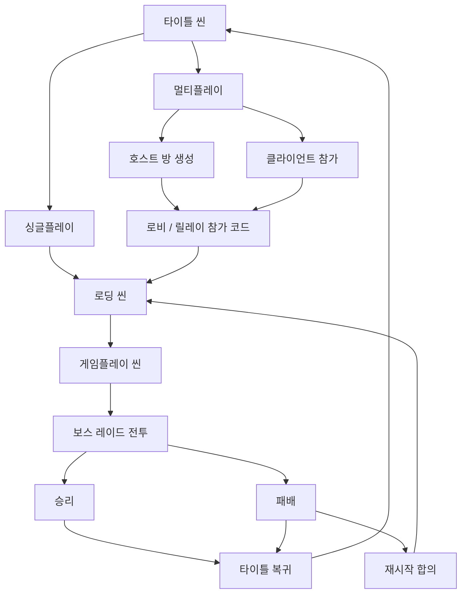
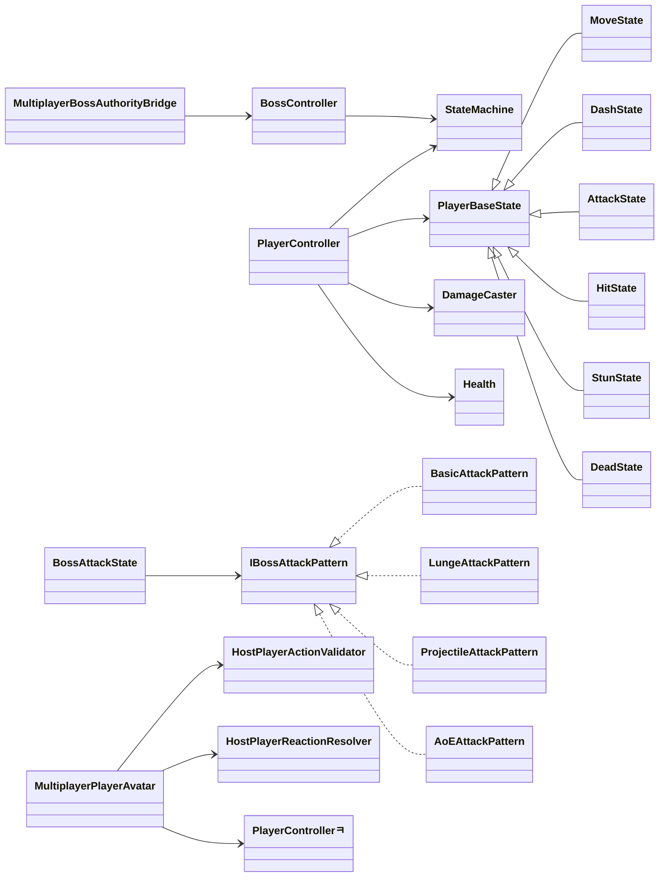
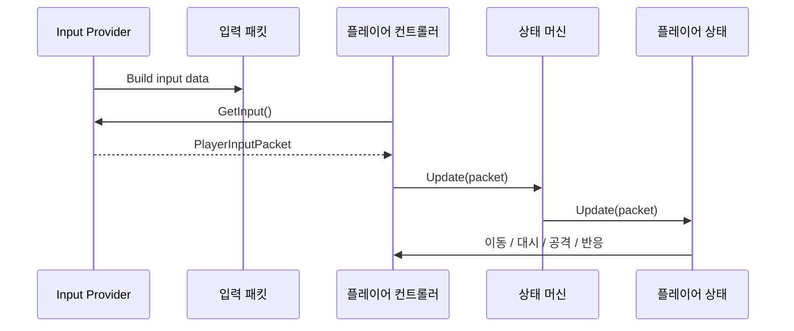
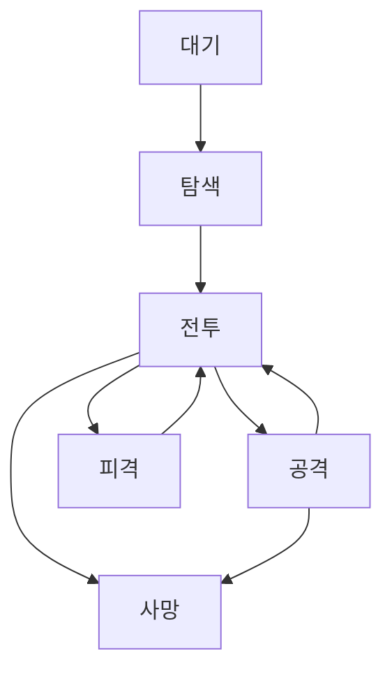
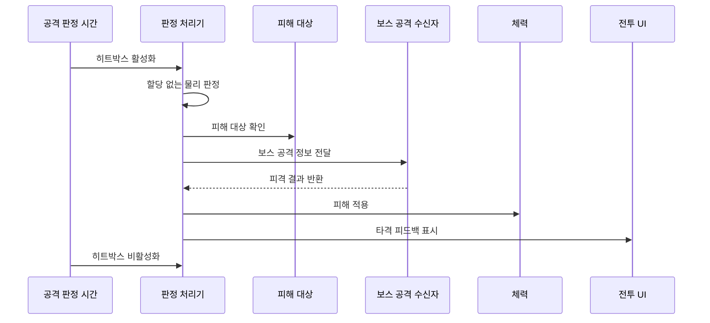
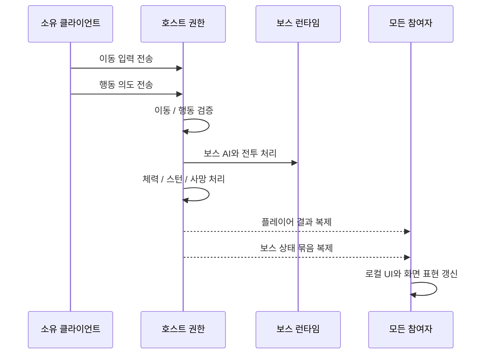

# 보스 레이드 포트폴리오

## 1. 프로젝트 개요

`Boss Raid Portfolio`는 플레이어가 드래곤 보스의 패턴을 읽고 회피, 공격, 재도전을 반복하는 3인칭 보스 레이드 액션 게임입니다. 기존 싱글플레이 흐름을 유지하면서, 2인 온라인 협동 플레이를 추가하는 방향으로 구조를 확장했습니다.

| 항목 | 내용 |
| --- | --- |
| 장르 | 3인칭 액션 / 보스 레이드 / 2인 협동 멀티플레이 |
| 핵심 목표 | 보스 패턴을 읽고, 공격 타이밍과 회피 타이밍을 판단하는 전투 경험 구현 |
| 주요 구현 축 | 플레이어 상태 머신, 보스 상태 머신, 전투 판정, 호스트 권한 멀티플레이, 전투 UI/결과 흐름 |
| 네트워크 방향 | 호스트가 서버 역할을 함께 맡는 호스트 권한 구조 |
| 핵심 설계 원칙 | 입력과 로직 분리, 호스트 판정 우선, 화면 표현과 실제 게임 판정 분리, 런타임 할당 최소화 |

이 프로젝트에서 가장 중요하게 본 점은 "게임이 돌아가는 것"에서 끝내지 않고, 싱글플레이 로직을 멀티플레이 권한 구조로 확장할 수 있도록 책임을 나눈 것입니다.

## 2. 플레이 영상

작성 예정.

포함하면 좋은 장면:

| 장면 | 보여줄 내용 |
| --- | --- |
| 전투 시작 | 타이틀 또는 로비에서 게임플레이 씬으로 진입 |
| 플레이어 조작 | 이동, 대시, 공격 콤보, 피격, 사망 |
| 보스 패턴 | 기본 공격, 돌진, 투사체, 범위 공격 패턴 |
| 멀티플레이 | 호스트와 클라이언트가 서로의 상태와 보스 상태를 공유하는 장면 |
| 결과 화면 | 승리 / 패배 / 재시작 합의 |

## 3. 다운로드 / 실행 방법

작성 예정.

## 4. 개발 기간 및 개발 환경

작성 예정.

## 5. 팀 구성 및 담당 역할

작성 예정.

## 6. 핵심 구현 요약

| 구분 | 구현 내용 | 포트폴리오에서 강조할 점 |
| --- | --- | --- |
| 플레이어 시스템 | 입력 패킷 기반 상태 머신, 이동/대시/점프/공격/피격/스턴/사망 상태 분리 | 입력과 행동 로직을 분리해 싱글/멀티 양쪽에서 재사용 가능하게 설계 |
| 보스 시스템 | 상태 머신과 전략 패턴 기반 공격 패턴 구조 | 새로운 보스 패턴을 기존 `BossAttackState` 수정 없이 확장 가능 |
| 전투 판정 | `DamageCaster`, `AttackWarningController`, `IDamageable`, `IBossAttackHitReceiver` 기반 판정 | 공격자, 피격자, 보스 공격 메타데이터를 분리해 판정 흐름을 명확히 구성 |
| 멀티플레이 | Unity Netcode for GameObjects 기반 호스트 권한 구조 | 클라이언트는 의도를 보내고 호스트가 최종 판정하는 구조로 불일치 위험 감소 |
| 보스 동기화 | `BossAuthoritativeState` 상태 묶음과 보스 이펙트 이벤트 복제 | 클라이언트는 보스를 직접 계산하지 않고 호스트 상태를 화면 표시용으로 재생 |
| UI / 결과 흐름 | 전투 UI, 체력, 콤보, 대시 쿨다운, 승리/패배, 재시작 합의 | 실제 게임 상태와 로컬 UI 표시 책임을 분리 |
| 유지보수 | 문서 우선 작업 흐름, 진행 로그, 시스템 청사진, 기술 용어집 동기화 | 구현 이력과 설계 근거를 추적 가능한 형태로 관리 |

주요 참조 코드:

| 영역 | 파일 |
| --- | --- |
| 플레이어 핵심 로직 | [PlayerController.cs:14](/d:/Unity-projects/BossRaidPortfolio/Assets/Scripts/Player/PlayerController.cs#L14) |
| 보스 핵심 로직 | [BossController.cs:39](/d:/Unity-projects/BossRaidPortfolio/Assets/Scripts/Boss/BossController.cs#L39) |
| 보스 공격 전략 | [IBossAttackPattern.cs:7](/d:/Unity-projects/BossRaidPortfolio/Assets/Scripts/Boss/Attacks/IBossAttackPattern.cs#L7) |
| 플레이어 공격 판정 | [DamageCaster.cs:13](/d:/Unity-projects/BossRaidPortfolio/Assets/Scripts/Common/Combat/DamageCaster.cs#L13) |
| 멀티플레이 플레이어 권한 | [MultiplayerPlayerAvatar.cs:18](/d:/Unity-projects/BossRaidPortfolio/Assets/Scripts/Multiplayer/Gameplay/MultiplayerPlayerAvatar.cs#L18) |
| 멀티플레이 보스 권한 | [MultiplayerBossAuthorityBridge.cs:12](/d:/Unity-projects/BossRaidPortfolio/Assets/Scripts/Multiplayer/Gameplay/MultiplayerBossAuthorityBridge.cs#L12) |
| 결과 처리 흐름 | [GameManager.cs:26](/d:/Unity-projects/BossRaidPortfolio/Assets/Scripts/Common/GameManager.cs#L26) |

## 7. 전체 게임 구조

전체 흐름은 타이틀, 로딩, 게임플레이, 결과 단계로 분리했습니다. 싱글플레이와 멀티플레이는 같은 게임플레이 씬 흐름을 공유하되, 멀티플레이에서는 호스트가 씬 전환과 게임 결과를 최종 결정합니다.

쉬운 흐름:

| 단계 | 흐름 |
| --- | --- |
| 1 | 플레이어가 타이틀 씬에 진입합니다. |
| 2 | 싱글플레이 또는 멀티플레이를 선택합니다. |
| 3 | 로딩 씬이 다음에 열 씬 경로를 받습니다. |
| 4 | 게임플레이 씬에서 플레이어와 보스 런타임이 시작됩니다. |
| 5 | 플레이어와 보스 상태가 상태 머신으로 갱신됩니다. |
| 6 | `GameManager`가 승리/패배 결과를 처리합니다. |

## 8. 클래스 구성 및 아키텍처

핵심 구조는 상태 머신, 전략 패턴, 인터페이스 기반 전투 판정, 호스트 권한 구조 네 축으로 구성했습니다.

설계 의도:

| 구조 | 의도 |
| --- | --- |
| `PlayerInputPacket` | 입력을 직렬화 가능한 데이터로 묶어 싱글/멀티 입력 경로를 통일 |
| `StateMachine<TState>` | 플레이어와 보스의 상태 전환 구조를 공통화 |
| `IBossAttackPattern` | 보스 공격 패턴을 교체 가능한 전략으로 분리 |
| `IDamageable` | 공격 대상이 플레이어인지 보스인지 몰라도 피해 처리 가능 |
| `IBossAttackHitReceiver` | 보스 공격의 피격/스턴/사망 같은 반응 정보를 피격자 쪽에서 해석 |
| `MultiplayerPlayerAvatar` | 소유자 입력, 호스트 검증, 결과 복제를 연결하는 네트워크 경계 |
| `MultiplayerBossAuthorityBridge` | 호스트가 가진 보스 실제 상태를 클라이언트의 화면 표시용 보스에 전달 |

## 9. 플레이어 시스템

플레이어는 입력 수집, 상태 판단, 실제 이동/공격 실행을 분리했습니다. 로직 클래스가 Unity `Input`에 직접 의존하지 않고 `IInputProvider`를 통해 `PlayerInputPacket`을 받도록 구성했습니다.

다이어그램 설명:

| 요소 | 의미 |
| --- | --- |
| `Input Provider` | 키보드/마우스 입력을 읽는 입력 수집 계층입니다. 현재는 `LocalInputProvider`가 이 역할을 담당합니다. |
| `입력 패킷` | 이동 방향, 카메라 회전값, 버튼 입력을 `PlayerInputPacket` 하나로 묶은 데이터입니다. |
| `플레이어 컨트롤러` | 입력 패킷을 받아 현재 상태 머신에 전달하고, 실제 이동/공격 실행에 필요한 공통 기능을 제공합니다. |
| `상태 머신` | 현재 플레이어 상태를 보관하고, 해당 상태의 `Update(packet)`을 호출합니다. |
| `플레이어 상태` | 이동, 대시, 공격, 피격 같은 실제 행동 규칙을 처리합니다. |

흐름 설명:

| 순서 | 설명 |
| --- | --- |
| 1 | `Input Provider`가 매 프레임 입력을 읽어 `PlayerInputPacket`을 만듭니다. |
| 2 | `PlayerController`는 `GetInput()`으로 입력 패킷을 가져옵니다. |
| 3 | `PlayerController`는 입력 패킷을 상태 머신에 전달합니다. |
| 4 | 상태 머신은 현재 활성화된 플레이어 상태에 입력 패킷을 넘깁니다. |
| 5 | 각 상태는 입력 패킷을 기준으로 이동, 대시, 공격, 피격 반응을 실행합니다. |

주요 구현:

| 기능 | 설명 |
| --- | --- |
| 입력 분리 | `LocalInputProvider`가 입력을 읽고 `PlayerInputPacket`으로 변환 |
| 상태 머신 | `MoveState`, `DashState`, `JumpState`, `AttackState`, `HitState`, `StunState`, `DeadState`로 행동 분리 |
| 공격 콤보 | `AttackState`가 콤보 단계, 타격 판정 시간, 취소 가능 시간을 관리 |
| 대시 | 쿨다운과 지속 시간을 분리하고 전투 UI 채움 값으로 진행률 표시 |
| 피격 반응 | `IBossAttackHitReceiver`를 통해 보스 공격 메타데이터를 받아 피격/스턴/사망 처리 |
| 멀티플레이 역할 | `ActionAuthorityMode`로 싱글, 호스트, 클라이언트 소유자, 원격 표시 전용 역할 분리 |
| 시각 바인딩 | 교체된 시각 오브젝트 참조를 자동 복구하고 인스펙터 보고서로 오래된 참조를 진단 |

참조 코드:

| 기능 | 파일 |
| --- | --- |
| 플레이어 컨트롤러 | [PlayerController.cs:14](/d:/Unity-projects/BossRaidPortfolio/Assets/Scripts/Player/PlayerController.cs#L14) |
| 입력 패킷 | [PlayerInputData.cs:18](/d:/Unity-projects/BossRaidPortfolio/Assets/Scripts/Player/PlayerInputData.cs#L18) |
| 공격 상태 | [AttackState.cs:7](/d:/Unity-projects/BossRaidPortfolio/Assets/Scripts/Player/States/AttackState.cs#L7) |
| 대시 상태 | [DashState.cs:8](/d:/Unity-projects/BossRaidPortfolio/Assets/Scripts/Player/States/DashState.cs#L8) |
| 이동 코어 | [PlayerLocomotionCore.cs:9](/d:/Unity-projects/BossRaidPortfolio/Assets/Scripts/Player/PlayerLocomotionCore.cs#L9) |

## 10. 보스 시스템

보스는 상태 머신으로 전체 행동 흐름을 관리하고, 공격 패턴은 `IBossAttackPattern` 전략으로 분리했습니다. `BossCombatState`는 현재 거리, 페이즈, 쿨다운, 직전 패턴을 기준으로 어떤 공격을 사용할지 선택하고, 실제 공격 실행은 패턴 클래스에 위임합니다.

다이어그램 설명:

| 상태 | 의미 |
| --- | --- |
| `대기` | 보스가 전투 대상을 아직 찾지 않았거나, 전투 진입 전 기본 상태입니다. |
| `탐색` | 감지 범위 안의 생존 플레이어를 찾고 추적 대상으로 지정하는 상태입니다. |
| `전투` | 현재 타겟과의 거리, 페이즈, 공격 가능 여부를 확인하고 다음 행동을 결정하는 상태입니다. |
| `공격` | 선택된 보스 공격 패턴을 실행하는 상태입니다. 실제 공격 로직은 `IBossAttackPattern` 구현체가 처리합니다. |
| `피격` | 보스가 피해를 받았을 때 짧은 피격 반응을 처리하는 상태입니다. 공격 중에는 피격 연출이 제한될 수 있습니다. |
| `사망` | 보스 체력이 0이 되었을 때 전투를 종료하고 결과 흐름으로 넘어가는 상태입니다. |

전환 설명:

| 전환 | 설명 |
| --- | --- |
| `대기 -> 탐색` | 전투 대상 탐색을 시작합니다. |
| `탐색 -> 전투` | 유효한 생존 플레이어를 찾으면 전투 판단 상태로 진입합니다. |
| `전투 -> 공격` | 거리와 페이즈 조건을 만족하는 공격 패턴이 있으면 공격 상태로 전환합니다. |
| `공격 -> 전투` | 공격 패턴 실행이 끝나면 다시 전투 상태로 돌아와 다음 행동을 판단합니다. |
| `전투 -> 피격` | 보스가 피해를 받고 피격 반응이 허용되는 상황이면 피격 상태로 전환합니다. |
| `피격 -> 전투` | 피격 반응이 끝나면 다시 전투 상태로 복귀합니다. |
| `전투/공격 -> 사망` | 보스 체력이 0이 되면 현재 행동보다 사망 처리를 우선합니다. |

주요 구현:

| 기능 | 설명 |
| --- | --- |
| 보스 상태 머신 | 대기, 탐색, 전투, 공격, 피격, 사망 흐름으로 보스 상태 관리 |
| 패턴 선택 | 거리와 페이즈를 기준으로 기본 공격, 돌진, 투사체, 범위 공격 후보를 필터링 |
| 어그로 | 가장 가까운 생존 플레이어를 기본값으로 두고, `AggroPriorityRange`와 누적 피해 기여도로 타겟 유지/교체 |
| 기본 공격 | 부채꼴 경고와 1회 피해 판정을 사용 |
| 돌진 공격 | 고정 이동 거리와 직선 범위 피해 판정을 사용 |
| 투사체 공격 | 투사체 풀을 통해 발사체를 재사용 |
| 범위 공격 | 이륙, 전진 비행, 공중 대기, 착지 단계로 나뉘는 장판 공격 |
| 보스 동기화 | 호스트가 `BossAuthoritativeState`를 만들고 클라이언트는 화면 표시용으로 재생 |

참조 코드:

| 기능 | 파일 |
| --- | --- |
| 보스 컨트롤러 | [BossController.cs:39](/d:/Unity-projects/BossRaidPortfolio/Assets/Scripts/Boss/BossController.cs#L39) |
| 보스 상태 머신 | [BossFSM.cs:10](/d:/Unity-projects/BossRaidPortfolio/Assets/Scripts/Boss/BossFSM.cs#L10) |
| 기본 공격 패턴 | [BasicAttackPattern.cs:10](/d:/Unity-projects/BossRaidPortfolio/Assets/Scripts/Boss/Attacks/BasicAttackPattern.cs#L10) |
| 돌진 패턴 | [LungeAttackPattern.cs:10](/d:/Unity-projects/BossRaidPortfolio/Assets/Scripts/Boss/Attacks/LungeAttackPattern.cs#L10) |
| 투사체 패턴 | [ProjectileAttackPattern.cs:11](/d:/Unity-projects/BossRaidPortfolio/Assets/Scripts/Boss/Attacks/ProjectileAttackPattern.cs#L11) |
| 범위 공격 패턴 | [AoEAttackPattern.cs:13](/d:/Unity-projects/BossRaidPortfolio/Assets/Scripts/Boss/Attacks/AoEAttackPattern.cs#L13) |

## 11. 전투 판정 시스템

전투 판정은 "공격 범위 확인", "피격 대상 탐색", "피해 적용", "피격 반응 적용", "전투 UI 피드백"을 분리해서 처리했습니다.

다이어그램 설명:

| 요소 | 의미 |
| --- | --- |
| `공격 판정 시간` | 애니메이션이나 상태 로직에서 실제 타격 판정이 열려 있는 구간입니다. |
| `판정 처리기` | 공격 범위를 검사하고, 맞은 대상을 찾아 피해 처리를 연결하는 계층입니다. 플레이어 공격은 `DamageCaster`, 보스 경고 공격은 `AttackWarningController`가 담당합니다. |
| `피해 대상` | `IDamageable`을 구현한 대상입니다. 플레이어, 보스 피격 박스처럼 피해를 받을 수 있는 오브젝트가 여기에 해당합니다. |
| `보스 공격 수신자` | 보스 공격 메타데이터를 받아 피격, 스턴, 사망 같은 반응을 결정하는 대상입니다. |
| `체력` | 최종 피해량을 적용하고 현재 체력, 사망 이벤트를 관리하는 컴포넌트입니다. |
| `전투 UI` | 타격 성공, 피해량, 콤보, 체력 변화를 화면에 보여 주는 표시 계층입니다. |

흐름 설명:

| 순서 | 설명 |
| --- | --- |
| 1 | 공격 상태나 애니메이션 이벤트가 히트박스를 활성화합니다. |
| 2 | 판정 처리기는 할당 없는 물리 판정으로 공격 범위 안의 대상을 찾습니다. |
| 3 | 맞은 대상에서 `IDamageable`을 찾고, 보스 공격이면 `IBossAttackHitReceiver`를 통해 피격 반응도 함께 확인합니다. |
| 4 | 유효한 대상이면 `Health.TakeDamage(...)`로 피해를 적용합니다. |
| 5 | 타격 성공 결과를 전투 UI에 전달해 콤보나 피해 피드백을 표시합니다. |
| 6 | 공격 판정 시간이 끝나면 히트박스를 비활성화해 잔존 판정을 막습니다. |

핵심 의도:

| 원칙 | 설명 |
| --- | --- |
| 판정과 피해 적용 분리 | 공격 범위 검사와 체력 감소를 분리해 플레이어/보스 양쪽에서 같은 구조를 재사용합니다. |
| 인터페이스 기반 처리 | `IDamageable`과 `IBossAttackHitReceiver`를 사용해 구체 클래스 의존도를 줄였습니다. |
| 런타임 할당 최소화 | 반복되는 전투 판정에는 `NonAlloc` 물리 API를 사용해 불필요한 GC 발생을 줄였습니다. |
| 잔존 판정 방지 | 공격 종료 시 히트박스를 강제로 닫아 상태 전환 후에도 공격 판정이 남지 않도록 했습니다. |

주요 구현:

| 기능 | 설명 |
| --- | --- |
| 할당 없는 판정 | `Physics.OverlapSphereNonAlloc`, `Physics.OverlapBoxNonAlloc`으로 런타임 GC 최소화 |
| 인터페이스 기반 피해 처리 | `IDamageable`로 플레이어/보스 피격 대상을 추상화 |
| 보스 공격 메타데이터 | `BossAttackHitData`로 피격 종류, 피해량, 스턴 여부를 전달 |
| 판정 이벤트 | `OnAttackHitConfirmed`, `OnAttackWindowResolved`로 전투 UI와 콤보 피드백 연결 |
| 잔존 히트박스 보호 | 상태 전환 시 남아 있는 히트박스를 강제로 비활성화 |
| 무효 피해 필터 | 0 이하 피해량은 이벤트와 애니메이션 오작동을 막기 위해 무시 |
| 보스 경고 표시 | 1번/2번 공격은 `AttackWarningController`가 경고 표시와 실제 피해 판정을 담당 |

참조 코드:

| 기능 | 파일 |
| --- | --- |
| 플레이어 공격 판정 | [DamageCaster.cs:83](/d:/Unity-projects/BossRaidPortfolio/Assets/Scripts/Common/Combat/DamageCaster.cs#L83) |
| 할당 없는 물리 판정 | [DamageCaster.cs:165](/d:/Unity-projects/BossRaidPortfolio/Assets/Scripts/Common/Combat/DamageCaster.cs#L165) |
| 보스 경고/피해 | [AttackWarningController.cs:746](/d:/Unity-projects/BossRaidPortfolio/Assets/Scripts/Boss/AttackWarningController.cs#L746) |
| 공통 체력 | [Health.cs:12](/d:/Unity-projects/BossRaidPortfolio/Assets/Scripts/Common/Combat/Health.cs#L12) |
| 보스 피격 데이터 | [BossAttackHitData.cs:21](/d:/Unity-projects/BossRaidPortfolio/Assets/Scripts/Common/Combat/BossAttackHitData.cs#L21) |

## 12. 멀티플레이 시스템

멀티플레이는 2인 협동을 기준으로 설계했습니다. 호스트가 실제 게임 판정을 가지고, 클라이언트는 입력 의도와 로컬 화면 표현을 담당합니다.

| 항목 | 구조 |
| --- | --- |
| 네트워크 모델 | 호스트 겸 서버 / 호스트 권한 |
| 연결 방식 | 로비 정보 + 릴레이 참가 코드 |
| 플레이어 입력 | 소유 클라이언트가 입력/행동 의도를 호스트에 전송 |
| 플레이어 이동 | 소유자 예측 이동 + 호스트 기준 상태 보정 |
| 공격/대시 | 이동 입력과 별도의 행동 의도로 호스트가 검증 |
| 피격/사망 | 호스트가 피해, 스턴, 사망을 판정하고 상태 묶음을 전송 |
| 보스 | 호스트가 AI, 이동, 공격, 체력, 페이즈, 사망을 계산 |
| 클라이언트 보스 | 호스트 상태 묶음을 받아 화면 표시용으로 재생 |
| 결과 | 보스 사망 시 승리, 두 플레이어 사망 시 패배 |
| 재시작 | 두 플레이어 모두 Enter를 누르면 재시작 합의 완료 |

다이어그램 설명:

| 요소 | 의미 |
| --- | --- |
| `소유 클라이언트` | 해당 플레이어를 직접 조작하는 클라이언트입니다. 입력을 수집하고 호스트에 전달합니다. |
| `호스트 권한` | 최종 게임 판정을 담당하는 실행 주체입니다. 이동, 행동, 피해, 사망, 보스 상태를 검증하고 확정합니다. |
| `보스 런타임` | 호스트에서 실제로 동작하는 보스 AI와 전투 로직입니다. 클라이언트는 보스 판단을 직접 계산하지 않습니다. |
| `모든 참여자` | 호스트와 클라이언트를 포함한 전체 플레이어 화면입니다. 호스트가 확정한 결과를 받아 UI와 화면 표현을 갱신합니다. |

흐름 설명:

| 순서 | 설명 |
| --- | --- |
| 1 | 소유 클라이언트가 이동 입력과 공격/대시 같은 행동 의도를 호스트로 보냅니다. |
| 2 | 호스트는 받은 입력이 현재 상태에서 가능한지 검증합니다. |
| 3 | 호스트는 보스 AI, 보스 공격, 플레이어 피격, 체력 변화를 실제 게임 판정으로 처리합니다. |
| 4 | 호스트는 플레이어 결과와 보스 상태 묶음을 모든 참여자에게 복제합니다. |
| 5 | 각 참여자는 받은 결과를 기준으로 전투 UI, 애니메이션, 보스 표시를 갱신합니다. |

핵심 의도:

| 원칙 | 설명 |
| --- | --- |
| 클라이언트는 의도만 전송 | 클라이언트는 "공격했다"가 아니라 "공격하고 싶다"를 보냅니다. |
| 호스트가 결과 확정 | 실제 공격 성공, 피해량, 스턴, 사망, 보스 상태는 호스트가 결정합니다. |
| 화면 표현은 로컬에서 갱신 | 각 참여자는 호스트가 보낸 결과를 바탕으로 자기 화면의 UI와 애니메이션을 재생합니다. |

멀티플레이에서 중요하게 본 점은 `클라이언트가 결과를 확정하지 않는다`는 원칙입니다. 클라이언트는 "공격하고 싶다", "대시하고 싶다" 같은 의도만 보내고, 실제 성공 여부와 피해량은 호스트가 결정합니다.

참조 코드:

| 기능 | 파일 |
| --- | --- |
| 플레이어 네트워크 경계 | [MultiplayerPlayerAvatar.cs:18](/d:/Unity-projects/BossRaidPortfolio/Assets/Scripts/Multiplayer/Gameplay/MultiplayerPlayerAvatar.cs#L18) |
| 소유자 입력 RPC | [MultiplayerPlayerAvatar.cs:177](/d:/Unity-projects/BossRaidPortfolio/Assets/Scripts/Multiplayer/Gameplay/MultiplayerPlayerAvatar.cs#L177) |
| 행동 의도 RPC | [MultiplayerPlayerAvatar.cs:192](/d:/Unity-projects/BossRaidPortfolio/Assets/Scripts/Multiplayer/Gameplay/MultiplayerPlayerAvatar.cs#L192) |
| 행동 검증기 | [HostPlayerActionValidator.cs:5](/d:/Unity-projects/BossRaidPortfolio/Assets/Scripts/Multiplayer/Gameplay/HostPlayerActionValidator.cs#L5) |
| 피격 반응 처리기 | [HostPlayerReactionResolver.cs:7](/d:/Unity-projects/BossRaidPortfolio/Assets/Scripts/Multiplayer/Gameplay/HostPlayerReactionResolver.cs#L7) |
| 보스 동기화 중계 | [MultiplayerBossAuthorityBridge.cs:80](/d:/Unity-projects/BossRaidPortfolio/Assets/Scripts/Multiplayer/Gameplay/MultiplayerBossAuthorityBridge.cs#L80) |

## 13. 디자인 패턴 및 설계 의도

| 패턴/구조 | 적용 위치 | 설계 의도 |
| --- | --- | --- |
| 상태 머신 | 플레이어, 보스 | 상태별 책임을 나누고 전환 조건을 명확히 관리 |
| 전략 패턴 | 보스 공격 패턴 | 공격 패턴을 추가해도 `BossAttackState`의 복잡도가 커지지 않게 분리 |
| 인터페이스 기반 설계 | `IInputProvider`, `IDamageable`, `IBossAttackHitReceiver` | 구현체를 직접 알지 않아도 입력/피해/피격 반응을 연결 |
| 오브젝트 풀링 | 보스 투사체와 범위 공격 투사체 재사용 | 반복 생성/삭제 비용과 GC를 줄임 |
| 데이터 패킷 | `PlayerInputPacket`, `MultiplayerLocomotionState`, `BossAuthoritativeState` | 네트워크 전송과 재현에 필요한 값만 구조화 |
| 호스트 권한 | 멀티플레이 게임플레이 | 게임 결과를 한 곳에서 확정해 참여자 간 불일치를 줄임 |
| 표현 계층 분리 | 플레이어 시각 오브젝트, 보스 중계, 전투 UI | 실제 게임 판정과 화면 표시를 분리해 디버깅과 동기화 안정성 확보 |

설계의 핵심은 "단일 진실 공급원을 한 곳에 둔다"입니다. 예를 들어 보스 피해는 호스트가 결정하고, 클라이언트는 그 결과를 보여 줍니다. 보스 공격 패턴도 `BossAttackState`가 세부 동작을 직접 알지 않고, `IBossAttackPattern`을 통해 실행합니다.

## 14. 최적화

| 최적화 항목 | 적용 내용 | 효과 |
| --- | --- | --- |
| 할당 없는 물리 판정 | 공격 판정에 `OverlapSphereNonAlloc`, `OverlapBoxNonAlloc` 사용 | 전투 중 반복 물리 쿼리로 인한 GC 할당 감소 |
| 사전 할당 버퍼 | 판정 결과 배열을 미리 확보해 재사용 | 매 프레임/공격 판정 시간 중 할당 방지 |
| 오브젝트 풀링 | 보스 투사체와 범위 공격 투사체 재사용 | 런타임 생성/삭제 비용 감소 |
| 머티리얼 속성 블록 | 범위 공격 경고 표시의 채움 값/투명도 갱신 | 머티리얼 인스턴스 복제 방지 |
| 최소 네트워크 상태 | Transform 전체 남발 대신 입력/상태 묶음 중심 전송 | 네트워크 전송량과 적용 경로 단순화 |
| 런타임 리소스 정리 | 중복 프리팹을 제거하고 `MultiplayerRuntimeConfig`로 기준 프리팹 참조 | 빌드/런타임 프리팹 출처 혼선을 줄임 |
| 전투 UI 갱신 분리 | 대시 쿨다운, 보스 체력, 플레이어 체력을 각각 단일 진실 공급원 기준으로 갱신 | UI 표시 버그와 실제 게임 상태 오염 방지 |

성능 최적화는 "빠르게 만드는 것"보다 "전투 중 반복되는 비용을 통제하는 것"에 초점을 맞췄습니다. 특히 공격 판정, 투사체, 경고 장판처럼 자주 실행되는 기능은 할당 없는 API와 풀링을 우선 적용했습니다.

## 15. 문제 해결 / 트러블슈팅

| 문제 | 원인 | 해결 | 결과 |
| --- | --- | --- | --- |
| 이동만 해도 검기 이펙트가 생성됨 | 무기 끝 위치 변화 속도만 기준으로 이펙트를 생성 | `AttackState`일 때만 검기 생성 허용 | 이동 입력과 공격 이펙트를 분리 |
| 지형이 체크 패턴으로 보임 | `TerrainData`가 참조하는 TerrainLayer GUID 누락 | 동일 GUID를 가진 연결용 TerrainLayer 에셋 추가 | TerrainLayer 참조 복구 |
| 타이틀 UI가 화면 밖/우측으로 밀림 | 복구된 Animator가 `RectTransform` 값을 런타임에 덮어씀 | 루트/패널 Animator 비활성화 및 런타임 루트 바인딩 우선순위 정리 | 타이틀 UI 위치 안정화 |
| 게임 오버 이미지가 표시되지 않음 | 멀티플레이 게임플레이 씬 경로 판정이 검증용 씬에만 묶임 | 실제 씬 경로와 검증용 씬 경로를 모두 허용 | 승리/패배 결과 분기 복구 |
| 패배 재시작 안내 문구가 사라짐 | 결과 문구를 항상 공백으로 덮어씀 | `Victory`는 공백, `Defeated`는 안내 문구 표시로 분기 | 재시작 합의 안내 복구 |
| 교체된 플레이어 시각 오브젝트가 오래된 참조를 바라봄 | 씬에 원본 시각 오브젝트와 교체 시각 오브젝트가 공존 | `PlayerController` 시각 오브젝트 바인딩 자동 복구와 엄격 보고서 추가 | 인스펙터에서 바인딩 상태 진단 가능 |
| 피해 피드백 투명도가 플레이 모드에서 다시 보임 | 전투 UI 컨트롤러가 투명도를 런타임에 `1`로 강제 | 인스펙터 투명도 값을 표시 상한값으로 캐시 | 숨김 의도를 런타임에서도 유지 |
| 클라이언트 소유자 애니메이션 흔들림 | 예측/재생 경로와 프레임 갱신이 이동 속도 값을 중복 작성 | 소유자 이동 속도 작성 경로를 프레임 기준 단일 작성자로 정리 | 시각적 대기/걷기 흔들림 완화 |
| 브랜치 에셋 내보내기가 불안정하게 실패 | Unity 프로젝트 열림 잠금, UPM 환경 변수, 원본 zip 어셈블리 문제가 섞임 | 잠금 사전 확인, 환경 변수 보강, UPM IPC 사전 시작, zip 어셈블리 로드 보강 | `.unitypackage`, 원본 압축 파일, 명세 파일 생성 안정화 |

트러블슈팅 방식은 값 우선으로 접근했습니다. 먼저 "어느 값이 단일 진실 공급원인지"를 찾고, 그 값이 잘못 쓰이는 지점을 좁힌 뒤 최소 수정으로 해결했습니다.

## 16. 회고

가장 잘한 점은 플레이어, 보스, 전투 판정, 멀티플레이 권한을 처음부터 완전히 섞지 않고 분리하려고 한 점입니다. 덕분에 싱글플레이 로직을 유지하면서도 호스트 권한 기반 멀티플레이로 확장할 수 있었습니다.

특히 배운 점은 실제 게임 판정과 화면 표현을 분리하는 중요성입니다. 클라이언트 화면에서 즉시 보이는 애니메이션이나 전투 UI는 사용자 경험에 중요하지만, 피해와 사망 같은 결과는 호스트가 확정해야 합니다. 이 경계를 분리하지 않으면 작은 UI 버그나 시각 보정이 실제 게임 결과까지 흔들 수 있습니다.

아쉬운 점도 있습니다. 멀티플레이 구현 과정에서 `MultiplayerPlayerAvatar`가 입력, 검증 연결, 복제, 전투 UI 적용을 많이 들고 있어 클래스 책임이 커졌습니다. 동작 검증을 우선하면서 임시 경계를 고정한 선택은 필요했지만, 장기적으로는 복제 담당자와 적용 담당자를 분리해 더 읽기 쉬운 구조로 정리하는 것이 좋습니다.

이번 프로젝트를 통해 얻은 핵심 경험:

| 항목 | 배운 점 |
| --- | --- |
| 상태 기반 설계 | 복잡한 액션 게임 로직은 상태 머신으로 나누면 디버깅 지점이 명확해짐 |
| 네트워크 권한 | 클라이언트 조작감과 호스트 판정 사이의 균형이 멀티플레이 품질을 결정함 |
| 전투 판정 | 히트박스, 경고 표시, 피해, 반응을 분리해야 수정 범위가 작아짐 |
| 문서화 | 복잡한 흐름은 구현 직후 문서화해야 다음 수정의 비용이 줄어듦 |
| 디버깅 | 증상보다 단일 진실 공급원과 실제 런타임 값을 먼저 확인해야 함 |

## 17. 개선 예정 사항

| 개선 항목 | 목표 |
| --- | --- |
| 복제 담당자 / 적용 담당자 분리 | `MultiplayerPlayerAvatar`의 책임을 줄이고 네트워크 전송/적용 경계를 명확히 분리 |
| 플레이 모드 테스트 보강 | 보스 피격, 플레이어 사망, 재시작 합의, 씬 전환을 자동 검증 |
| 멀티플레이 재접속 검토 | 호스트/클라이언트 일시 연결 끊김에 대한 UX 개선 |
| 보스 패턴 밸런싱 | 각 패턴의 경고 시간, 피해량, 쿨다운, 사거리를 더 정교하게 조정 |
| UI 완성도 개선 | 타이틀, 로비, 전투 UI, 결과 화면의 시각적 완성도 개선 |
| 전투 로그/툴링 | 피해 기여도, 어그로 대상, 피격 판정을 에디터에서 더 쉽게 확인 |
| 문서 정리 | 오래된 레거시 문서와 최신 시스템 청사진의 중복 정보를 정리 |
| 빌드 배포 자동화 | 실행 파일, 에셋 내보내기, 명세 파일 생성 흐름을 더 일관되게 관리 |

개선 방향은 새 기능을 무작정 추가하는 것보다, 현재 구현된 핵심 반복 구조를 더 안정적으로 검증하고 읽기 쉬운 구조로 다듬는 데 초점을 둡니다.
