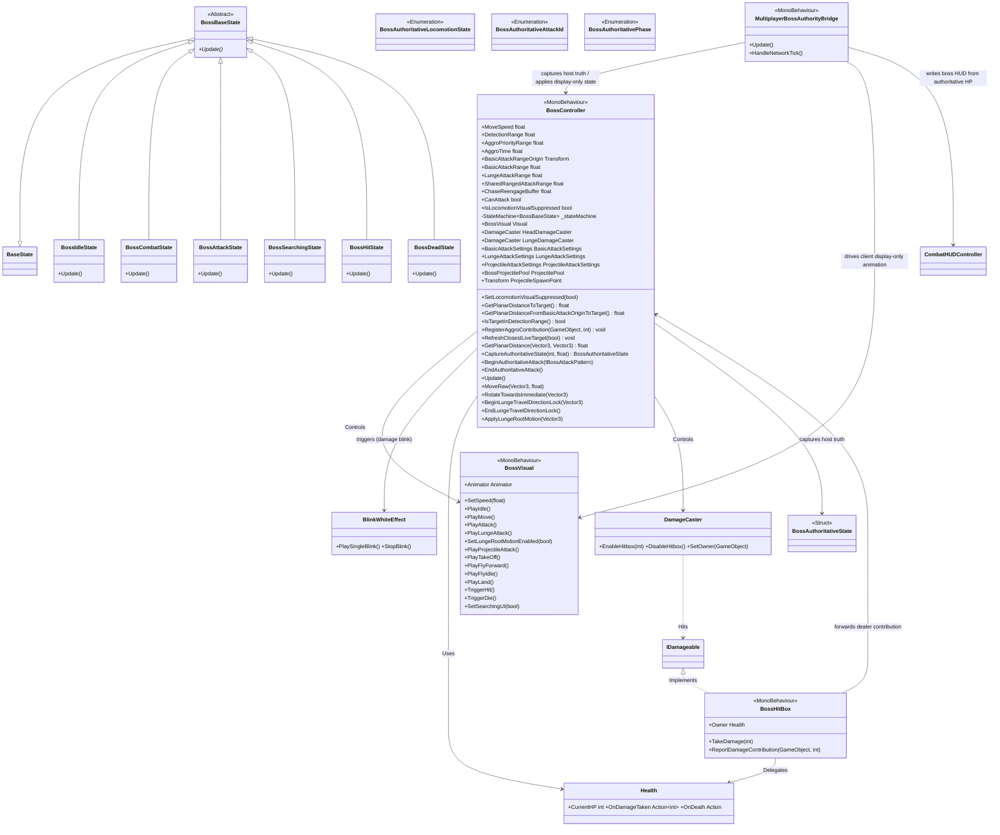
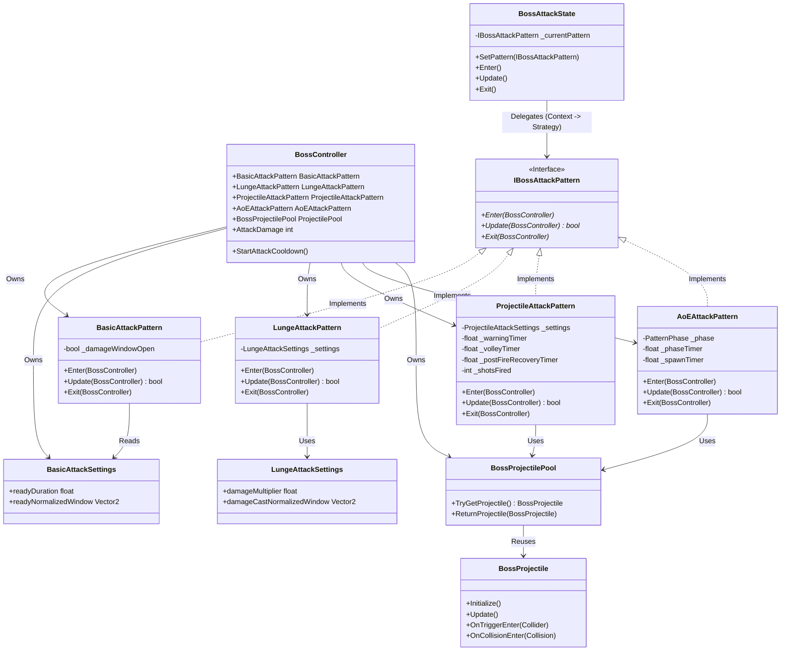
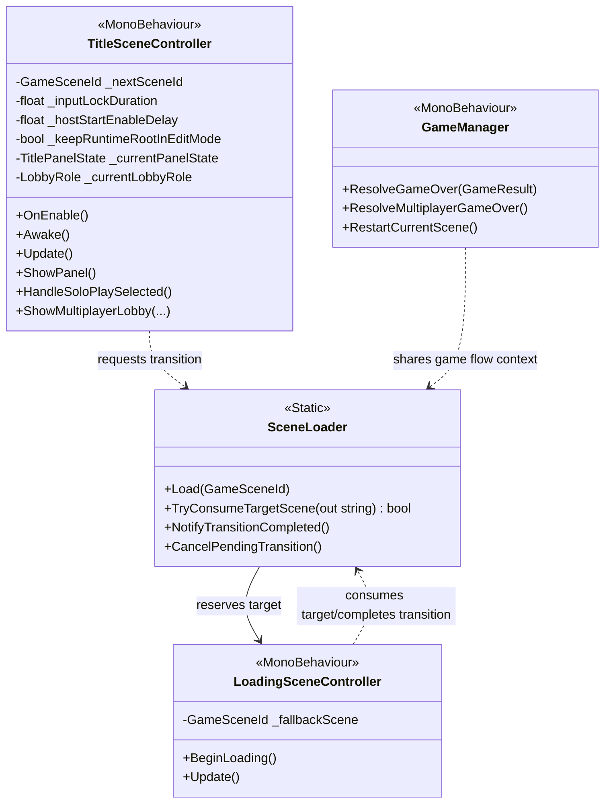

# 🛠️ System Blueprint: Boss Raid Portfolio

이 문서는 프로젝트의 핵심 아키텍처 설계와 데이터 규칙을 정의합니다. AI 및 개발자는 이 청사진을 준수하여 코드를 작성해야 합니다.

## 1. Core Architecture Philosophy
* **Decoupling (탈응집)**: 입력(Provider) → 해석(Controller) → 행동(State)의 단방향 의존성 유지.
* **Network-Ready Data**: 로직에는 `bool`이나 `Input` 클래스를 직접 사용하지 않고, 반드시 직렬화 가능한 `PlayerInputPacket` 구조체만 전달한다.
* **Zero-GC**: `Update` 루프 내에서의 메모리 할당(new)을 금지하며, 구조체(Struct)와 NonAlloc 물리 API를 사용한다.

---

## 2. Technical Class Diagram (Target Architecture)
본 프로젝트는 `StateMachine` 패턴을 기반으로 Player와 Boss의 로직을 제어합니다.

### 2.1. Player System Architecture

```mermaid
classDiagram
    direction TB

    %% Interfaces
    class IInputProvider {
        <<Interface>>
        +GetInput() PlayerInputPacket
    }
    class IDashContext {
        <<Interface>>
        +StartDashCooldown()
    }
    class IAttackable {
        <<Interface>>
        +AttackCombos AttackComboData[]
    }
    class IDamageable {
        <<Interface>>
        +TakeDamage(int)
    }
    class IBossAttackHitReceiver {
        <<Interface>>
        +ReceiveBossAttackHit(BossAttackHitData) BossAttackHitResolution
    }

    %% Data
    class PlayerInputPacket { <<Struct>> }
    class AttackComboData { <<Struct>> }
    class InputFlag { <<Enumeration>> }
    class ClientToHostPlayerActionIntent { <<Struct>> }
    class HostPlayerState { <<Struct>> }
    class HostToClientPlayerReactionSnapshot { <<Struct>> }
    class MultiplayerLocomotionState { <<Struct>> }
    class BossAuthoritativeState { <<Struct>> }
    class BossAuthoritativeLocomotionState { <<Enumeration>> }
    class BossAuthoritativeAttackId { <<Enumeration>> }
    class BossAuthoritativePhase { <<Enumeration>> }
    class BossAttackHitData { <<Struct>> }
    class BossAttackHitType { <<Enumeration>> }
    class BossAttackHitResolution { <<Enumeration>> }

    %% Core Components
    class PlayerController {
        <<MonoBehaviour>>
        +MoveSpeed float
        +Animator Animator
        -_stateMachine StateMachine
        -_multiplayerPresentationDriver MultiplayerPlayerPresentationDriver
        +MoveState MoveState
        +DashState DashState
        +JumpState JumpState
        +AttackState AttackState
        +HitState HitState
        +StunState StunState
        +DeadState DeadState
        +PlayerVisual Visual
        +Update()
        +SetCameraRoot(Transform)
        +GetAttackFacingDirection() Vector3
        +SetActionAuthorityMode(...)
        +CaptureCurrentLocomotionState(...)
        +ApplyLocomotionState(...)
        +SimulateLocomotionTickFromCurrent(...)
        +TryStartAuthoritativeAttackComboStep(...)
        +TryStartAuthoritativeDash(...)
        +TryStartAuthoritativeAttack1(...)
        +ApplyAuthoritativeReactionSnapshot(...)
        +RefreshLocalPresentationBindings()
        +GetPreferredCameraFollowPosition() Vector3
        +SetPendingComboHudStep(int)
        +ShowComboHud(int)
        +HideComboHud()
    }

    class BaseState {
        <<Abstract>>
        +Enter()
        +Exit()
    }

    class PlayerBaseState {
        <<Abstract>>
        +Update(PlayerInputPacket)*
    }

    class LocalInputProvider { +GetInput() }
    class MultiplayerBufferedInputProvider {
        +SetInput(PlayerInputPacket, int)
        +Clear()
        +GetInput()
    }
    class PlayerLocomotionCore {
        <<Static>>
        +CaptureCurrentState(...)
        +ApplyState(...)
        +SimulateTick(...)
    }
    class MultiplayerPlayerAvatar {
        <<NetworkBehaviour>>
        +OnNetworkSpawn()
        +SubmitOwnerInputServerRpc(...)
        +SubmitOwnerActionIntentServerRpc(...)
        +PushAuthoritativeLocomotionStateClientRpc(...)
        +PushApprovedActionStartClientRpc(...)
        +PushReactionSnapshotClientRpc(...)
        +SubmitRetryReadyIfOwner()
        +TryGetReplicatedHealth(out int, out int) bool
        +IsReplicatedDead bool
        +IsRetryReady bool
        +GetActiveAvatarCount() int
    }
    class MultiplayerBossAuthorityBridge {
        <<MonoBehaviour>>
        +Update()
        +HandleNetworkTick()
        +TryGetLatestBossState(out BossAuthoritativeState) bool
        +HasLatestBossState bool
        +IsBossDead bool
    }
    class HostPlayerActionValidator { +TryValidate(...) }
    class HostPlayerReactionResolver {
        +SeedFromRuntime(...)
        +SyncRuntimeState(...)
        +TryResolveBossHit(...)
        +TryRecordDamageContribution(...)
    }
    class MultiplayerPlayerPresentationDriver {
        +RefreshBindings()
        +HandleSimulationModeChanged(...)
        +UpdatePredictedLocomotionPresentation(PlayerInputPacket)
        +GetPreferredCameraFollowPosition() Vector3
    }
    class MultiplayerLocalPlayerRegistry {
        <<Static>>
        +LocalPlayer PlayerController
        +SetLocalPlayer(PlayerController)
        +Clear()
    }
    class PlayerVisual { +Animator Animator }
    class BlinkWhiteEffect {
        +PlayBlink(float)
        +PlaySingleBlink()
        +SetBlink(bool)
        +StopBlink()
    }
    class ThirdPersonCameraController {
        <<MonoBehaviour>>
        +LateUpdate()
        +FollowOffset Vector3
        +MouseYawPitchControl
    }
    class CombatHUDController {
        +Initialize(Health, Health)
        +SetPlayerHpNormalized(float, int, int)
        +SetPlayerName(string)
        +SetBossName(string)
        +SetPartnerName(string)
        +SetPartnerHpNormalized(float, int, int)
        +SetPartnerHudVisible(bool)
        +SetPlayerTorso(Sprite)
        +ShowCombo(int)
        +HideCombo()
        +ShowHud(bool)
        +ShowDamageFeedback(bool, int)
    }
    class DamageCaster {
        +OnAttackHitConfirmed Action
        +OnAttackWindowResolved Action~bool,int~
        +EnableHitbox(int)
        +DisableHitbox()
    }
    class Health {
        +CurrentHP int
        +OnDamageTaken Action
        +OnDeath Action
    }

    %% Concrete States
    class MoveState { +Update() }
    class DashState { +Update() }
    class JumpState { +Update() }
    class AttackState { +Update() }
    class HitState { +Update() }
    class StunState { +Update() }
    class DeadState { +Update() }

    %% Relationships
    LocalInputProvider ..|> IInputProvider : implements
    MultiplayerBufferedInputProvider ..|> IInputProvider : implements
    PlayerController ..|> IDashContext : implements
    PlayerController ..|> IAttackable : implements
    PlayerController ..|> IBossAttackHitReceiver : implements
    Health ..|> IDamageable : implements

    PlayerController --> IInputProvider : uses
    PlayerController --> PlayerVisual : controls
    PlayerController --> BlinkWhiteEffect : triggers (post-stun blink)
    PlayerController --> DamageCaster : controls/subscribes
    PlayerController --> CombatHUDController : updates
    PlayerController --> Health : owns
    PlayerController --> PlayerLocomotionCore : delegates shared locomotion sim
    PlayerController --> MultiplayerPlayerPresentationDriver : delegates multiplayer presentation
    ThirdPersonCameraController --> PlayerController : reads look cache / injects CameraRoot
    ThirdPersonCameraController --> MultiplayerLocalPlayerRegistry : resolves local owner in multiplayer
    MultiplayerPlayerAvatar --> PlayerController : configures runtime role / starts approved action / applies owner reaction
    MultiplayerPlayerAvatar --> LocalInputProvider : toggles local owner input
    MultiplayerPlayerAvatar --> MultiplayerBufferedInputProvider : writes remote owner input
    MultiplayerPlayerAvatar --> ClientToHostPlayerActionIntent : emits action edges
    MultiplayerPlayerAvatar --> HostPlayerActionValidator : validates dash/attack start
    MultiplayerPlayerAvatar --> HostPlayerReactionResolver : resolves host reaction
    MultiplayerPlayerAvatar o-- HostPlayerState : keeps host truth
    MultiplayerPlayerAvatar o-- HostToClientPlayerReactionSnapshot : caches latest reaction
    MultiplayerPlayerAvatar o-- MultiplayerLocomotionState : snapshots/replay
    MultiplayerBossAuthorityBridge --> BossAuthoritativeState : sends/applies dedicated boss state
    ClientToHostPlayerActionIntent --> InputFlag : reuses action bits
    HostPlayerActionValidator --> HostPlayerState : writes accepted action
    HostPlayerReactionResolver --> HostPlayerState : updates
    HostPlayerReactionResolver --> HostToClientPlayerReactionSnapshot : creates

    PlayerBaseState --|> BaseState : extends
    MoveState --|> PlayerBaseState : extends
    DashState --|> PlayerBaseState : extends
    JumpState --|> PlayerBaseState : extends
    AttackState --|> PlayerBaseState : extends
    HitState --|> PlayerBaseState : extends
    StunState --|> PlayerBaseState : extends
    DeadState --|> PlayerBaseState : extends

    DamageCaster ..> IDamageable : depends
    DamageCaster ..> IBossAttackHitReceiver : depends (Boss attack metadata)
    LocalInputProvider o-- PlayerInputPacket : creates
```

### 2.2. Boss AI Architecture (The Dragon)
거리 기반 상태 전환, closest-target base + recent-damage aggro override, 비주얼 분리(BossVisual)가 적용된 보스 전용 구조입니다.

**관련 코드:**
*   **Controller**: `Assets/Scripts/Boss/BossController.cs`
*   **Visual**: `Assets/Scripts/Boss/BossVisual.cs`
*   **States**: `Assets/Scripts/Boss/BossFSM.cs` (모든 Boss State 클래스 포함)
*   **Attack Patterns**: `Assets/Scripts/Boss/Attacks/` (`IBossAttackPattern.cs`, `BasicAttackPattern.cs`, `LungeAttackPattern.cs`, `ProjectileAttackPattern.cs`, `AoEAttackPattern.cs`)
*   **Combat**: `Assets/Scripts/Common/Combat/Health.cs`, `Assets/Scripts/Common/Combat/DamageCaster.cs`, `Assets/Scripts/Common/Combat/BossHitBox.cs`

**현재 배치 원칙:**
* `HeadDamageCaster`, `LungeDamageCaster`는 Boss 로직 계층(루트 또는 루트 하위 로직 오브젝트)에 둔다.
* `HeadDamageCasterPlace`, `BodyDamageCasterPlace`는 Visual/Bone 계층에 남기고 `_castCenter` 앵커로만 사용한다.
* `Head`, `Body`의 `BossHitBox`와 Collider는 피격용이므로 Visual/Bone 계층에 유지한다.

### 2.3. Boss Attack System (Strategy Pattern)
공격 패턴의 확장성을 위해 `Strategy Pattern`을 적용했습니다. `BossAttackState`는 구체적인 공격 로직을 알지 못하며, 주입된 `IBossAttackPattern`에게 실행을 위임합니다.

**관련 코드:**
*   **Attack Patterns**: `Assets/Scripts/Boss/Attacks/` (`IBossAttackPattern.cs`, `BasicAttackPattern.cs`, `LungeAttackPattern.cs`, `ProjectileAttackPattern.cs`, `AoEAttackPattern.cs`)
*   **Projectile Pooling**: `Assets/Scripts/Boss/Projectiles/` (`BossProjectilePool.cs`, `BossProjectile.cs`)

### 2.4. Game Flow Architecture (Title -> Loading -> GamePlay)
타이틀 입력, 로딩 연출, 전투 씬 진입을 분리한 게임 루프 시작 구간 구조입니다.

**관련 코드:**
*   **Flow Entry**: `Assets/Scripts/Common/TitleSceneController.cs`
*   **Transition Router**: `Assets/Scripts/Common/SceneLoader.cs`
*   **Loading Orchestrator**: `Assets/Scripts/Common/LoadingSceneController.cs`
*   **Result & Restart**: `Assets/Scripts/Common/GameManager.cs`

`TitleSceneController`는 `MultiplayerModePanel / HostCreatePanel / ClientJoinPanel / LobbyPanel / WrongKeyPopup`을 title flow 검증용 패널 묶음으로 유지한다.
이 경로는 title flow/layout 확인과 menu state transition 확인에 사용한다.

---

## 3. Current Implementation Snapshot

아래 표는 일자별 작업 기록이 아니라, 현재 런타임 계약을 빠르게 확인하기 위한 구조 스냅샷입니다.
세부 규칙, 실험 기록, 검증 로그는 각 전용 문서를 기준으로 유지합니다.

### 3.1. Core Systems & Input
| Component | Note |
| --- | --- |
| **Input Provider Layer** | `IInputProvider`를 기준으로 local input과 multiplayer buffered input을 분리한다. |
| **Input Packet** | `PlayerInputPacket`은 bit-packed 버튼 입력과 직렬화 가능한 데이터만 운반한다. |
| **StateMachine** | Player와 Boss는 `StateMachine` 기반으로 상태를 전환하고, Controller는 실행 진입점만 노출한다. |
| **Physics & Pooling** | 물리 판정은 NonAlloc 경로를 기준으로 하며, 보스 투사체는 `BossProjectilePool`로 재사용한다. |
| **Camera Module** | `ThirdPersonCameraController`가 `CameraRoot`와 look 입력 기반 orbit을 담당한다. 2026-04-07 spectator follow-up 기준 multiplayer에서 local avatar가 dead이고 partner가 alive면, local death edge 뒤 약 `2.5초`를 기다린 다음 local look/orbit ownership은 유지한 채 follow position만 alive partner 쪽으로 전환한다. |
| **Multiplayer Runtime Bridge** | `MultiplayerPlayerAvatar`, `MultiplayerBossAuthorityBridge`, `PlayerLocomotionCore`, `MultiplayerPlayerPresentationDriver`가 각각 player authority glue, boss authority bridge, shared locomotion, local presentation을 분담한다. 2026-04-07 result flow follow-up 기준 avatar는 replicated HP/dead뿐 아니라 retry-ready bit와 active avatar registry도 같이 들고, `GameManager`는 이 shared multiplayer bridge surface를 result/retry count source로 재사용한다. same-day cleanup 이후 temporary action trace, disconnect/session continuity debug, boss lunge debug spam은 제거하고 current verify에는 warnings/errors 위주로 남긴다. |
| **Balance Tooling** | `Assets/Editor/PlayerBossBalanceToolWindow.cs`는 `Tools/Balance/Open Player Boss Balance Tool` editor window를 제공한다. one combined JSON file 안에 `player` / `boss` section을 묶고, current scope에서는 `Health` max HP와 `PlayerController`/`BossController`의 selected balance field만 export/import 한다. target은 prefab asset과 verify scene 둘 다 지원하며, scene path는 `Assets/Scenes/mutiplayer/GamePlayScene_Verify.unity`, default player prefab path는 `Assets/Resources/Multiplayer/MultiplayerPlayerAvatar.prefab`를 기준으로 한다. |

### 3.2. Player System
| Component | Note |
| --- | --- |
| **Movement Logic** | 이동/대시/점프 로직은 각 Player State가 판단하고, 실제 이동 실행은 `PlayerController`가 담당한다. |
| **Attack Logic** | `AttackState`는 콤보, 캔슬, 개별 데미지 윈도우를 처리하며, multiplayer에서는 Host-approved action start를 기준으로 동작한다. |
| **Camera & Presentation** | 카메라 입력과 `CameraRoot` 관리는 `ThirdPersonCameraController`가 맡고, multiplayer local 화면 보정은 `MultiplayerPlayerPresentationDriver`가 visual-only helper로 담당한다. dead local player spectator는 alive partner의 exact camera를 공유하지 않고, dead player의 own orbit input을 유지한 채 약 `2.5초` 뒤 partner `GetPreferredCameraFollowPosition()`만 따라간다. |
| **Hit & Reaction** | 플레이어는 `IBossAttackHitReceiver`를 통해 보스 공격 메타데이터를 받고, hit/stun/death 반응은 authoritative snapshot apply를 기준으로 정리한다. |
| **HUD Binding** | `CombatHUDController`는 player/boss HP, combo, damage feedback을 관리한다. multiplayer에서는 player HUD는 avatar-driven authoritative path를 쓰고, boss HUD는 local boss `Health` 대신 `MultiplayerBossAuthorityBridge`가 boss authoritative snapshot으로 직접 갱신한다. same viewer-side HUD path는 portrait에도 적용되어, Host 화면은 Host portrait가 좌측 main HUD에, Client 화면은 Client portrait가 좌측 main HUD에 오도록 `MultiplayerPlayerAvatar`가 local viewer 기준으로 portrait layout도 다시 쓴다. `MultiplayerPlayerAvatar.TryGetReplicatedHealth(...)`도 same HUD replica를 result-flow read source로 재사용한다. |
| **Animator & Validation** | `PlayerAnimatorGuard`가 플레이어 Animator 상태/이벤트 계약의 누락을 점검하고 복구 경로를 제공한다. |

### 3.3. Boss System (The Dragon)
| Component | Note |
| --- | --- |
| **Boss Logic (FSM)** | `BossController`는 Idle, Combat, Attack, Searching, Hit, Dead 흐름을 상태 머신으로 관리한다. |
| **Boss Sensors** | 타겟 감지와 공격 거리 평가는 Y를 제외한 XZ 거리 기준으로 수행한다. 기본 타겟 획득 fallback은 closest live player지만, current target이 `AggroPriorityRange` 안에 있는 동안에는 attack 전/후에도 그 target을 계속 유지한다. boss가 어느 플레이어에게서든 첫 피격을 받으면 `AggroTime`이 시작되고, 타이머 동안 current target을 유지한 채 cycle damage를 누적한다. 타이머가 끝난 뒤 두 플레이어가 `AggroPriorityRange` 안에 함께 있으면 current cycle damage winner로 target을 한 번 교체하고, 새 피격이 들어오면 다음 cycle이 다시 시작된다. current implementation의 target refresh path는 `scan live targets -> resolve aggro priority -> apply target if changed` 순서로 분리해 유지한다. inspector tuning은 detection-related 값(`AggroPriorityRange`, `DetectionRange`, `LungeAttackRange`, `SharedRangedAttackRange`, `ChaseReengageBuffer`, `SearchDuration`)을 `Detection Settings`에 모으고, `AggroTime`만 `Aggro Settings`에 분리한다. |
| **Boss Navigation** | 추적 이동, 즉시 회전, attack-range hysteresis, locomotion visual suppression을 분리해 관리한다. aggro timer는 `AttackState`와 phase intro 중에는 pause되어 animation 전환을 방해하지 않는다. |
| **Boss Combat** | 공격 선택은 pattern range filtering과 `Strategy Pattern`을 기준으로 구성되며, Basic/Lunge/Projectile/AoE 슬롯을 같은 attack state에서 위임한다. Phase2의 Projectile/AoE entry gate는 `SharedRangedAttackRange` 하나를 공용 source로 사용한다. |
| **DamageCaster Ownership** | `HeadDamageCaster`, `LungeDamageCaster`는 Boss 로직 계층에 두고, 실제 위치 추종은 visual/bone 계층의 anchor를 사용한다. |
| **Lunge Contract** | Lunge는 animation event + normalized-time fallback + root motion relay를 조합해 phase 전환과 이동을 제어한다. |
| **Boss Authority Contract** | current `step 1-2` 기준 `BossController`는 `CaptureAuthoritativeState(...)`로 dedicated boss snapshot을 만들고, `MultiplayerBossAuthorityBridge`가 이 snapshot을 Host runtime-root에서 capture/send 한다. snapshot은 transform / locomotion state / current attack id / attack start server tick / HP / phase / dead flag만 담는다. |
| **Boss Multiplayer Read** | multiplayer client는 boss gameplay truth를 직접 계산하지 않고, disabled local boss object에 `MultiplayerBossAuthorityBridge`가 latest dedicated state의 display-only transform/semantic animator state를 apply하는 구조를 기준으로 한다. current baseline은 direct apply이며, same received boss tick은 한 번만 consume하고, move/search locomotion speed는 weak packet delta에서도 host locomotion speed를 바닥값으로 유지한다. boss HUD도 같은 bridge가 `CurrentHealth/MaxHealth` snapshot을 local `CombatHUDController`에 직접 써서 local disabled boss `Health`와 분리한다. same bridge는 `TryGetLatestBossState(...)` / `IsBossDead` read surface로 later result flow의 boss truth source도 제공한다. client gameplay prediction/extrapolation은 넣지 않는다. |
| **Boss Effect Replay** | attack 3/4의 spawned projectile/AoE visual은 `BossReplicatedEffectEvent`로 별도 전송한다. Host의 `ProjectileAttackPattern`/`AoEAttackPattern`이 실제 spawn 시점에 effect event를 큐에 적재하면, `MultiplayerBossAuthorityBridge`가 reliable named message로 remote client에 보내고, client는 local pooled `BossProjectile`/`AoECircleController`를 display-only로 재생한다. damage truth는 계속 Host-only다. |

### 3.4. User Interface (UI)
| Component | Note |
| --- | --- |
| **Combat HUD** | `CombatHUDController`는 HP bar, combo UI, damage feedback, 전체 HUD visibility를 제어한다. multiplayer boss HP는 `MultiplayerBossAuthorityBridge`가 authoritative snapshot 기준으로 직접 반영한다. same HUD controller는 prefab 안의 기본 Host/Client portrait pair를 캐시하고, local viewer가 누구인지에 따라 좌측 main portrait와 partner portrait를 swap한다. |
| **Player/Boss Labels** | HUD는 player, boss, partner label과 HP source를 분리해 solo/multiplayer 양쪽에 대응한다. multiplayer에서는 label뿐 아니라 portrait도 viewer-relative rule을 따라, Host 화면은 `Host(me)`가 좌측, Client 화면은 `Client(me)`가 좌측에 유지된다. |
| **Title Prototype UI** | `TitleSceneController`는 `TitleMainPanel`, multiplayer 선택 패널, join/lobby/wrong-key panel을 title flow 검증용으로 관리한다. |

### 3.5. Game Logic & Flow
| Component | Note |
| --- | --- |
| **Game Loop** | `TitleSceneController` -> `SceneLoader` -> `LoadingSceneController` -> `GameManager` 흐름으로 title, loading, gameplay, result를 분리한다. |
| **Scene Transition Contract** | target scene 예약/소비/완료 알림은 `SceneLoader`가 단일 진입점으로 관리한다. |
| **Restart & Result** | 전투 결과 처리와 current scene restart는 `GameManager`가 담당한다. solo는 기존 local `Health` death event path를 유지하고, multiplayer는 `MultiplayerBossAuthorityBridge.IsBossDead`로 `Victory`, active `MultiplayerPlayerAvatar` 둘 다 dead일 때만 `Defeated`를 판정한다. result UI는 `GameOver_Panel` 아래 `Image_Win` / `Image_Lose` art contract와 `Text_GameResult` root를 함께 토글하며, defeat 때만 `Press Enter to Play (x/2)` prompt를 같이 보여 준다. count source는 avatar retry-ready bit를 사용하되, `GameManager`가 same defeat round의 highest valid count를 latch해 teardown 순간 `1/2 -> 0/2` regression을 막는다. `2/2`가 되면 Host는 short delay 뒤 `MultiplayerSessionService.RestartGameplayAsync()`로 NGO gameplay scene reload와 player respawn을 다시 시작한다. |

---

## 4. Related Documents

| Topic | Source of Truth |
| --- | --- |
| **Coding rules / Zero-GC / physics rules** | `docs/technical/Coding_Standard.md` |
| **Input packet / FSM flow / state transition detail** | `docs/technical/Input_FSM_Flow.md` |
| **Technical term reference** | `docs/technical/Technical_Glossary.md` |
| **AI workflow / plan-first / document sync** | `docs/AI_Maintenance_Guide.md` |
| **Multiplayer overall design** | `docs/technical/multiplayer/Multiplayer_Design.md` |
| **Player action authority** | `docs/technical/multiplayer/player/Multiplayer_Player_Action_Authority.md` |
| **Boss authority** | `docs/technical/multiplayer/boss/Multiplayer_Boss_Authority.md` |
| **Boss aggro rule** | `docs/technical/multiplayer/boss/Mutiplayer_Boss_Aggro.md` |
| **Daily implementation history** | `docs/Progress_Log/README.md` 및 각 일자 로그 |

이 문서는 architecture overview와 current runtime snapshot을 유지한다.
일자별 변화, temporary verify 메모, detailed rule dump는 전용 문서에 남긴다.
