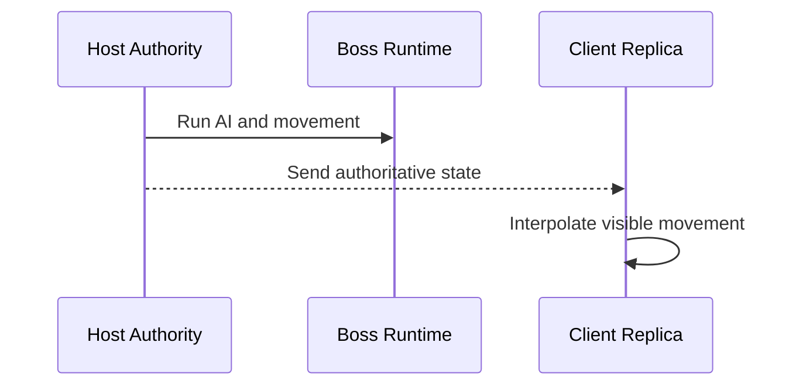
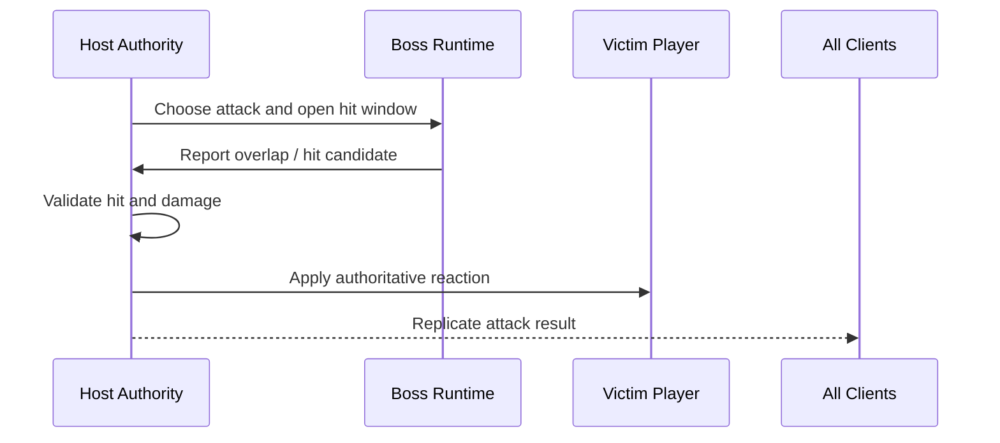
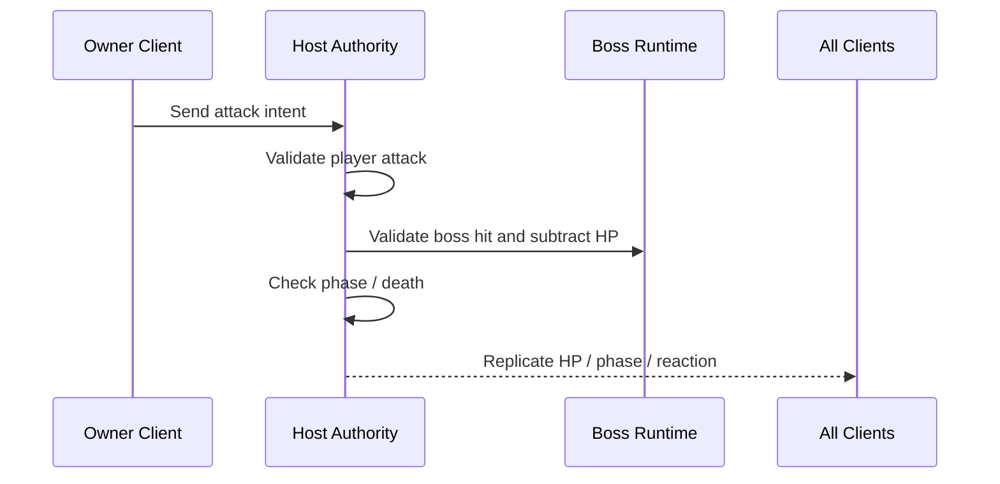
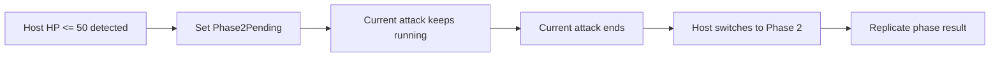

# 🐉 멀티플레이 보스 권한 문서

이 문서는 listen-server 기준에서 boss authority rule을 정리한 기준 문서다.

이 프로젝트의 multiplayer 기준선은 `Host Authority`이며,
boss는 player처럼 owner input을 가지는 오브젝트가 아니라,
Host가 직접 시뮬레이션하는 `server-owned NPC`로 본다.

---

## 1. 목적 (Purpose)

이 문서의 목적은 아래 4가지를 고정하는 것이다.

* boss가 누구의 authority를 따르는지 정한다.
* boss movement / attack / taking damage / phase change / death의 판정 주체를 정한다.
* Host와 Client가 boss에 대해 각각 무엇을 담당하는지 분리한다.
* boss multiplayer 구현 전에 `minimal replicated state`를 정리한다.

---

## 2. 현재 결론 (Current Conclusion)

2026-03-31 기준 current answer는 아래와 같다.

* boss는 `Host authoritative`다.
* boss는 `owner client`가 없다.
* boss AI / aggro / movement / attack / hit validation / HP / phase / death는 Host가 결정한다.
* client는 boss gameplay truth를 결정하지 않고, Host가 보낸 결과를 부드럽게 보여 준다.
* phase 2는 `HP <= 50%`를 Host가 감지한 뒤, `current attack end` 시점에 전환한다.

중요한 정정:

* `shared game object`는 여러 PC가 메모리를 직접 공유한다는 뜻이 아니다.
* 각 peer가 자기 로컬 boss instance를 가진다.
* Host boss instance가 truth를 쓰고, client boss instance는 그 truth를 읽는 replica/proxy다.

---

## 3. Sector Split

| 섹터 | 의미 | 기본 역할 |
| --- | --- | --- |
| Boss | replicated network object | gameplay state container |
| Host | authority writer | decision / simulation / validation |
| Client | replica reader | presentation / smoothing / local-only feedback |

### 3.1. Boss

boss는 `shared game object + replicated state`로 정리할 수 있다.

이 말의 뜻은 아래와 같다.

* Host와 Client 모두 boss 오브젝트를 로컬에 하나씩 가진다.
* 하지만 최종 truth는 Host boss가 쓴다.
* client boss는 그 결과를 읽고 화면에 재생한다.

### 3.2. Host

Host는 boss 관련 gameplay truth를 결정한다.

* target select
* aggro update
* movement path / rotate / stop
* attack pattern select
* hit window open / close
* projectile spawn and lifetime truth
* damage valid check
* HP change
* phase change
* death

### 3.3. Client

Client는 boss 관련 presentation을 담당한다.

* movement interpolation
* animator state playback
* telegraph, VFX, SFX
* boss HP bar / phase UI
* hit flash / camera shake / local audio

하지만 client는 아래를 final로 결정하지 않는다.

* who boss targets
* which attack boss uses
* whether hit was valid
* how much damage boss takes
* when phase changes
* when death starts

---

## 4. Authority Rule By Feature

| 기능 | Host | Client |
| --- | --- | --- |
| movement | authoritative movement sim | interpolation / optional limited extrapolation |
| aggro | target choose / retarget / alive check | display only |
| attack start | pattern choose / start tick / hit timing | telegraph + animation playback |
| projectile / hitbox | spawn / move / activate / resolve | show result |
| taking damage | validate hit, subtract HP, apply hit reaction | show hit flash / UI update |
| phase change | authoritative threshold detect + pending flag + current attack end switch | show Phase UI / VFX |
| death | authoritative start and result | show death animation / UI |

---

## 5. Minimal Replicated State

boss multiplayer 첫 버전은 모든 내부 변수를 다 보낼 필요가 없다.
아래처럼 중요한 state만 보내는 방향이 안전하다.

| 항목 | 용도 |
| --- | --- |
| transform | boss 위치/회전 표시 |
| locomotion state | idle / chase / turn / special move 표시 |
| current attack id | 어떤 패턴이 재생 중인지 표시 |
| attack start tick or time | telegraph / hit timing / recover timing 기준 |
| HP | HUD와 phase 판단 결과 표시 |
| phase | phase-specific visual / logic branch 표시 |
| dead flag | death / result flow |
| target id | facing / aggro presentation |

메모:

* client는 이 state를 바탕으로 visual을 만든다.
* Host는 이 state를 쓰는 쪽이다.
* 가능하면 `minimal data transfer`를 유지한다.

---

## 6. Flow

### 6.1. Boss Movement

즉, 보스의 실제 이동 계산은 Host가 수행하고,
Client는 전달받은 상태를 부드럽게 보여 주는 역할에 집중한다.

### 6.2. Boss Attack -> Player Hit

### 6.3. Player Attack -> Boss Damage

이 흐름에서 client는 `보스가 이미 피해를 받았다`를 직접 확정하지 않고,
Host 판정 결과를 반영한다.

---

## 7. Phase Change Rule

현재 대화 기준 기본 규칙은 아래와 같다.

* boss HP가 authoritative 기준으로 `50% 이하`가 되면 Host가 `Phase 2 pending`을 기록한다.
* 실제 `Phase 2 switch`는 현재 attack이 끝난 뒤에 실행한다.

하지만 중요한 점은 `조건이 단순해도 판정 주체는 Host`라는 것이다.

이유:

* HP truth는 Host가 가진다.
* client는 HP snapshot을 약간 늦게 받을 수 있다.
* phase timing은 attack cancel / next pattern / death race와 충돌할 수 있다.

간단한 흐름으로 쓰면:

---

## 8. Client Presentation Note

boss는 player보다 `client prediction` 필요성이 보통 더 낮다.
첫 버전에서는 아래 방향을 권장한다.

* movement는 interpolation 위주
* extrapolation은 필요할 때만 아주 제한적으로
* attack timing은 Host tick 기준
* local-only feedback은 허용

예:

* hit flash
* camera shake
* warning UI
* local sound choice

하지만 이 presentation은 gameplay truth를 바꾸지 않는다.

---

## 9. Open Questions (To Confirm)

아래는 boss authority 문서를 더 구체화할 때 확인하면 좋은 질문이다.

1. boss target rule은 `nearest alive player`, `last aggro target`, `weighted threat` 중 어떤 기준으로 갈지?
2. boss special movement가 있다면 (`charge`, `lunge`, `fly move`) 일반 chase와 같은 replication으로 볼지, attack-bound movement로 묶을지?

이 질문이 정리되면 boss authority 문서를 implementation-ready spec에 더 가깝게 좁힐 수 있다.
