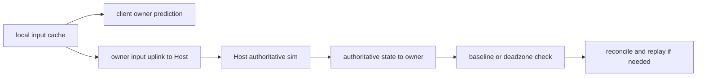

# 🧭 멀티플레이 클라이언트 이동 문서

이 문서는 현재 코드 기준의 멀티플레이 클라이언트 이동 구조를 정리한 기준 문서다.

이전 버전처럼 `2개 실행 경로가 현재도 같이 남아 있다`는 관점이 아니라,
`현재 런타임은 PredictionReconciliation 한 경로를 사용하고, Host-only 경로는 제거된 레거시다`
라는 기준으로 다시 정리한다.

---

## 1. 현재 결론

2026-03-30 현재 코드 기준 핵심 결론은 아래 4가지다.

* 현재 런타임 이동 경로는 `PredictionReconciliation` 하나다.
* 최종 판정은 여전히 Host가 담당한다.
* client는 `client authority`가 아니라 `local prediction`만 가진다.
* 과거 `HostOnlyCharacterController` / `LookOnly` / `LocomotionRuntimePath` switch는 현재 코드에서 제거됐다.

대표 근거 위치:

* `Assets/Scripts/Multiplayer/Gameplay/MultiplayerPlayerAvatar.cs:141`
* `Assets/Scripts/Multiplayer/Gameplay/MultiplayerPlayerAvatar.cs:335`
* `Assets/Scripts/Multiplayer/Gameplay/MultiplayerPlayerAvatar.cs:565`
* `Assets/Scripts/Multiplayer/Gameplay/MultiplayerPlayerAvatar.cs:826`
* `docs/technical/multiplayer/Multiplayer_Design.md:156`

---

## 2. 현재 구조 정리

### 2.1. 현재 런타임 경로

| 항목 | 현재 상태 |
| --- | --- |
| runtime path | `PredictionReconciliation` |
| client owner mode | `PredictedLocomotion` |
| Host locomotion mode | `AuthoritativeLocomotion` |
| Host non-locomotion fallback | `Full` |
| 최종 authority | Host |
| client 역할 | local prediction + reconcile/replay |

중요한 정정:

* 지금은 `2개 실행 경로가 현재 코드에 같이 있는 상태`가 아니다.
* 현재 코드는 `PredictionReconciliation`만 유지한다.
* non-locomotion 입력에서 Host가 `Full`로 돌아가는 것은 `다른 네트워크 구조`가 아니라 `같은 구조 내부 fallback`이다.

대표 근거 위치:

* `Assets/Scripts/Multiplayer/Gameplay/MultiplayerPlayerAvatar.cs:335`
* `Assets/Scripts/Multiplayer/Gameplay/MultiplayerPlayerAvatar.cs:420`
* `Assets/Scripts/Multiplayer/Gameplay/MultiplayerPlayerAvatar.cs:565`
* `Assets/Scripts/Multiplayer/Gameplay/MultiplayerPlayerAvatar.cs:826`
* `Assets/Scripts/Player/PlayerController.cs:15`

### 2.2. 현재 흐름 요약

쉬운 영어로 줄이면:

`client predicts first -> Host simulates same input -> Host sends truth -> client compares -> client replays if needed`

### 2.3. 6줄 추적 카드

1. `[S1] Trigger | 로컬 입력을 프레임 캐시 | Assets/Scripts/Player/LocalInputProvider.cs:42 | frame input cache`
2. `[S2] Entry | 네트워크 tick에서 inputSequence 증가 후 owner가 입력 전송 | Assets/Scripts/Multiplayer/Gameplay/MultiplayerPlayerAvatar.cs:420 | seq++ + ServerRpc`
3. `[S3] Gate | 첫 authoritative baseline을 받은 뒤, MoveState && buttons == 0일 때만 prediction 허용 | Assets/Scripts/Multiplayer/Gameplay/MultiplayerPlayerAvatar.cs:435 | locomotion-only prediction`
4. `[S4] Core Check | Host가 shared locomotion core로 같은 입력을 authoritative하게 시뮬레이션 | Assets/Scripts/Multiplayer/Gameplay/MultiplayerPlayerAvatar.cs:485 | same move/yaw/gravity rule`
5. `[S5] Effect | owner가 deadzone 확인 후 필요 시 reconcile/replay 수행 | Assets/Scripts/Multiplayer/Gameplay/MultiplayerPlayerAvatar.cs:141 | baseline/deadzone/replay`
6. `[S6] Result | 반응은 빠르고, 남은 미세한 떨림은 주로 predicted render 쪽에서 읽는다 | Assets/Scripts/Multiplayer/Gameplay/MultiplayerPlayerPresentationDriver.cs:247 | render trace`

### 2.4. 각 스크립트 역할

| 스크립트 | 현재 역할 |
| --- | --- |
| `Assets/Scripts/Multiplayer/Gameplay/MultiplayerPlayerAvatar.cs` | owner uplink, Host authority sim, authoritative snapshot, reconcile/replay |
| `Assets/Scripts/Player/PlayerController.cs` | solo FSM 유지 + locomotion wrapper + predicted presentation delegate |
| `Assets/Scripts/Player/PlayerLocomotionCore.cs` | shared locomotion capture / apply / simulate |
| `Assets/Scripts/Multiplayer/Gameplay/MultiplayerPlayerPresentationDriver.cs` | predicted render smoothing + predicted render trace |
| `Assets/Scripts/Player/LocalInputProvider.cs` | frame input cache |
| `Assets/Scripts/Multiplayer/Runtime/MultiplayerRuntimeRoot.cs` | multiplayer tick rate 설정 |

### 2.5. prediction 범위

현재 prediction은 `전체 캐릭터 예측`이 아니다.

현재 기준:

* `MoveState`
* `buttons == 0`

일 때만 locomotion prediction이 돈다.

즉, dash / attack / hit는 여전히 full character prediction 범위가 아니다.

대표 근거 위치:

* `Assets/Scripts/Multiplayer/Gameplay/MultiplayerPlayerAvatar.cs:925`
* `Assets/Scripts/Player/PlayerController.cs:363`
* `Assets/Scripts/Player/PlayerLocomotionCore.cs:45`

### 2.6. Host authority fallback

현재 구조에서 Host는 두 가지 simulation mode를 쓴다.

| 상황 | Host mode | 의미 |
| --- | --- | --- |
| locomotion-only | `AuthoritativeLocomotion` | shared locomotion core로 fixed-tick authority sim |
| non-locomotion | `Full` | 기존 solo FSM 경로를 Host authority로 실행 |

이건 `Path A와 Path B가 같이 산다`는 뜻이 아니다.
같은 Host-authoritative 구조 안에서 `locomotion-only prediction slice`가 있는 것이다.

대표 근거 위치:

* `Assets/Scripts/Multiplayer/Gameplay/MultiplayerPlayerAvatar.cs:550`
* `Assets/Scripts/Multiplayer/Gameplay/MultiplayerPlayerAvatar.cs:565`

### 2.7. 제거된 레거시 경로

아래 항목은 현재 코드에서 제거됐다.

* `RuntimeSimulationMode.LookOnly`
* `HostOnlyCharacterController`
* `LocomotionRuntimePath`
* old `LookOnly` presentation trace
* prefab의 `_locomotionRuntimePath`

즉, 과거 Host-only 경로는 `historical reference`로만 봐야 한다.
현재형 설명에는 넣지 않는 것이 맞다.

대표 근거 위치:

* `Assets/Scripts/Player/PlayerController.cs:15`
* `Assets/Scripts/Multiplayer/Gameplay/MultiplayerPlayerAvatar.cs:826`
* `docs/technical/Technical_Glossary.md:18`
* `docs/Progress_Log/2026-03-30.md:8`

---

## 3. 렌더링 정리

### 3.1. 현재 렌더링 위치

현재 owner 화면 보정은 `PlayerController` 본문이 아니라
`MultiplayerPlayerPresentationDriver`가 담당한다.

즉:

* gameplay truth는 Host + shared locomotion core
* visible body smoothing은 predicted presentation driver

로 역할이 갈라져 있다.

대표 근거 위치:

* `Assets/Scripts/Player/PlayerController.cs:282`
* `Assets/Scripts/Player/PlayerController.cs:399`
* `Assets/Scripts/Multiplayer/Gameplay/MultiplayerPlayerPresentationDriver.cs:60`

### 3.2. 무엇이 바뀌었는가

#### 3.2.1. smoothing 위치가 바뀌었다

예전에는 Host-only 지연을 body/camera masking으로 숨기려는 비중이 컸다.
지금은 `predicted tick target 사이를 어떻게 그릴지`가 핵심이다.

#### 3.2.2. motion rule이 바뀌었다

현재 owner visual body는 아래 규칙으로 움직인다.

`previous predicted tick -> current predicted tick`

즉, 늦은 root를 chase하기보다
predicted target 사이를 render frame에서 보간한다.

대표 근거 위치:

* `Assets/Scripts/Multiplayer/Gameplay/MultiplayerPlayerPresentationDriver.cs:60`
* `Assets/Scripts/Multiplayer/Gameplay/MultiplayerPlayerPresentationDriver.cs:247`

#### 3.2.3. snap rule이 바뀌었다

현재 중요한 snap 기준은 두 개다.

* 큰 거리 차이는 바로 snap
* sharp move-angle change도 snap

중요 숫자:

* `distance snap = 0.35`
* `transition snap angle = 35`

대표 근거 위치:

* `Assets/Scripts/Player/PlayerController.cs:150`
* `Assets/Scripts/Multiplayer/Gameplay/MultiplayerPlayerPresentationDriver.cs:12`
* `Assets/Scripts/Multiplayer/Gameplay/MultiplayerPlayerPresentationDriver.cs:341`

#### 3.2.4. tick-start alpha가 바뀌었다

current path는 tick-boundary frame이 exact zero에서 시작하지 않게
small `alphaFloor`를 준다.

현재 값:

* `alphaFloor = 0.05`

대표 근거 위치:

* `Assets/Scripts/Multiplayer/Gameplay/MultiplayerPlayerPresentationDriver.cs:13`
* `Assets/Scripts/Multiplayer/Gameplay/MultiplayerPlayerPresentationDriver.cs:383`

#### 3.2.5. easing curve가 바뀌었다

현재 interpolation alpha는 cubic ease-out이다.

`interpAlpha = 1 - (1 - t)^3`

이 뜻은:

* tick 초반에 catch-up을 좀 더 빨리 준다
* visible body가 한 tick 늦게 끌리는 느낌을 줄인다

대표 근거 위치:

* `Assets/Scripts/Multiplayer/Gameplay/MultiplayerPlayerPresentationDriver.cs:321`

### 3.3. 현재 렌더링 튜닝 값

| 항목 | 값 | 근거 위치 |
| --- | --- | --- |
| predicted render smooth time | `0.0167` | `Assets/Scripts/Player/PlayerController.cs:149` |
| predicted render snap distance | `0.35` | `Assets/Scripts/Player/PlayerController.cs:150` |
| transition snap angle | `35` | `Assets/Scripts/Multiplayer/Gameplay/MultiplayerPlayerPresentationDriver.cs:12` |
| tick-boundary alphaFloor | `0.05` | `Assets/Scripts/Multiplayer/Gameplay/MultiplayerPlayerPresentationDriver.cs:13` |
| correction deadzone position | `0.03` | `Assets/Scripts/Multiplayer/Gameplay/MultiplayerPlayerAvatar.cs:20` |
| correction deadzone yaw | `1.25` | `Assets/Scripts/Multiplayer/Gameplay/MultiplayerPlayerAvatar.cs:21` |
| network tick rate | `60` | `Assets/Scripts/Multiplayer/Runtime/MultiplayerRuntimeRoot.cs:11` |

### 3.4. 현재 판독 기준

현재 render quality는 `lag number`만 보면 안 된다.

같이 봐야 하는 값:

* `behindTicks`
* `visualVelMag`

뜻:

* `behindTicks`가 작아도
* `visualVelMag`가 크면
* 화면은 더 튄다

대표 근거 위치:

* `Assets/Scripts/Multiplayer/Gameplay/MultiplayerPlayerPresentationDriver.cs:299`
* `Assets/Scripts/Multiplayer/Gameplay/MultiplayerPlayerPresentationDriver.cs:314`

---

## 4. 현재 면접용 기억 카드

1. 현재 런타임 경로는 `PredictionReconciliation` 하나다.
2. client는 `local prediction`만 하고, final authority는 Host가 가진다.
3. locomotion-only 구간만 prediction하고, 나머지는 같은 구조 안에서 Host `Full` simulation으로 fallback한다.
4. shared truth는 `PlayerLocomotionCore`가 담당한다.
5. 남은 미세한 A/D 문제는 주로 `predicted render smoothing` 쪽에서 읽는다.
6. `LookOnly` / `HostOnlyCharacterController`는 현재 코드가 아니라 제거된 이력이다.

---

## 5. 관련 문서

* `docs/technical/System_Blueprint.md`
* `docs/technical/Technical_Glossary.md`
* `docs/technical/multiplayer/Multiplayer_Client_Movement_brief.md`
* `docs/Progress_Log/2026-03-30.md`
