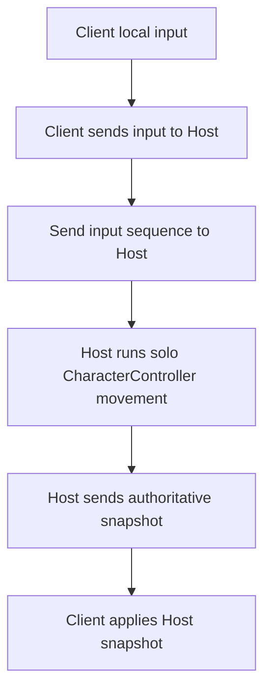
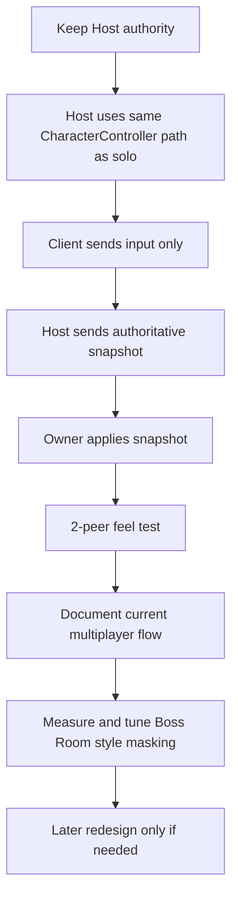

# 🧭 멀티플레이 클라이언트 이동 문서

이 문서는 `4.4 Host authority input path`의 현재 구현 상태와
지금까지 시도한 경로,
다시 하지 말아야 할 것,
다음 계획을 한 곳에 정리하는 기준 문서다.

쉬운 영어 설명:

이 문서는
`how client movement works now`,
`what we already tried`,
`what we should avoid`,
`what we do next`
를 같이 보는 문서다.

---

## 1. 문서 목적 (Purpose)

이 문서는 아래 내용을 고정한다.

* current client locomotion flow
* current implementation scope
* short history of failed/successful attempts
* do-not-retry checklist
* next safe plan

---

## 2. 기준 문서와 참조 로그 (Reference)

| 항목 | 문서 |
| --- | --- |
| 상위 설계 문서 | `docs/technical/multiplayer/Multiplayer_Design.md` |
| 세션 기준 문서 | `docs/technical/multiplayer/Multiplayer_Initialization_Session_Spec.md` |
| 시스템 구조 기준 | `docs/technical/System_Blueprint.md` |
| 용어 기준 | `docs/technical/Technical_Glossary.md` |
| 참조 로그 1 | `docs/Progress_Log/2026-03-25.md` |
| 참조 로그 2 | `docs/Progress_Log/2026-03-26.md` |

### 2.1. 현재 범위 (Current Scope)

현재 범위는 `locomotion under Host authority`다.

현재 포함:

* move
* rotate
* Host-only authoritative `CharacterController` path
* same movement truth as solo on Host
* client input uplink
* authoritative snapshot apply on owner
* local look/camera presentation only
* Boss Room style local owner visual child masking
* Boss Room style local owner camera follow masking
* move-start body snap on local owner visual
* medium-threshold faster catch-up while moving
* immediate local owner locomotion animator speed in `LookOnly`
* narrow large-angle local owner facing snap
* temporary local owner presentation trace hook
* temporary Path B client prediction trace hook
* explicit multiplayer NGO tick rate (`60`) for Path B runtime verify
* explicit `MultiplayerLocomotionInput` network contract
* shared `CharacterController` locomotion core for capture / apply / simulate

현재 비포함:

* owner locomotion prediction
* rollback/replay active path
* deterministic kinematic locomotion motor active path
* shared pure locomotion simulator active path
* attack prediction
* dash prediction
* stun/hit rollback

---

## 3. 현재 구현 상태 (Current Implementation State)

### 3.1. 현재 목표

현재 목표는 아래 두 가지를 같이 만족하는 것이다.

* Host stays final truth
* Client feels immediate and stable

쉬운 영어 설명:

클라이언트는 바로 움직이는 느낌이 나야 한다.
하지만 최종 정답은 Host가 가져야 한다.

### 3.2. 현재 흐름 (Current Flow)

현재 locomotion path는 쉬운 영어로 아래와 같다.

`client sends input -> Host simulates with solo CharacterController path -> Host sends authoritative state -> client applies snapshot`

### 3.3. 현재 흐름도

### 3.4. 현재 들어간 것 (What Is In)

| 항목 | 현재 상태 |
| --- | --- |
| owner input sequence | 구현됨 |
| Host authoritative locomotion snapshot | 구현됨 |
| same solo `CharacterController` path on Host | 구현됨 |
| reliable owner input RPC | 구현됨 |
| Boss Room style owner visual masking | 구현됨 |
| Boss Room style owner camera masking | 구현됨 |
| move-start body snap | 구현됨 |
| medium-threshold faster moving catch-up | 구현됨 |
| immediate local owner locomotion animator speed | 구현됨 |
| narrow local owner facing snap for large angle change | 구현됨 |
| temporary local owner presentation trace hook | 구현됨 |
| explicit `LocomotionRuntimePath` switch point | 구현됨 |
| explicit `MultiplayerLocomotionInput` contract | 구현됨 |
| shared `CharacterController` locomotion core | 구현됨 |
| client local locomotion prediction | 비활성 |
| rollback/replay active path | 비활성 |
| deterministic kinematic locomotion motor active path | 비활성 |
| shared pure locomotion simulator active path | 비활성 |
| Host/Client 2-peer feel validation | 아직 미완료 |

### 3.5. 현재 아직 남은 문제

현재 가장 중요한 남은 문제는 아래다.

* latest custom motor / pure-sim pass는 `going down + jitter` feedback을 남겼다.
* 더 큰 문제는 solo와 multiplayer의 movement truth가 갈라진다는 점이었다.
* 그래서 current active path는 다시 same `CharacterController` truth로 되돌렸다.
* current masking pass는 gameplay root를 바꾸지 않고, owner가 보는 visual/camera layer만 보정한다.
* latest follow-up은 remaining jitter가 `idle -> move start` body shake에만 남는다고 보고, move-start frame에서 visual body를 바로 snap하는 쪽으로 더 좁혀 적용했다.
* latest play feedback에서는 `forward jitter`는 줄었지만, client local view 기준 `body only`, `no camera shake`, `left/right or angle change`, `slightly slow input start/facing update`가 남았다.
* same test에서 Host screen은 client move를 smooth하게 봤다. 즉 current issue는 Host simulation이 아니라 `local owner body presentation` 쪽으로 더 좁혀졌다.
* latest coding follow-up은 그 feedback에 맞춰 `strong direction change`도 move-start와 같은 immediate body response로 묶어 봤지만, user test에서는 local client jitter와 delayed feel이 더 커져서 current active path에서는 다시 제거했다.
* latest narrow follow-up은 body position masking은 그대로 두고, `LookOnly` local owner가 locomotion `Speed` animator parameter를 즉시 갱신하고, 큰 facing angle change에서만 body rotation을 빠르게 snap하는 쪽으로 범위를 다시 좁혔다.
* latest latest follow-up은 local move input이 active인 동안 body visual position이 `SmoothDamp`로 늦게 따라가는 대신 authoritative target position을 바로 따르도록 더 좁게 바꿨다.
* latest user test says that `active move = direct follow` made jitter worse again. It now jitters on `idle -> move start`, `idle -> left/right`, `left -> forward -> right`, and even while moving. `Speed 0 -> 1` feel also did not improve. This means the patch should be treated as a failed attempt and revert candidate, not as the next base path.
* current active path에서는 `active move = direct follow`를 다시 제거했고, body position masking은 `move-start snap + idle/catch-up smooth catch-up` 상태로 되돌렸다.
* latest diagnosis step은 current active path를 바꾸지 않고, local owner presentation trace hook을 추가해 `root / target / visual / offset / yaw`를 log로 남기도록 했다.
* trace log shows `move-start snap` itself is working, but while moving `visualTargetOffset` grows to about `0.22 ~ 0.46`. This means the local body is still falling behind the Host target and then chasing it.
* current trace-based follow-up keeps the same Host truth, keeps `move-start snap`, does not use `direct follow`, and adds only one middle rule: while moving, if the body falls behind by a medium distance, use a faster temporary catch-up smooth instead of the normal slow smooth.
* latest Path B `Phase 0` step adds an explicit `LocomotionRuntimePath` switch point in `MultiplayerPlayerAvatar`. current default remains `HostOnlyCharacterController`, so revert is still one enum change away.
* latest Path B `Phase 1` step adds an explicit `MultiplayerLocomotionInput` network contract and routes current owner uplink / host buffer / replay history through that contract.
* latest Path B `Phase 2` step extracts shared locomotion capture / apply / simulate entry points into `PlayerController`, based on the current `CharacterController` rule.
* latest Path B `Phase 3` step turns on owner-local predicted locomotion tick under `PredictionReconciliation`. owner now stores input history and runs local locomotion sim immediately for locomotion-only scope.
* latest Path B `Phase 4` step makes Host consume the same locomotion input under the same shared `CharacterController` locomotion core and push authoritative locomotion state back to the owner.
* latest Path B `Phase 5` step turns on owner reconciliation / replay for locomotion-only scope. if Host state disagrees, owner restores Host state and replays pending predicted inputs.
* verify gameplay test path now serializes `_locomotionRuntimePath = PredictionReconciliation` on `Assets/Resources/Multiplayer/MultiplayerPlayerAvatar.prefab`, so `Assets/Scenes/mutiplayer/GamePlayScene_Verify.unity` can actually boot into Path B without manual inspector switching first.
* latest debug follow-up keeps one spawn-time runtime role log in `MultiplayerPlayerAvatar`, so console can show `selectedPath / activePrediction / server / owner / mode` directly.
* latest Path B debug cleanup keeps the real `PredictionReconciliation` owner trace as the main current debug line. `[MultiplayerClientMoveTrace]` now keeps `predict / fallback / reconcile` by default, while noisy `deadzone / duplicate` packets are disabled by default and can be turned back on only when deeper packet reading is needed. idle `predict` spam is also filtered out now, so current log focuses on active movement or real correction events.
* old `LookOnly`-only `[MultiplayerPresentationTrace]` is no longer the main current debug line and is disabled by default. It stays only as a fallback diagnostic for the older Host-only presentation path.
* latest Path B trace reading says `0 -> 1 speed` delay is now mostly gone, and Host authoritative state is usually landing in `deadzone` with `posError=0.000 / yawError=0.00`. This means the remaining walking jitter is now read more like `tick-step movement` than `correction jitter`.
* current next runtime fix is to stop relying on NGO default tick rate (`30`) and set an explicit higher multiplayer tick rate in `MultiplayerRuntimeRoot` for Path B runtime verification.
* latest tick-rate-60 verify result says the explicit tick-rate change made a real difference. current trimmed log shows normal walking is staying on the prediction path almost all the time.
* latest trimmed Path B log also says the remaining jitter is now very small and likely concentrated in the first authoritative baseline sync. early `reconcile` lines showed the same startup position mismatch (`posError=1.500`) before real movement began.
* latest narrow Path B follow-up applies that fix directly: owner client now accepts the first Host authoritative locomotion state as the startup baseline, then starts normal prediction/replay after that. Easy English: `wait for first Host baseline once, then predict normally`.
* latest user feedback + log reading now split the remaining issue into 2 cases. `A / D only` jitter is not reading like big correction tug-of-war anymore. It looks more like owner-local predicted render-side tick-step visibility, because those strafe sections stay mostly on `phase=predict`.
* dash-related jitter is a separate case. That one still matches `fallback / reconcile` behavior outside pure locomotion prediction scope, so it should not be mixed with the remaining pure strafe issue.
* current guess is: forward/back hides small step movement more easily, but left/right shows that same small step movement more clearly on screen. Easy English: `pure strafe jitter now looks more visual than authority mismatch`.
* latest narrow render follow-up uses that guess directly. `PredictedLocomotion` owner path now keeps the same prediction / Host authority / replay rules, but adds only a small render-side smoothing layer for the visible body child. Easy English: `keep Path B core, smooth only what the client sees`.
* latest user feedback after that smoothing pass says forward/back is now basically fine, but pure `A / D` still has only very slight jitter. current Path B log still stays mostly on `phase=predict`, so the next diagnosis step is to read the predicted visual layer itself, not the authority layer again.
* latest debug follow-up adds `[MultiplayerPredictedRenderTrace]` in `PlayerController` for `PredictedLocomotion` owner view. It focuses on lateral-dominant movement and logs `root / target / visual / visualTargetOffset / rootYaw / visualVelMag`. Easy English: `now we read the local body visual directly`.
* latest narrow render follow-up no longer uses `SmoothDamp` chase as the main predicted visual-body rule. It now interpolates the visible body child between `previous predicted tick -> current predicted tick` and keeps snap only for large gaps. Easy English: `draw between predicted ticks, do not chase the target`.
* latest narrow render follow-up 2 keeps that tick interpolation, but adds one short predicted-visual snap when move direction changes sharply. Easy English: `normal move = interpolate, sharp turn/strafe change = snap once`.

즉:

* current active question은 `how much medium moving catch-up Boss Room style masking can safely add without showing Host step jitter directly`다.
* latest Path B question is narrower: `does explicit higher NGO tick rate reduce walking tick-step jitter while keeping current prediction/reconciliation match`.
* latest current Path B question is now: `after the first authoritative baseline sync fix, is the remaining walking jitter still visible during real move loops`.
* latest current split question is: `for pure A / D strafe, is the remaining slight jitter now a render-side smoothing problem rather than a prediction/reconcile problem`.
* latest current Path B follow-up question is now: `does owner-local predicted render smoothing reduce pure strafe tick-step visibility without hurting the good 0 -> 1 response`.
* latest current diagnosis question is now: `on pure A / D, how far does the visible body child lag from the predicted root during the remaining slight jitter`.
* latest current Path B render question is now: `does tick-aware predicted render interpolation reduce pure A / D slight jitter better than SmoothDamp chase`.
* latest current transition question is now: `does one sharp-turn predicted visual snap remove the remaining slight strafe transition jitter`.

### 3.6. 현재 fallback rule

현재 gameplay truth rule은 아래와 같다.

* gameplay root / collider truth는 Host authoritative snapshot이 가진다.
* local owner는 root를 직접 움직이지 않는다.
* local owner가 보는 visual child와 camera follow anchor만 masking layer가 보정한다.
* runtime path switch는 남아 있고, current default는 아직 Host-only다.
* 하지만 `PredictionReconciliation`를 선택하면 locomotion-only 범위에서 real owner prediction + Host authoritative sim + reconciliation/replay가 now active다.
* move-start frame에서는 body visual position을 바로 snap한다.
* big error는 바로 snap한다.
* moving 중 medium-large error는 faster temporary smooth catch-up을 사용한다.
* idle/catch-up small error는 normal smooth catch-up을 사용한다.

쉬운 영어 설명:

지금은 gameplay root를 바꾸지 않는다.
owner가 보는 화면만 조금 덜 흔들리게 만든다.

---

## 4. 짧은 이력 (Short History)

과거는 아래 4줄만 기억하면 된다.

* `Host-only`
  stable but slow
* `Half prediction`
  fast but jittery
* `Rollback/replay`
  did not land well here
* `Custom motor`
  made drift from solo movement truth
* `Current reset`
  Host-only CharacterController path again

### 4.1. 현재 상태 한 줄 요약

* current question은 `authority direction`이 아니라 `how pure the locomotion simulator must be`다.

### 4.2. 이미 해본 것과 결과 (Tried Already)

아래 항목은 이미 실제 play feedback까지 받은 시도들이다.

1. `Host-only authoritative path`
   stable, but client felt slow.

2. `Half prediction`
   first feel was faster, but jitter came back.

3. `Rollback/replay + custom motor / pure sim`
   did not fit this project well, and movement truth drifted away from solo.

4. `Boss Room style masking`
   good as a direction, but only as a presentation helper, not as a gameplay replacement.

5. `move-start body snap`
   helped a little on first-frame shake, but did not solve the whole client feel problem.

6. `strong direction-change response window`
   made local client jitter and delayed feel worse, so it was removed.

7. `move-start lead`
   did not remove jitter, so it was removed.

8. `active move = direct follow`
   made jitter worse in more cases and did not improve `Speed 0 -> 1` feel.

9. `Path B Phase 0 - explicit switch point`
   added a safe runtime path switch first, and current default still stays on Host-only for fast revert.

10. `Path B Phase 1 - locomotion input contract`
   explicit network locomotion input struct is now in the current path.

11. `Path B Phase 2 - shared locomotion core`
   shared locomotion capture / apply / simulate logic is now extracted into `PlayerController`, using the same `CharacterController`-based rule that the current branch keeps as gameplay truth. old dead custom-motor branch is no longer part of the active path.

12. `Path B Phase 3 - local owner prediction`
   under `PredictionReconciliation`, owner now predicts locomotion immediately and stores predicted state history by input sequence.

13. `Path B Phase 4 - Host authoritative sim`
   Host now processes the same locomotion input with the same shared `CharacterController` locomotion core and returns authoritative state with ack sequence/server tick.

14. `Path B Phase 5 - reconciliation / replay`
   owner now compares Host state against predicted state and replays pending locomotion inputs when there is a mismatch.

쉬운 영어 요약:

* body-position tricks kept making the client body fight the delayed Host root.
* the more aggressive the body-position trick was, the worse the jitter became.
* this is why the next revert should remove `active move = direct follow`.

---

## 5. 다시 하지 말아야 할 것 (Do Not Retry Checklist)

아래 항목은 다음 client movement 작업에서 다시 메인 해법으로 채택하지 않는다.

* `half prediction`
  `client predicts -> Host corrects only` 경로는 다시 쓰지 않는다.
* `1~2 sec delay`
  큰 delay는 action feel만 나쁘게 만든다.
* `smoothing as the main fix`
  문제를 가릴 수는 있지만 원인을 해결하지 못한다.
* `visual-only fix as the real gameplay fix`
  presentation/camera masking은 visible jitter를 줄일 수는 있지만, gameplay truth를 대신하는 해법으로 쓰지 않는다.
* `client authority`
  현재 방향은 이미 `Host authority`로 고정됐다.
* `cleanup + movement experiment` 동시 진행
  hierarchy/scene 정리와 movement authority 실험은 분리한다.
* solo와 multiplayer movement truth를 따로 키우는 방향
  long-term maintenance cost가 너무 커진다.
* `custom movement logic will fix jitter by itself`라고 가정
  current branch feedback은 그 반대였다.
* `active move = direct follow`
  local body가 active move 동안 Host root step을 그대로 보게 되어 jitter가 더 커졌다. 같은 body-position trick을 다시 메인 해법으로 쓰지 않는다.

---

## 6. 유지해야 할 것 (Keep Checklist)

아래 기준은 계속 유지한다.

* `Host authority`를 final truth로 유지
* same `CharacterController + MoveState` truth as solo 유지
* `hostPlayer` / `clientPlayer` naming 유지
* legacy `Player` runtime removal 유지
* local camera/HUD는 local owner에만 bind
* client feel 실험보다 movement consistency 우선
* small step 뒤마다 2-peer smoke test

---

## 7. 다음 계획 (Next Plan By Reference)

### 7.1. 레퍼런스 기준

`reference_games.md`는 study material로 유지한다.

* `Boss Room`
  overall multiplayer structure 참고
* `TheEndGame`
  prediction architecture study reference
* `PredictionReconciliationNetwork`
  class role naming 참고
* `MultiplayerProject`
  queue / replay / interpolation 개념 참고

쉬운 영어 설명:

right now we do not follow a custom reference motor.
right now we keep the same gameplay movement truth as solo.

### 7.2. what to do next

1. Run Host/Client 2-peer validation on the current masked reset path.

2. Check only the base path first:
   - move start
   - move stop
   - diagonal move
   - rotate while moving

3. Write down the exact current multiplayer flow in easy English:
   - client input
   - Host movement
   - snapshot return
   - owner apply

4. Measure what still jitters:
   - root update feel
   - visual child feel
   - camera follow feel

5. Tune masking only in the presentation layer first.
   - smooth time
   - snap threshold
   - local owner camera follow damping
   - move-start body snap window
   - local owner facing response only, if needed
   - local owner locomotion animator response only, if needed

6. Keep gameplay root authoritative.
   - do not change solo movement logic
   - do not jump back to a custom motor

7. Keep action out for now.
   first locomotion stable
   later attack / dash / hit

### 7.3. 다음 계획 흐름도

### 7.4. 레퍼런스 기반 결론

`reference_games.md`를 기준으로 보면:

* `Boss Room`은 structure reference다.
* `TheEndGame`와 다른 prediction samples는 study reference다.
* current active implementation decision은 reference copy보다 `same movement truth as solo`가 더 우선이다.
* current masking pass는 `Boss Room style latency masking around an authoritative root`에 더 가깝다.

쉬운 영어 설명:

current movement step now looks closer to:
`same solo CharacterController truth first + Boss Room style masking`

and not:
`custom motor first`

next coding step should look closer to:
`measure + tune masking around the same authoritative root`

and more specifically:
`keep the fix narrow, and only tune one small local owner body response at a time`

not:
`new gameplay motor`

### 7.5. 왜 reference game은 괜찮아 보이는데, 현재 branch는 client control issue가 남는가

`reference_games.md` 기준으로 지금 상황을 쉬운 영어로 정리하면 아래와 같다.

* `Boss Room`은 우리와 같은 direct locomotion reference가 아니다.
  * server-authoritative는 맞다.
  * 하지만 movement는 `click-to-move + NavMesh + latency-masking animation` 쪽이다.
  * 그래서 `third-person direct move start feel`을 그대로 비교하기 어렵다.
* `TheEndGame`는 우리 문제에 더 가깝다.
  * fully authoritative
  * client prediction
  * reconciliation / replay
  * full movement state return
  * networking-ready movement core
* 하지만 current branch는 지금 `TheEndGame path` 위에 서 있지 않다.
  * current active path는 `same solo CharacterController truth first + Boss Room style masking`이다.

쉬운 영어 설명:

reference games look better because
they are solving a different movement problem,
or they are using a bigger networking movement architecture.

our current branch is still:

`client sends input -> Host moves root -> client sees Host root later`

그래서 local client 기준 `0 -> 1` start feel이 Host screen처럼 보이지 않는다.

### 7.6. 지금까지 무엇을 했는가

현재 branch에서 이미 한 일은 아래와 같다.

1. multiplayer ownership/runtime scaffold를 만들었다.
   * `hostPlayer` / `clientPlayer`
   * legacy `Player` runtime removal
   * local camera/HUD rebind

2. Host movement truth를 solo와 같은 경로로 고정했다.
   * same `CharacterController + MoveState`
   * Host authoritative snapshot apply

3. `Half prediction`을 시도했다.
   * first feel은 빨라졌지만 jitter가 다시 생겼다.

4. `rollback/replay + custom motor / pure sim`을 시도했다.
   * branch feedback 기준 solo truth와 멀어졌고,
   * `going down + jitter` 문제를 남겼다.

5. current reset 이후 `Boss Room style masking`을 얹었다.
   * body visual masking
   * camera follow masking
   * move-start snap
   * immediate animator speed
   * narrow facing snap

6. 더 좁은 body-position tricks도 시도했다.
   * strong direction-change response
   * move-start lead
   * active move = direct follow
   * medium moving catch-up
   * 결과적으로 body-position trick은 delayed Host root와 계속 싸웠다.

7. temporary presentation trace를 추가했다.
   * trace 기준
     * move-start snap 자체는 first frame에서 동작했다.
     * 하지만 그 직후 local body가 Host target을 다시 뒤쫓기 시작했다.
     * current console에서도 input start 직후 몇 프레임 동안 root/target이 그대로이고,
       그 다음 body가 뒤늦게 따라붙는다.

### 7.7. 지금 남은 일은 무엇인가

이제 남은 일은 사실상 2가지 path choice였고, current owner choice는 `Path B`다.

#### Path A. current Host-only CharacterController path를 유지

이 path는:

* gameplay truth가 solo와 같다
* 유지보수가 쉽다
* Host screen 기준 움직임은 안정적이다

하지만:

* local client `0 -> 1` start feel은 완전히 Host처럼 되기 어렵다
* 이유는 client가 real root를 바로 움직이지 않기 때문이다
* presentation-only tuning은 이미 limit에 가까워졌다

쉬운 영어 설명:

this path can stay stable,
but client start feel will stay a little late.

#### Path B. bigger locomotion architecture로 간다

이 path는 `TheEndGame` 쪽에 더 가깝다.

필요한 것:

* local owner prediction
* authoritative server/Host sim
* input tick / buffer
* authoritative full state return
* reconciliation / replay
* networking-ready movement core

쉬운 영어 설명:

if we want client feel close to Host,
this is the real path.

하지만:

* 작업량이 크다
* current solo `CharacterController` path와 어떻게 공유할지 다시 설계해야 한다
* locomotion부터 다시 정리한 뒤 dash / attack / hit로 확장해야 한다

### 7.8. 현재 결론

현재 문제는 주로 아래 세 가지가 아니다.

* camera
* Animator `Speed` parameter itself
* Host simulation correctness

현재 문제는 주로 이것이다.

* local client는 Host authoritative root가 시작되기를 기다린다
* 그래서 `0 -> 1` feel이 늦다
* 그 다음 visual body가 root를 따라붙으며 jitter가 보인다

즉:

* yes, this is partly an architecture problem
* not because multiplayer is fully broken
* but because direct third-person movement under Host authority is now hitting the limit of presentation-only masking

### 7.9. current chosen next plan: Path B

현재 선택된 다음 단계는 `Path B`다.

쉬운 영어 설명:

we are not choosing more masking tuning now.
we are choosing the bigger locomotion networking architecture.

#### 7.9.1. 목표

* client가 바로 반응하는 feel을 갖는다
* Host가 final truth를 유지한다
* 더 이상 body masking trick만으로 문제를 가리지 않는다

#### 7.9.2. 핵심 방향

이번 Path B는 아래를 같이 가져간다.

* `TheEndGame`식 architecture 참고
* full owner prediction
* Host authoritative sim
* authoritative state return
* reconciliation / replay

하지만 그대로 복사하지는 않는다.

* project codebase에 맞게 adapter 형태로 넣는다
* current branch에 이미 있는 ownership/session/runtime scaffold는 유지한다

#### 7.9.3. 왜 이렇게 가는가

현재 console/feedback 기준으로:

* `move-start snap` 자체는 first frame에서 동작한다
* 하지만 local client는 여전히 Host authoritative root가 실제로 움직이기 시작할 때까지 기다린다
* 그래서 `0 -> 1` feel이 늦다
* 그 다음 visual body가 Host root를 따라붙으며 jitter가 보인다

즉:

presentation-only masking만으로는 Host screen 같은 direct feel을 만들기 어렵다.

#### 7.9.4. 단계별 구현 계획

1. `Phase 0 - Revert Point / Switch`
   * current Host-only path를 안전한 revert point로 유지한다
   * prediction path는 switchable path로 붙인다
   * 실패 시 current path로 빠르게 돌아갈 수 있어야 한다

2. `Phase 1 - Network Locomotion Contract`
   * `LocomotionInput` 정의
   * `LocomotionState` 정의
   * tick / ack / move / look / velocity / grounded 기준을 명확히 한다

3. `Phase 2 - Shared Locomotion Core`
   * move / rotate / gravity / grounded 규칙을 shared simulator shape로 뽑는다
   * local owner prediction과 Host sim이 같은 locomotion rule을 쓰게 한다

4. `Phase 3 - Local Owner Prediction`
   * local input을 tick과 함께 저장한다
   * owner는 바로 local sim을 돌린다
   * predicted state history를 저장한다

5. `Phase 4 - Host Authoritative Sim`
   * Host는 같은 input을 authoritative path로 처리한다
   * authoritative locomotion state를 ack tick과 함께 owner에게 보낸다

6. `Phase 5 - Reconciliation / Replay`
   * owner는 authoritative state를 받으면 해당 tick state와 비교한다
   * mismatch가 있으면 그 tick state로 되돌린 뒤 pending input을 replay한다

7. `Phase 6 - Remote Separation`
   * owner만 prediction/replay를 쓴다
   * remote players는 interpolation만 유지한다

8. `Phase 7 - Later Extension`
   * locomotion이 안정화된 뒤
   * dash / attack / hit / stun을 확장한다

#### 7.9.5. 첫 구현 범위

첫 Path B coding slice는 locomotion only다.

포함:

* move start
* move stop
* forward / backward / left / right
* rotate while moving
* grounded / gravity if needed for current scene

비포함:

* dash
* attack
* hit
* stun

#### 7.9.6. 리스크와 revert rule

아래가 보이면 바로 revert candidate로 본다.

* jitter가 지금보다 더 커진다
* drift가 커진다
* control feel이 더 나빠진다
* solo / multiplayer truth가 다시 크게 갈라진다

쉬운 영어 설명:

if prediction path gets worse,
we switch back fast.

#### 7.9.7. 현재 문서 기준 한 줄

* current default runtime path는 아직 `Host-only CharacterController path`다.
* meaningful Path B gameplay test path는 now `PredictionReconciliation` switch path다.
* `Assets/Scenes/mutiplayer/GamePlayScene_Verify.unity`는 runtime player prefab 기준으로 이 path를 바로 타도록 맞췄다.

#### 7.10. Path B slight render change history wrap-up

이 섹션은 `pure A / D`에 남은 very slight jitter를 줄이기 위해, Path B render layer에서 무엇을 시도했고 무엇이 실제로 도움이 되었는지를 짧게 정리한다.

##### 7.10.1. 왜 별도 wrap-up이 필요한가

최근 movement work는 큰 구조 변경보다 `owner-local predicted render presentation`의 작은 조정들이 연속으로 들어갔다.

문제는:

* improvement는 있었지만 대부분 `slight` 수준이었다
* 비슷한 가설을 다른 이름으로 다시 시도할 위험이 있었다
* 다음 단계는 `guess the right numbers`가 핵심이 되므로, 이미 실패한 방향과 남은 tuning knob를 분리해서 기억할 필요가 있다

쉬운 영어 설명:

we should stop repeating similar render guesses.
we need one short memory of what changed,
what helped,
and what numbers still matter.

##### 7.10.2. 시도 순서와 결과

1. `Predicted render smoothing layer`
   * 가설: pure strafe jitter는 authority mismatch보다 render-side tick-step visibility에 가깝다
   * 적용: `PredictedLocomotion` local owner visible body child에만 small render smoothing layer 추가
   * 결과: forward/back는 거의 괜찮아졌고, `A / D`는 still slight jitter
   * 결론: render-side 접근 자체는 맞았지만, first smoothing rule은 충분하지 않았다

2. `Predicted render trace hook`
   * 가설 확인용 측정 추가
   * 로그: `root`, `target`, `visual`, `visualTargetOffset`, `rootYaw`, `visualVelMag`
   * 결과: pure strafe에서 `visualTargetOffset`가 대체로 `0.08 ~ 0.14` 정도로 남아 있었고, visible body가 predicted root를 계속 chase하고 있었다
   * 결론: core prediction보다 `visual child lag/chase`가 더 큰 문제로 보였다

3. `SmoothDamp chase -> tick interpolation`
   * 가설: moving target을 계속 chase하는 `SmoothDamp`보다, `previous predicted tick -> current predicted tick`를 render frame에서 그리는 쪽이 더 자연스럽다
   * 적용: predicted visual body main follow rule을 tick interpolation으로 교체
   * 결과: steady strafe에서 `visualTargetOffset`가 대체로 `0.06 ~ 0.07` 수준으로 내려갔다
   * 결론: 이 변경은 실제로 도움이 되었다. 현재 Path B render layer의 기본 답은 이쪽이다

4. `Sharp transition snap`
   * 가설: 남은 slight jitter는 steady strafe보다 `left -> forward -> right` 같은 transition frame에서 더 잘 보인다
   * 적용: sharp move-angle change일 때만 한 번 current predicted target으로 snap
   * 기준값: `PredictedPresentationTransitionSnapAngle = 35f`
   * 결과: transition jitter가 더 줄었지만, still very slight strafe jitter remains
   * 결론: 현재 단계에서는 large architecture issue가 아니라 `small transition/render tuning` 문제로 보인다

##### 7.10.3. 현재까지 확실히 배운 것

* `TickRate=60` 상승은 큰 차이를 만들었다
* `0 -> 1` speed feel 문제는 지금 거의 해결된 쪽이다
* pure locomotion에서는 `phase=predict`가 대부분이고, old Host fight 패턴은 많이 줄었다
* pure `A / D` 남은 issue는 now mostly `owner-local predicted render presentation`
* dash 쪽 jitter는 별도 문제다. pure locomotion render tuning과 섞어서 보면 안 된다

##### 7.10.4. 다시 하지 말 것

아래는 현재 문서 기준 `do not retry` 성격으로 본다.

* old `Host-only` body-position masking guesses를 Path B 위에 다시 얹기
* `SmoothDamp chase`를 main predicted render rule로 되돌리기
* broad direction-change body tricks 다시 시도하기
* `direct follow while moving` 류의 aggressive follow 복귀
* render issue를 authority/reconcile issue로 다시 오판해서 큰 구조를 다시 흔들기

##### 7.10.5. 지금 남은 tuning knobs

현재 slight render jitter tuning에서 실제로 의미 있는 숫자는 이쪽이다.

* `TickRate = 60`
  * 현재 baseline
  * `30 -> 60`은 큰 개선이 있었음
  * 아직 `60 -> 80`은 우선순위 아님

* `_multiplayerPredictedRenderSmoothTime = 0.0167f`
  * current predicted render interpolation window 값
  * 지금은 single visible gauge가 아니고 hidden runtime support 값으로 유지한다
  * current remaining pure `A / D` issue는 이 값보다 one-tick-behind render shape 쪽 단서가 더 강하다

* `_multiplayerPredictedRenderSnapDistance = 0.35f`
  * 큰 gap일 때 interpolation을 포기하고 snap하는 기준
  * 현재 normal slight jitter보다는 `big mismatch safety` 역할이 더 큼

* `PredictedPresentationTransitionSnapAngle = 35f`
  * sharp direction-change를 transition으로 볼 기준
  * 너무 낮으면 snap이 너무 자주 일어날 수 있음
  * 너무 높으면 transition 도움을 거의 못 줄 수 있음

##### 7.10.6. 현재 가장 가능성 높은 다음 숫자 guess

현재 상태에서 few tries로 맞추려면, 다음 우선순위가 가장 합리적이다.

1. `_multiplayerPredictedRenderSmoothTime`
   * 이유: interpolation window support 값으로는 아직 중요하지만, current visible tuning target은 아니다

2. `PredictedPresentationTransitionSnapAngle`
   * 이유: `left -> forward -> right` 같은 transition frame의 tiny leftover는 sharp transition rule 민감도와 더 관련 있어 보인다

3. `_multiplayerPredictedRenderSnapDistance`
   * 이유: normal pure strafe slight jitter보다는 big-gap safety 쪽이라 우선순위는 낮다

##### 7.10.7. 현재 문서 기준 한 줄

* Path B core is now mostly healthy.
* very slight pure `A / D` jitter now looks like `predicted render tuning`, not major authority mismatch.
* current active render rule is one shared `previous predicted tick -> current predicted tick` interpolation for all pure locomotion directions.
* next few tries should focus on trace-backed render logic, not on reopening lateral-lead tuning.

##### 7.10.8. current one-tick-behind clue and fix

latest pure `A / D` trace repeatedly showed `visualTargetOffset=0.100`. with `MoveSpeed=6` and `TickRate=60`, that is almost exactly one tick of movement.

so the current reading changed:

* remaining slight strafe jitter is not mainly `Host correction fight`
* it is closer to `visible body is often one predicted tick behind`
* `forward/back` hides that better, but lateral move shows it clearly on screen

for that reason, the latest narrow follow-up does **not** touch authority / replay / tick rate.
it only changes the local predicted render shape:

* old main shape: `previous predicted tick -> current predicted tick`
* failed lateral follow-up: `current predicted target + small lateral lead from predicted tick delta`
* current active shape: same `previous predicted tick -> current predicted tick` interpolation for `forward/back` and `A / D`, but with a stronger faster-early `cubic ease-out` alpha inside that tick window

easy English:

* do not keep a separate lateral-only render rule
* use the same interpolation rule for all pure locomotion directions
* keep sharp transition snap and big-gap snap as separate safety rules

this should stay a render-only follow-up. if it helps, keep it narrow. if it fails, do not change Path B core first.

##### 7.10.9. readable render-behind metrics

latest debug follow-up keeps the same `[MultiplayerPredictedRenderTrace]` prefix but adds the numbers needed to read smoothness more directly:

* `tickStep`
  * how far the predicted target moved in one prediction tick
* `behindTicks`
  * `visualTargetOffset / tickStep`
  * easy English: how many ticks behind the visible body is
* `interpMode`
  * current render interpolation mode
* `linearAlpha`
  * raw time progress inside the tick window before the easing curve
* `supportSmooth`
  * hidden interpolation support window still used under the hood
* `interpAlpha`
  * current eased progress inside the render interpolation window
  * current follow-up uses cubic ease-out, so it should catch up earlier than the old quadratic ease-out

##### 7.10.10. latest grouped lead result

latest grouped trace compared several lateral-lead samples directly against `behindTicks`.

* `0.0` was the best result in the latest grouped run
* `0.1` was the next best
* both negative values and bigger positive values were worse

##### 7.10.11. tick-boundary alpha floor follow-up

latest cubic ease-out follow-up improved the middle of each tick, but trace still showed some `linearAlpha=0.000`, `interpAlpha=0.000`, and `behindTicks=1.000` frames.

so the next narrow follow-up does not change prediction / replay / Host authority again. it only changes the first render frame inside the predicted tick window:

* before: first render frame after a new predicted target could start at exact `alpha = 0`
* current follow-up: predicted render now applies a small minimum start progress (`alphaFloor = 0.15`) before the cubic ease-out curve
* easy English: do not let the visual body spend one whole frame fully stuck on the previous tick target

trace now prints this as:

* `alphaFloor`
  * minimum start progress used for the tick-boundary render frame

success clue for this follow-up:

* fewer `linearAlpha=0.000`
* fewer `interpAlpha=0.000`
* fewer `behindTicks=1.000`

##### 7.10.12. alphaFloor reading correction

later grouped tests showed one important correction:

* `behindTicks` and `visualTargetOffset` only measure **how late** the visible body is
* they do **not** measure whether the body feels calm or jittery on screen
* for this last slight strafe issue, `visualVelMag` also matters

easy English:

* bigger `alphaFloor` can reduce lag
* but it can also make the visible body jump more aggressively inside the tick
* that can look worse even if `behindTicks` gets smaller

latest reading says the calmer visual zone is the low range:

* around `0.04 ~ 0.07`
* current default baseline is `0.05`

so the current recommendation changed:

* do not optimize only for smallest `behindTicks`
* read `behindTicks` **and** `visualVelMag` together
* for this project, visually calmer strafe matters more than chasing the absolute smallest lag number

easy English:

* more lateral lead is **not** automatically better
* too much lead makes the visible body chase/overlead more
* so the active path no longer uses the lateral-lead branch
* the gauge stays hidden to keep the verify flow simple

easy English reading rule:

* `behindTicks` close to `1.0` means `looks one tick behind`
* `behindTicks` around `0.2 ~ 0.4` usually means much smoother
* if `interpMode=easeOutPrevToCurrent` and jitter still remains, the next suspect is not lateral lead anymore

---

## 8. 성공 기준 (Success Criteria)

이 문서 기준으로 다음 movement 단계가 성공으로 보이려면 아래를 만족해야 한다.

* client move start가 즉시 반응한다
* client stop 뒤 extra slide가 거의 없다
* rotate 중 visible jitter가 없다
* Host authority는 유지된다
* solo와 multiplayer movement truth가 갈라지지 않는다

---

## 9. 한 줄 기억 카드 (Memory Card)

* `Host-only` was stable but slow.
* `Half prediction` was fast but jittery.
* `Custom motor` drifted from solo truth.
* Current reset uses Host-only CharacterController path again.
* Current Path B says `input-start is better, walking jitter now looks like tick-step movement`.
