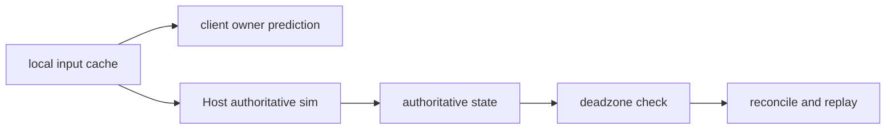

# 🧭 멀티플레이 클라이언트 이동 정리

이 문서는 `Multiplayer_Client_Movement.md`의 압축판이다.

면접이나 빠른 복습에서는 이 문서만 읽어도 되도록,
현재 코드 기준 핵심만 짧게 정리한다.

---

## 1. 한 줄 결론

현재 코드 기준 멀티플레이 이동은
`PredictionReconciliation 한 경로 + Host final authority + client local prediction`
으로 기억하면 된다.

중요한 정정:

* 지금은 `2개 실행 경로가 같이 남아 있는 상태`가 아니다.
* current runtime code는 `PredictionReconciliation`만 유지한다.
* old `HostOnlyCharacterController` / `LookOnly`는 제거된 레거시다.

대표 근거 위치:

* `Assets/Scripts/Multiplayer/Gameplay/MultiplayerPlayerAvatar.cs:335`
* `Assets/Scripts/Multiplayer/Gameplay/MultiplayerPlayerAvatar.cs:565`
* `Assets/Scripts/Multiplayer/Gameplay/MultiplayerPlayerAvatar.cs:826`
* `docs/technical/multiplayer/Multiplayer_Design.md:156`

---

## 2. 구조 요약

### 2.1. 현재 경로

| 항목 | 현재 상태 |
| --- | --- |
| runtime path | `PredictionReconciliation` |
| client owner | `PredictedLocomotion` |
| Host authority | 유지 |
| client authority | 없음 |
| replay | 있음 |
| deadzone | 있음 |

쉬운 영어 flow:

`client predicts -> Host simulates same input -> Host sends truth -> client deadzone-checks -> client replays if needed`

### 2.2. current flow diagram

### 2.3. 6줄 기억 카드

1. 입력은 `LocalInputProvider`가 프레임 캐시한다. `Assets/Scripts/Player/LocalInputProvider.cs:42`
2. owner는 네트워크 tick에서 입력 순번을 올리고 Host로 보낸다. `Assets/Scripts/Multiplayer/Gameplay/MultiplayerPlayerAvatar.cs:420`
3. 첫 baseline 수신 뒤, `MoveState && buttons == 0`일 때만 prediction이 돈다. `Assets/Scripts/Multiplayer/Gameplay/MultiplayerPlayerAvatar.cs:435`
4. Host는 shared `PlayerLocomotionCore`로 같은 입력을 authoritative하게 sim한다. `Assets/Scripts/Player/PlayerLocomotionCore.cs:45`
5. owner는 authoritative state를 받고 deadzone / reconcile / replay를 수행한다. `Assets/Scripts/Multiplayer/Gameplay/MultiplayerPlayerAvatar.cs:141`
6. 남은 미세한 A/D 떨림은 주로 render-side trace로 읽는다. `Assets/Scripts/Multiplayer/Gameplay/MultiplayerPlayerPresentationDriver.cs:247`

### 2.4. current fallback

현재 구조 안에서 Host는 두 mode를 쓴다.

| 상황 | mode | 의미 |
| --- | --- | --- |
| locomotion-only | `AuthoritativeLocomotion` | shared locomotion core authority sim |
| non-locomotion | `Full` | 기존 solo FSM authority sim |

이건 `다른 경로`가 아니라 `같은 구조 내부 fallback`이다.

---

## 3. 렌더링 요약

### 3.1. current render owner

현재 owner visual smoothing은
`PlayerController` 본문이 아니라
`MultiplayerPlayerPresentationDriver`가 맡는다.

대표 근거 위치:

* `Assets/Scripts/Player/PlayerController.cs:282`
* `Assets/Scripts/Multiplayer/Gameplay/MultiplayerPlayerPresentationDriver.cs:60`

### 3.2. 무엇이 핵심인가

* render rule은 `previous predicted tick -> current predicted tick`
* 큰 거리 차이는 snap
* sharp move-angle change도 snap
* interpolation은 cubic ease-out
* tick-start frame은 `alphaFloor = 0.05`

대표 근거 위치:

* `Assets/Scripts/Player/PlayerController.cs:149`
* `Assets/Scripts/Player/PlayerController.cs:150`
* `Assets/Scripts/Multiplayer/Gameplay/MultiplayerPlayerPresentationDriver.cs:12`
* `Assets/Scripts/Multiplayer/Gameplay/MultiplayerPlayerPresentationDriver.cs:13`
* `Assets/Scripts/Multiplayer/Gameplay/MultiplayerPlayerPresentationDriver.cs:321`

### 3.3. 현재 숫자

| 항목 | 값 |
| --- | --- |
| predicted render smooth time | `0.0167` |
| predicted render snap distance | `0.35` |
| transition snap angle | `35` |
| alphaFloor | `0.05` |
| position deadzone | `0.03` |
| yaw deadzone | `1.25` |
| tick rate | `60` |

### 3.4. 판독 기준

render quality는 둘 다 같이 읽는다.

* `behindTicks`
* `visualVelMag`

즉:

* behind lag가 줄어도
* visible speed spike가 커지면
* 화면은 더 안 좋아질 수 있다

대표 근거 위치:

* `Assets/Scripts/Multiplayer/Gameplay/MultiplayerPlayerPresentationDriver.cs:299`
* `Assets/Scripts/Multiplayer/Gameplay/MultiplayerPlayerPresentationDriver.cs:314`

---

## 4. 제거된 이력

아래 항목은 현재 코드 경로가 아니다.

* `HostOnlyCharacterController`
* `LookOnly`
* `LocomotionRuntimePath` switch
* old presentation trace
* prefab path override

즉, 과거 문서를 읽을 때 이것들은 `historical notes`로만 보면 된다.

대표 근거 위치:

* `docs/technical/Technical_Glossary.md:18`
* `docs/technical/System_Blueprint.md:578`

---

## 5. 면접용 최종 요약

1. 현재 코드는 `PredictionReconciliation` 한 경로다.
2. Host가 final authority를 유지한다.
3. client는 local prediction만 한다.
4. locomotion-only 구간만 predict하고, 나머지는 같은 구조 안에서 Host `Full` fallback을 쓴다.
5. render는 predicted tick interpolation, snap rule, cubic ease-out, `alphaFloor = 0.05`로 조정한다.
6. `LookOnly`와 Host-only path는 현재 코드가 아니라 제거된 레거시다.
