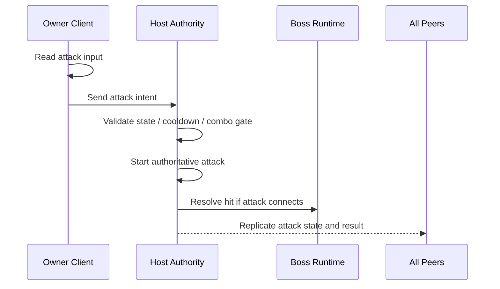
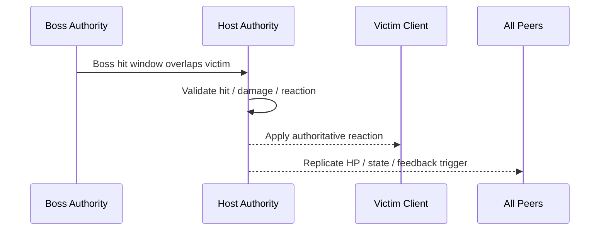
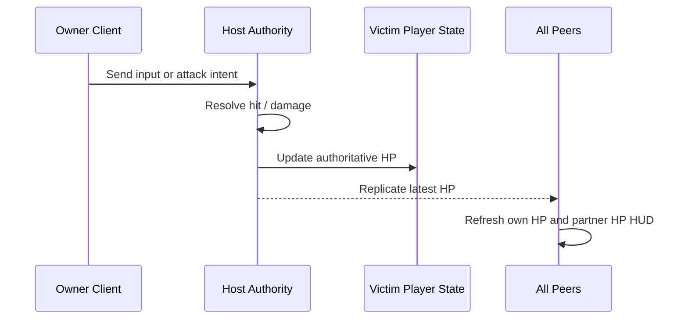
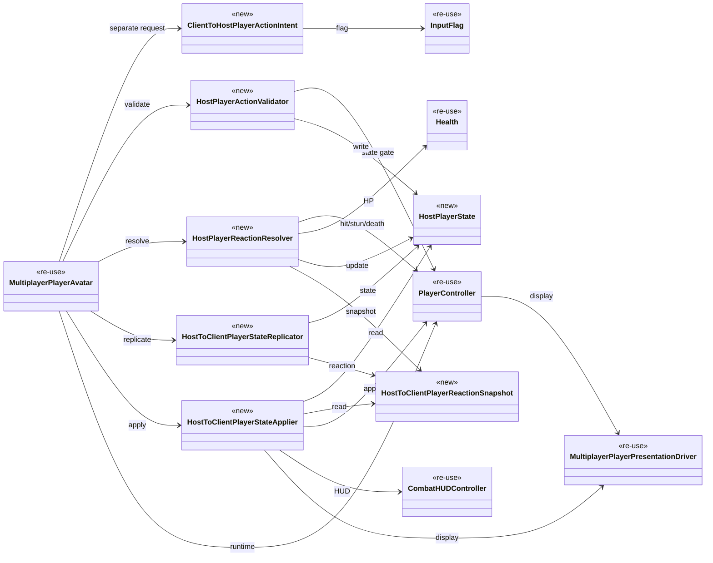

# 🕹️ 멀티플레이 플레이어 액션 권한 문서

이 문서는 boss multiplayer 구현 전에,
player-side `special movement / combat movement`가 어떤 권한 규칙을 따라야 하는지 정리한 기준 문서다.

현재 `docs/technical/multiplayer/Multiplayer_Client_Movement.md`가
`normal locomotion prediction + Host reconcile`를 정리한다면,
이 문서는 그 바깥에 있는 `dash / attack / got hit / stun` 같은
`non-locomotion gameplay action`을 정리한다.

---

## 1. 목적 (Purpose)

이 문서의 목적은 아래 3가지를 먼저 고정하는 것이다.

* free locomotion과 combat action을 authority 관점에서 분리한다.
* `client sends intent, Host decides result` 규칙을 액션 계층에 적용한다.
* boss multiplayer가 의존할 player reaction rule을 먼저 안정화한다.

---

## 2. 현재 결론 (Current Conclusion)

2026-03-31 기준 현재 결론은 아래와 같다.

* normal locomotion은 기존처럼 `client prediction + Host authoritative reconcile`를 유지한다.
* action start는 owner client가 intent를 보내고, Host가 시작 가능 여부와 최종 시작 tick을 판정한다.
* dash start는 `local anticipation + Host correction`을 기본값으로 둔다.
* 첫 구현 단계에서는 locomotion input packet과 별도로 `separate action-intent path`를 둔다.
* attack authority의 첫 구현 범위는 `start + hit + damage result`로 둔다.
* 첫 구현 단계의 공격 범위는 `Attack1 only`로 둔다.
* 첫 구현 단계에서는 `attack local anticipation`을 두지 않고, dash만 local anticipation을 허용한다.
* forced reaction의 첫 범위는 `hit + stun only`로 둔다.
* attack 중 피격되면 현재 공격은 즉시 종료되고, Host가 hit/stun 전환을 판정한다.
* `got hit`는 `client -> Host`가 아니라 `Host -> client` 성격이 강하다.
* dash는 `damage immunity`가 없더라도 combat timing과 거리 판정에 영향을 줄 수 있으므로, 단순 locomotion과 같은 급으로 취급하지 않는다.
* Host local player도 network hop만 생략할 뿐, 같은 action validator 경로를 따른다.
* invalid `Attack1` / `Dash` input은 첫 구현 단계에서 queue하지 않고 즉시 drop한다.
* 첫 구현 단계에서 client HP는 mirrored runtime value가 아니라 `HUD-only`로 반영한다.
* owner client도 `HostToClientPlayerStateApplier` 경로를 통해 Host 결과를 적용한다.
* remote client는 `display-only` 경로로 두고, runtime gameplay apply는 하지 않는다.
* remote client의 display-only 범위에는 partner의 `dash / Attack1 / hit / stun / death` 표현이 포함된다.
* `damage contribution record`는 첫 구현 단계에서 `server tick` 기준의 `raw hit log` 형태로 시작한다.
* death도 첫 구현 단계의 Host authoritative damage flow 범위에 포함한다.
* display layer는 새 클래스를 바로 추가하지 않고, 기존 `MultiplayerPlayerPresentationDriver`를 먼저 확장한다.

중요한 정정:

* `attack`은 input-driven action이다.
* `got hit`는 result-driven reaction이다.
* 둘 다 client local-only로 닫으면 안 되지만, network direction은 서로 다르다.

---

## 3. 범위 (Scope)

| 항목 | 이 문서에서의 분류 | 기본 권한 규칙 |
| --- | --- | --- |
| walk / run / turn | free locomotion | client prediction + Host truth |
| dash | special movement action | local anticipation + Host correction |
| attack start / hit / damage result | combat action | separate action intent + Host start/hit/damage authority |
| got hit | forced reaction | Host decides |
| stun | forced reaction | Host decides |
| HP (self / partner) | replicated gameplay state | Host decides, client displays |
| death | combat result | Host decides |
| camera / HUD | local presentation | local-only |

메모:

* `dash does not make player immune to damage`를 현재 기준선으로 둔다.
* 즉, dash 중에도 Host는 보스 공격 피격 여부를 그대로 판정할 수 있어야 한다.
* 첫 구현 단계의 공격 범위는 `Attack1 only`다.
* 추가 피격 반응은 현재 범위에 포함하지 않는다.

---

## 4. 권한 규칙 (Authority Rule)

### 4.1. 큰 분류

이 문서는 player-side action을 아래 3층으로 나눈다.

| 층 | 설명 | 판정 주체 |
| --- | --- | --- |
| Free Movement | walk / run / rotate 같은 기본 이동 | Host final, client predicts |
| Action Flow | dash / attack 같은 action 요청과 시작/결과 | Host validates, starts, and resolves hit/damage result |
| Forced Reaction | hit / stun / death | Host decides and pushes result |

### 4.2. 세부 기준표

| 기능 | Client 역할 | Host 역할 | 비고 |
| --- | --- | --- | --- |
| walk / run | input capture, local prediction, render smoothing | same input authoritative sim, reconcile source | current active path 유지 |
| dash | dash press intent 전송 + immediate local anticipation | cooldown / state gate / authoritative start tick / final displacement authority | local feel 우선, no damage immunity by default |
| attack | locomotion input과 분리된 action intent 전송, 첫 구현 단계에서는 local anticipation 없음 | 첫 구현 단계는 `Attack1` 기준으로 attack start, hit window, damage result authority를 가진다 | combo sync는 다음 단계 |
| got hit | local hit flash, local camera shake 같은 presentation | hit valid check, damage amount, reaction type, control lock 시작 | `Host -> victim client` 성격 |
| stun | 받은 결과를 보여 줌 | stun start / duration / recover timing 결정 | first scope forced reaction |
| HP (self / partner) | replicated HP 값을 받아 HUD 갱신 | damage 적용 후 현재 HP를 authoritative하게 기록하고 복제 | client는 자기 HP 기준값을 보내지 않는다 |
| death | result UI / local feedback | HP 0 판단, death state, respawn/restart eligibility | 첫 구현 단계 범위에 포함 |
| HUD / camera | local-only | 없음 | replicated gameplay object가 아님 |

### 4.3. HP 권한 규칙

player HP는 `owner client`가 직접 쓰는 값이 아니라, Host가 관리하는 게임플레이 기준값이다.

즉, 아래처럼 정리한다.

* Host는 `host player HP`와 `client player HP`를 모두 authoritative하게 가진다.
* client는 자기 HP를 `결과값`으로 Host에 보내지 않는다.
* client는 입력, 공격 의도, dash 의도만 보낸다.
* Host가 피격/데미지 판정을 끝낸 뒤 최신 HP를 각 peer에 복제한다.
* 첫 구현 단계에서는 client mirrored `Health`를 따로 두지 않고, 각 peer가 복제된 HP를 기준으로 `내 HP`, `상대 HP` HUD만 갱신한다.

화면 기준으로 보면:

* host 화면: `host own HP` + `client partner HP`
* client 화면: `client own HP` + `host partner HP`

두 화면 모두 `누구의 HP 바인지`는 다르지만,
값의 출처는 항상 Host authoritative HP다.

### 4.4. 핵심 금지 규칙

아래는 client가 최종 결정하면 안 된다.

* `I hit the boss for 20 damage.`
* `I am stunned now.`
* `I am safe because I dashed.`
* `My HP is now 70.`
client는 위 결과를 확정하지 않는다.
client는 오직 intent를 보내거나, Host 결과를 화면에 재생한다.

---

## 5. 흐름 (Flow)

### 5.1. 공격 시작

이 흐름에서 client는 locomotion input과 분리된 `공격 입력 의도`만 보내고,
실제 공격 시작과 적중 판정은 Host가 담당한다.
첫 구현 단계에서는 `Attack1 only`, `attack local anticipation off`를 기준으로 둔다.

### 5.2. 보스에게 맞음 (Got Hit)

이 흐름에서 피격 client는 `내가 맞았다`를 스스로 확정하지 않고,
Host가 보낸 결과를 적용한다.
현재 규칙에서는 피격이 확정되면 진행 중인 공격도 즉시 종료한다.

### 5.3. 플레이어 HP 갱신

이 흐름의 핵심은 `client가 자기 HP 숫자를 Host에 올리는 구조가 아니다`라는 점이다.
피격 결과와 HP 변경은 Host가 계산하고, client는 그 결과를 받아 UI를 갱신한다.

---

## 6. 구현 기준 메모 (Implementation Note Before Boss)

boss multiplayer 전에 아래 계약을 먼저 정리하는 것이 좋다.

| 항목 | 이유 |
| --- | --- |
| separate action intent packet | attack / dash 같은 시작 요청을 locomotion input packet과 분리하기 |
| reaction snapshot | hit / stun / death 같은 Host result를 한 묶음으로 보내기 |
| health snapshot or NetworkVariable | self HP / partner HP HUD를 같은 기준값으로 묶기 |
| raw hit log with server tick | 이후 boss aggro가 damage time window를 계산하기 쉽게 만들기 |
| movement lock flag | 공격/피격 중 locomotion prediction 허용 범위를 줄이기 |
| authoritative start tick | animation / hit window / 상태 종료시점을 같은 기준으로 맞추기 |

중요한 방향:

* `normal locomotion slice`와 `action/reaction slice`를 분리해서 생각한다.
* full character prediction을 처음부터 다 열지 않는다.
* 첫 구현 단계에서는 `separate action-intent path`를 먼저 고정한다.
* Host local player도 같은 validator / resolver 규칙을 따르고, network hop만 생략한다.
* remote client는 display-only apply만 담당하고, runtime gameplay apply는 하지 않는다.
* 먼저 `Host authoritative action + Host authoritative reaction`을 고정한다.

---

## 7. dash 규칙 메모 (Dash Note)

현재 사용자 확인 기준:

* dash는 `damage immunity`를 주지 않는다.
* dash start는 `local anticipation + Host correction`을 기본값으로 둔다.

이 전제에서는 dash를 아래처럼 보는 것이 안전하다.

* dash는 `free locomotion`보다 `special movement action`에 가깝다.
* dash 중에도 보스 hit check는 Host에서 그대로 유효하다.
* local player 화면에서는 즉시 dash를 시작해 feel을 살린다.
* 하지만 authoritative start tick, final displacement, hit truth는 Host가 잡는다.
* correction이 필요하면 Host truth 쪽으로 정렬한다.

---

## 8. 현재 확정 규칙

현재 문서 기준으로 아래 항목은 확정된 규칙으로 본다.

1. attack 중 피격 시 현재 공격은 즉시 종료되고, Host가 hit/stun 전환을 판정한다.
2. forced reaction의 첫 범위는 `hit + stun only`이며, 추가 피격 반응은 현재 범위에 포함하지 않는다.

---

## 9. 구현 순서

- 현재 구현은 `Host authoritative action/reaction`를 먼저 고정한 뒤,
  그 위에 `Boss authority`를 올리는 순서로 진행한다.

핵심 원칙은 아래 3가지다.

* client는 결과값을 확정하지 않고 `input`와 `action intent`를 보낸다.
* Host는 `action start`, `HP`, `hit`, `stun` 같은 게임플레이 기준 상태를 판정한다.
* client는 Host가 보낸 authoritative state와 result를 받아 화면과 로컬 반응을 갱신한다.

### 9.1. 호스트-클라이언트 구현
1. client는 자기 `HP 결과값`을 보내지 않고, locomotion input packet과 분리된 `attack intent`, `dash intent`를 Host에 보낸다.
2. Host local player도 같은 action validator 경로를 따르며, network hop만 생략한다.
3. Host는 client가 보낸 intent를 기준으로 `attack start 가능 여부`, `dash start 가능 여부`, `최종 시작 tick`, `HP 변화`, `hit/damage/stun/death 결과`를 authoritative하게 결정한다.
4. invalid `Attack1` / `Dash` input은 첫 구현 단계에서 queue하지 않고 즉시 drop한다.
5. owner client와 remote client는 모두 `HostToClientPlayerStateApplier` 경로로 Host가 복제한 상태를 받되, owner client는 runtime apply까지 포함하고 remote client는 display/HUD만 반영한다.
6. remote client의 display-only 범위에는 partner의 `dash / Attack1 / hit / stun / death` 표현이 포함된다.
7. normal locomotion은 기존 방향대로 `client prediction + Host reconcile`을 유지한다.
8. dash는 `local anticipation + Host correction`으로 처리하고, 최종 기준 상태는 Host가 가진다.
9. attack은 첫 구현 단계에서 `Attack1 only`, local anticipation 없이, `client input-driven`, `Host authoritative start/hit/damage result` 구조로 먼저 고정한다.
10. forced reaction의 첫 범위는 `hit + stun only`로 두고, client는 이를 결과로서 적용만 한다.
11. Host는 이후 boss aggro에 연결할 수 있도록 `누가 언제 얼마의 damage를 넣었는가`를 `server tick` 기준 `raw hit log` 형태로 기록하는 기준 경로를 함께 잡는다.
12. death도 첫 구현 단계의 Host authoritative damage flow 범위에 포함한다.

### 9.2. 호스트 보스 구현 (다른 문서에서 작성)
1. Boss의 `HP`, `aggro`, `target select`, `attack`, `hit result`, `reaction`, `state transition`은 Host가 authoritative하게 관리한다.
2. Host는 Boss의 현재 상태와 전투 결과를 각 client에 복제한다.
3. client는 복제된 Boss 정보를 받아 시각 표현과 HUD를 갱신한다.
4. Host는 `Boss ↔ player` 사이의 충돌, 피격, 데미지, 상태 전환을 최종 판정한다.
5. player-side authority contract와 `damage contribution record`가 안정화된 뒤 Boss combat authority와 aggro rule을 연결한다.

### 9.3. 구현 우선순위 정리

1. `player input/intent -> Host validation -> Host result replication` 흐름을 먼저 완성한다.
2. 그 다음 `player HP / hit / stun / attack-dash authority`와 `damage contribution record`를 안정화한다.
3. 마지막으로 Boss authority와 `Boss-player interaction`을 연결한다.

## 10. 관련 클래스

아래 클래스 목록은 `player-side authority contract`를 먼저 고정하기 위한 기준안이다.
이 섹션은 나중에 Mermaid class diagram으로 옮기기 쉽게 `역할 단위`로 나눈다.

| name | new/re-use | feature |
| --- | --- | --- |
| `MultiplayerPlayerAvatar` | re-use | player 1명의 네트워크 진입점이다. ownership, RPC 흐름, runtime role 연결을 담당한다. |
| `ClientToHostPlayerActionIntent` | new | owner client가 Host에 보내는 separate action request packet이다. locomotion input packet과 분리되며, 첫 구현 단계에서는 `Dash`, `Attack1` request만 가진다. |
| `InputFlag` | re-use | 기존 입력 비트 플래그다. `Dash`, `Attack`를 action intent 분류에도 재사용한다. |
| `HostPlayerActionValidator` | new | Host에서 action start 가능 여부를 검사한다. cooldown, state gate, combo gate, start timing을 판정한다. |
| `HostPlayerReactionResolver` | new | Host에서 `hit`, `stun`, `death`, `HP change` 같은 결과 계층을 판정하고, `damage contribution record`를 `server tick` 기준 `raw hit log` 형태로 함께 기록한다. |
| `HostPlayerState` | new | Host가 가진 player 기준 상태 데이터다. `HP`, 현재 action, stun/death 상태, 마지막 처리 기준값을 담는다. |
| `HostToClientPlayerReactionSnapshot` | new | Host가 client에 보내는 one-shot reaction result다. `hit`, `stun`, `death` 같은 즉시 반응 전달에 사용한다. |
| `HostToClientPlayerStateReplicator` | new | Host가 `HostPlayerState`와 reaction snapshot을 client들에 복제하는 전송 담당 클래스다. |
| `HostToClientPlayerStateApplier` | new | owner client와 remote client가 모두 Host 복제 상태를 받는 적용 담당 클래스다. owner client는 runtime/HUD/display를 반영하고, remote client는 partner의 `dash / Attack1 / hit / stun / death` display/HUD만 반영한다. 첫 구현 단계에서는 client `Health`를 직접 쓰지 않는다. |
| `MultiplayerPlayerPresentationDriver` | re-use | local prediction과 visual smoothing을 담당하는 기존 display 계층이다. 첫 구현 단계에서는 이 클래스를 먼저 확장한다. |
| `PlayerController` | re-use | player FSM 실행 주체다. dash, attack, hit, stun을 실행하지만 Host authority 판정 자체를 가지지는 않는다. |
| `Health` | re-use | Host 기준 HP runtime container다. 첫 구현 단계에서는 client mirrored `Health` 대신 HUD-only 반영을 우선한다. |
| `CombatHUDController` | re-use | Host가 복제한 HP와 상태를 기준으로 local HUD를 갱신한다. 첫 구현 단계의 client HP 반영 지점이다. |

### 10.1. 흐름도 초안

아래 다이어그램은 `owner client -> Host -> client apply/display` 흐름을 넓게 보는 용도다.
Host local player도 같은 validator / resolver 경로를 따르지만, network hop만 생략한다.

```mermaid
%%{init: {
  "themeVariables": {
    "fontSize": "16px"
  },
  "flowchart": {
    "useMaxWidth": false,
    "nodeSpacing": 20,
    "rankSpacing": 25,
    "diagramPadding": 4
  }
}}%%


flowchart LR
    subgraph OwnerClient["Owner Client"]
        Avatar["MultiplayerPlayerAvatar"]
        Intent["ClientToHostPlayerActionIntent"]
        OwnerApplier["HostToClientPlayerStateApplier"]
        OwnerController["PlayerController"]
        OwnerHud["CombatHUDController"]
        OwnerDisplay["MultiplayerPlayerPresentationDriver"]
    end

    subgraph Host["Host"]
        Validator["HostPlayerActionValidator"]
        Resolver["HostPlayerReactionResolver"]
        HostState["HostPlayerState"]
        Snapshot["HostToClientPlayerReactionSnapshot"]
        Replicator["HostToClientPlayerStateReplicator"]
        HostController["PlayerController"]
        HostHealth["Health"]
    end

    subgraph RemoteClient["Remote Client"]
        RemoteApplier["HostToClientPlayerStateApplier"]
        RemoteHud["CombatHUDController"]
        RemoteDisplay["MultiplayerPlayerPresentationDriver"]
    end

    Avatar -->|send separate action intent| Intent
    Intent -->|request| Validator
    Validator -->|validate start| HostController
    Validator -->|write action result| HostState

    HostController -->|runtime result| Resolver
    Resolver -->|apply HP| HostHealth
    Resolver -->|update gameplay state| HostState
    Resolver -->|create reaction event| Snapshot

    HostState -->|state| Replicator
    Snapshot -->|reaction| Replicator

    Replicator -->|replicate owner result| OwnerApplier
    Replicator -->|replicate remote result| RemoteApplier

    OwnerApplier -->|apply state| OwnerController
    OwnerApplier -->|update HUD| OwnerHud
    OwnerApplier -->|trigger reaction display| OwnerDisplay

    RemoteApplier -->|update HUD| RemoteHud
    RemoteApplier -->|partner dash/Attack1/hit/stun/death display| RemoteDisplay

    Avatar -->|dash local anticipation only| OwnerDisplay
```

### 10.2. 클래스 관계도 초안

아래 다이어그램은 `request -> validate -> resolve -> replicate -> apply -> display` 흐름을 기준으로 정리한다.

## 11. 구현 클래스 순서

아래 순서는 `request -> validate -> resolve -> replicate -> apply -> display` 흐름을 기준으로 잡는다.
처음부터 전부 동시에 열지 않고, 각 단계마다 수동 확인 포인트를 통과하면서 다음 단계로 넘어간다.

| 완료 체크 | 순서 | class | 목적 | how to test |
| --- | --- | --- | --- | --- |
| `[x]` | 1 | `ClientToHostPlayerActionIntent` | owner client가 locomotion input packet과 분리된 `Dash`, `Attack1` intent request packet을 먼저 고정한다. | client에서 `Dash`, `Attack1` 입력을 각각 1회씩 눌렀을 때 Host 로그/디버그 값에서 separate action intent, `InputFlag`, sequence가 기대값대로 들어오는지 확인한다. |
| `[x]` | 2 | `HostPlayerActionValidator` | Host가 action start 가능 여부를 판정하는 진입 게이트를 먼저 만든다. | dash cooldown 중 재입력이 거부되는지, stun/death 상태에서 attack start가 거부되는지 확인한다. |
| `[x]` | 3 | `MultiplayerPlayerAvatar` | separate action intent와 Host validate를 실제 RPC 흐름에 연결한다. | owner client 입력이 Host validator까지 도달하는지, remote peer가 자기 입력으로 상대 player를 직접 시작시키지 못하는지, locomotion packet과 action intent packet이 섞이지 않는지, Host local player도 같은 validator path를 따르는지 확인한다. |
| `[x]` | 4 | `HostPlayerState` | Host가 가진 기준 상태 데이터를 따로 고정한다. | Host에서 action start 후 state 값이 갱신되는지, client가 직접 값을 바꿔도 gameplay truth로 쓰이지 않는지 확인한다. |
| `[x]` | 5 | `HostToClientPlayerReactionSnapshot` | hit/damage/stun 같은 one-shot result packet을 분리한다. | 유효 타격 1회당 snapshot이 1회만 생성되는지, same event가 중복 재생되지 않는지 확인한다. |
| `[x]` | 6 | `HostPlayerReactionResolver` | Host에서 `hit`, `damage`, `stun`, `death`와 `damage contribution record`를 `server tick` 기준 `raw hit log`로 판정한다. | 공격 적중 시 Host HP가 감소하는지, stun 조건이 맞을 때만 stun이 발생하는지, death도 같은 경로에서 처리되는지, `누가 언제 얼마의 damage를 넣었는가` server tick raw hit log가 남는지 확인한다. |
| `[x]` | 7 | `Health` | HP 기준값 쓰기 경로를 Host 쪽으로 고정한다. | solo에서는 기존 HP 동작이 그대로 유지되고, multiplayer에서는 client local에서 HP를 바꿔도 최종값이 바뀌지 않으며 Host apply 결과만 최종 HP/HUD에 반영되는지 확인한다. |
| `[ ]` | 8 | `PlayerController` | Host 승인 결과를 실제 FSM 실행으로 연결한다. | Host 승인 후에만 dash/attack/hit/stun 상태 전환이 발생하는지, 승인 없이 local-only로 상태가 고정되지 않는지 확인한다. |
| `[ ]` | 9 | `HostToClientPlayerStateReplicator` | Host가 state/snapshot을 owner와 peer에 보내는 전송 경로를 만든다. | Host에서 바뀐 상태가 owner client와 remote client에 모두 도착하는지, 필요한 값만 복제되는지 확인한다. |
| `[ ]` | 10 | `HostToClientPlayerStateApplier` | owner client와 remote client가 모두 Host 결과를 받되, owner client는 runtime/HUD/reaction display를 반영하고 remote client는 display/HUD만 반영한다. 첫 구현 단계에서는 client `Health` 대신 HUD-only 경로를 사용한다. | owner client 화면은 Host 결과 기준으로 runtime/HUD/reaction이 갱신되고, remote client 화면은 partner의 `dash / Attack1 / hit / stun / death` display/HUD만 갱신되는지 확인한다. |
| `[ ]` | 11 | `MultiplayerPlayerPresentationDriver` | 기존 display driver를 확장해 dash local anticipation과 visual smoothing만 담당하게 정리한다. 첫 구현 단계에서는 `Attack1 only`, attack local anticipation off를 유지한다. | dash local anticipation만 즉시 보이고, `Attack1`은 Host 승인 후에만 시작되며, correction 후 위치/표현이 다시 맞춰지는지 확인한다. |

메모:

* 첫 구현 단계에서는 새 display class를 바로 추가하지 않고, 기존 `MultiplayerPlayerPresentationDriver`를 먼저 확장한다.
* 첫 구현 단계의 공격 범위는 `Attack1 only`다.
* separate action-intent path는 locomotion input packet과 섞지 않는다.
* invalid action input은 첫 구현 단계에서 queue하지 않고 drop한다.
* full combo replication은 위 순서를 통과한 뒤 다음 단계에서 다룬다.

## 11.1 구현 테스트
- Test 1. HostPlayerState (#4)

    Join as client.
    Press Attack1 once while idle.
    On Host Console, you should see this order:
    phase=observe
    phase=validate accepted=true
    phase=host-state
    In phase=host-state, check:
    active=Attack
    acceptedAction=Attack
    startTick=...
    hp=current/max
    Press Dash twice quickly.
    Expected:
    first press: accepted=true + phase=host-state
    second press: accepted=false reason=dash-cooldown
    no new accepted host-state write for the invalid press

- Test 2. Reaction Snapshot (#5)

    Start an attack.
    Let the boss hit that player with Attack1.
    On Host Console, check phase=reaction-snapshot.
    Expected fields:
    flags=Hit or Hit, InterruptedAction
    sourceHit=Attack1
    interrupted=Attack if the hit cut the action
    Then let boss Attack2 hit the player.
    Expected:
    flags includes Stun
    Then let the player die.
    Expected:
    flags includes Death
    hp=0/max
- Test 3. Resolver + Raw Hit Log (#6)

    Land a real player attack on the boss.
    On Host Console, check phase=raw-hit-log.
    Expected:
    action=Attack
    seq=...
    damage=...
    serverTick=...
    Swing and miss.
    Expected:
    no raw-hit-log
    Try invalid input like dash during cooldown.
    Expected:
    validate accepted=false
    no new host-state
    no raw-hit-log

- Test 4. Health Gate + HUD Sync (#7)

    Open `Assets/Scenes/mutiplayer/GamePlayScene_Verify.unity`.
    First run solo.
    Let the boss hit the player.
    Expected:
    inspector `Health` and player HUD fill both go down.
    Then run `Editor = Host`, `Build = Client`.
    Let the boss hit Host.
    Expected:
    Host screen main HP goes down.
    Client screen partner HP goes down.
    Let the boss hit Client.
    Expected:
    Client screen main HP goes down.
    Host screen partner HP goes down.
    Also check name labels.
    Expected:
    Host screen = `Host(me)` / `Client`
    Client screen = `Client(me)` / `Host`
