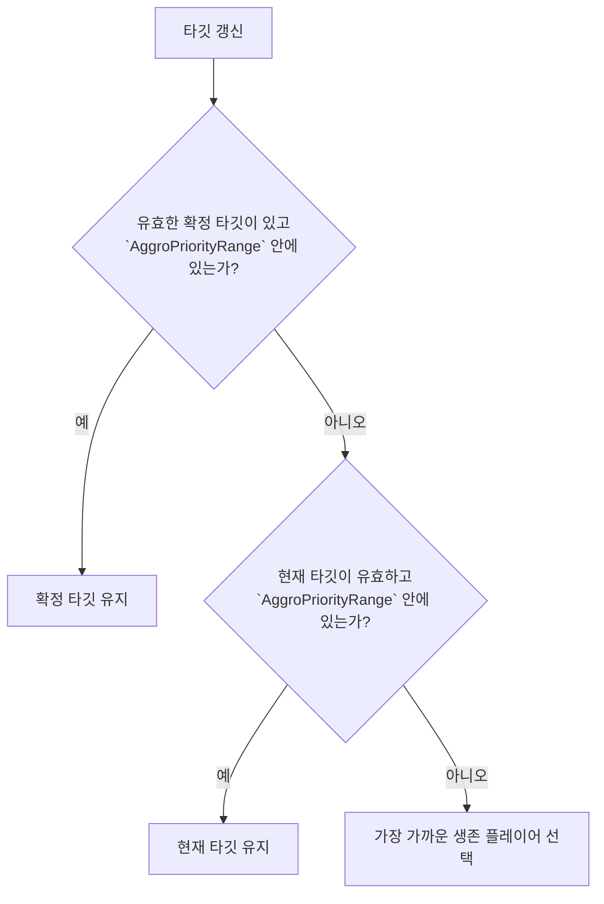
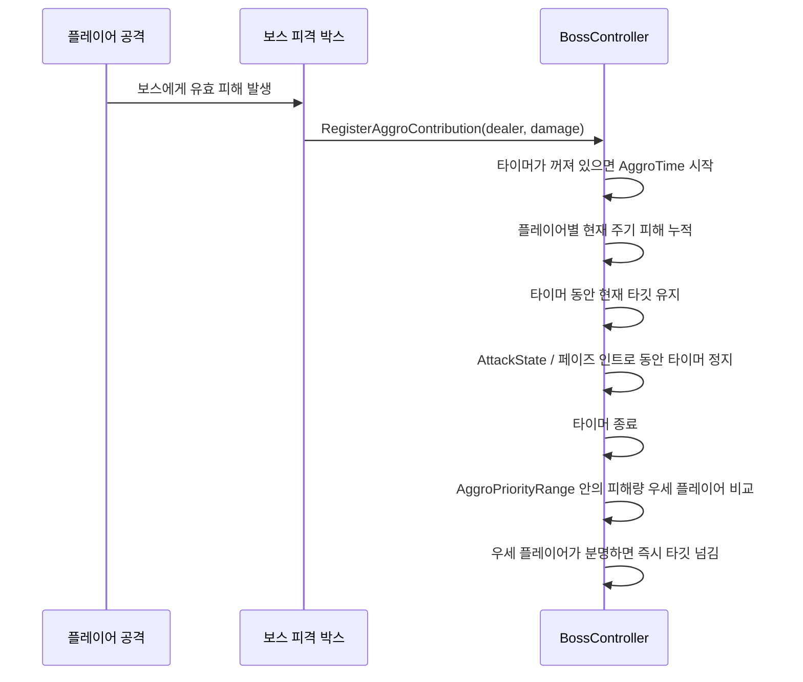

# 🎯 멀티플레이 보스 어그로 문서

이 문서는 현재 멀티플레이 보스 어그로 규칙의 기준 문서다.

이 문서의 목적은 아래 3가지를 분명하게 적는 것이다.

* 보스가 누구를 타깃으로 잡는지
* 어떤 순간에 타깃이 바뀌는지
* 왜 이 규칙이 필요한지

이 문서는 호스트 권한 기준으로 설명한다.
클라이언트는 결과를 읽고 보여 주지만, 어그로 결정 자체는 호스트가 한다.

---

## 1. 목적

이 문서는 현재 구현 기준으로 보스 어그로를 문장으로 풀어 적은 문서다.

이 문서를 보면 아래를 바로 알 수 있어야 한다.

* 거리 규칙이 언제 쓰이는지
* `AggroPriorityRange`가 무엇을 막는지
* `AggroTime`이 언제 시작하고 언제 끝나는지
* 더 많은 피해를 준 플레이어가 언제 타깃을 가져가는지
* 어떤 예외 상황에서 거리 기반 대체 규칙이 다시 열리는지

---

## 2. 한 줄 요약

짧게 요약하면 아래와 같다.

* 보스는 기본적으로 가장 가까운 생존 플레이어를 대체 타깃으로 삼는다.
* 현재 타깃이 `어그로 범위` 안에 있으면 거리만으로는 타깃이 바뀌지 않는다.
* 보스는 공격 전, 공격 중, 공격 후에도 같은 타깃을 유지한다.
* 플레이어 둘 중 하나가 보스에게 유효 피해를 주는 첫 순간 `어그로 타임`이 시작된다.
* `어그로 타임` 동안 보스는 현재 타깃을 유지하고 피해량만 기록한다.
* `어그로 타임`이 끝나면, 두 플레이어가 모두 `어그로 범위` 안에 있을 때 더 많은 피해를 준 플레이어로 타깃을 바꾼다.

---

## 3. 현재 규칙

### 3.1. 기본 규칙

1. 보스는 항상 생존한 플레이어만 타깃 후보로 본다.
2. 현재 타깃 유지나 확정 타깃 조건이 없으면, 보스는 가장 가까운 생존 플레이어를 기본 대체 타깃으로 고른다.
3. 현재 타깃이 `AggroPriorityRange` 안에 있으면 거리만으로는 타깃이 바뀌지 않는다.
4. 보스가 현재 타깃을 공격해도 타깃은 계속 유지된다.
5. 플레이어가 보스에게 실제로 유효 피해를 주면 `AggroTime`이 시작된다.
6. `AggroTime` 동안 보스는 현재 타깃을 유지하고, 플레이어별 누적 피해만 기록한다.
7. `AggroTime` 종료 시 두 플레이어가 모두 `AggroPriorityRange` 안에 있고 한쪽이 더 많은 피해를 줬으면, 보스는 그 플레이어에게 타깃을 한 번 넘긴다.
8. 피해량이 같거나, 피해가 없거나, 타깃이 죽었거나, 대상이 유효하지 않으면 피해 기반 타깃 변경은 열리지 않고 현재 유지 또는 거리 기반 대체 규칙으로 돌아간다.

### 3.2. 중요한 해석

아래 3줄이 실제 체감 규칙이다.

* `AggroPriorityRange`는 "피해량 비교를 여는 원"이면서 동시에 "현재 타깃 고정을 유지하는 원"이다.
* `AggroTime`은 "누가 더 많이 때렸는지 세는 시간"이지, "계속 가장 가까운 대상을 다시 고르는 시간"이 아니다.
* 공격은 어그로를 초기화하지 않는다. 공격 종료도 거리 기반 재선택의 이유가 아니다.

---

## 4. 핵심 데이터

| 데이터 | 의미 | 현재 역할 |
| --- | --- | --- |
| `playerTransform` | 현재 타깃 | 보스가 실제로 바라보는 대상 |
| `AggroPriorityRange` | 우선 범위 원 | 현재 타깃 유지와 타이머 종료 후 비교를 여는 기준 |
| `AggroTime` | 피해 누적 시간 | 현재 주기의 누적 피해를 세는 시간 |
| `_isAggroTimerRunning` | 타이머 상태 | 현재 어그로 주기가 진행 중인지 표시 |
| `_lockedAggroTarget` | 확정 타깃 | 타이머 종료 후 우세 플레이어를 잠깐 유지 |
| `_aggroContributorBuffer` | 기여자 버퍼 | 현재 주기에 참여한 플레이어 기록 |
| `_aggroContributorDamageBuffer` | 피해 버퍼 | 현재 주기의 누적 피해량 |
| `_aggroCandidateBuffer` | 비교 후보 버퍼 | 우선 범위 안의 생존 플레이어 후보 |

---

## 5. 로직 흐름

### 5.1. 타깃 갱신 흐름

짧게 읽으면 아래 순서다.

1. 먼저 확정 타깃을 본다.
2. 유효한 확정 타깃이 없으면, 현재 타깃이 아직 `AggroPriorityRange` 안에 있는지 본다.
3. 둘 다 아니면, 가장 가까운 생존 플레이어를 고른다.

### 5.2. 피격부터 어그로 타이머까지의 흐름

---

## 6. 상세 규칙

### 6.1. 기본 대체 규칙

거리 기반 규칙은 보스의 기본 대체 규칙이다.

아래 조건이면 가장 가까운 생존 플레이어를 다시 고른다.

* 확정 타깃이 없음
* 현재 타깃 유지가 불가능함
* 현재 타깃이 죽었거나 유효하지 않음
* 현재 타깃이 `AggroPriorityRange` 밖으로 나감

### 6.2. 현재 타깃 유지

현재 타깃 유지는 보스가 불필요하게 흔들리는 것을 줄이기 위한 규칙이다.

핵심 규칙은 아래 한 줄이다.

* 현재 타깃이 `AggroPriorityRange` 안에 있는 동안 보스는 그 타깃을 유지한다.

이 유지는 아래 구간에서도 계속된다.

* 공격 직전
* 공격 중
* 공격 직후 전투 갱신 구간

즉, 다른 플레이어가 잠깐 더 가까워졌다고 바로 보스 머리가 휙휙 바뀌지 않게 하기 위한 규칙이다.

### 6.3. `AggroTime` 시작

`AggroTime`은 플레이어 입력 자체가 아니라, 보스가 실제로 유효 피해를 받았을 때 시작된다.

즉 아래처럼 읽으면 된다.

* 공격 버튼만 눌렀을 때: 시작 안 함
* 공격이 빗나갔을 때: 시작 안 함
* 보스 피격 박스에 유효 피해가 들어갔을 때: 시작

이렇게 해야 어그로 주기가 실제 전투 사건과 맞는다.

### 6.4. `AggroTime` 진행 중

`AggroTime` 동안 보스는 아래 2가지만 한다.

* 현재 타깃 유지
* 피해 기여도 기록

타이머가 도는 동안 가장 가까운 대상을 계속 다시 고르지 않는 이유는,
그 구조가 보스의 회전 흔들림과 공격 직전 흔들림을 만들기 쉽기 때문이다.

### 6.5. 타이머 정지

타이머는 아래 상황에서 잠깐 멈춘다.

* `AttackState`
* 페이즈 인트로 애니메이션

이유는 간단하다.

* 타이머 만료가 애니메이션 타이밍을 끊지 않게 하기 위해서다.

이 정지 규칙이 없으면, 보스가 공격 시작 프레임이나 페이즈 인트로 프레임에서 타깃을 바꿔 보이는 문제가 다시 생길 수 있다.

### 6.6. 타이머 종료 후 타깃 넘김

타이머 종료 뒤에는 아래 순서로 타깃 넘김을 판단한다.

1. 우선 범위 안의 생존 후보를 다시 모은다.
2. 두 플레이어가 모두 비교 가능한 상태인지 본다.
3. 현재 주기의 누적 피해를 비교한다.
4. 피해량 우세 플레이어가 분명하면 그 플레이어를 `_lockedAggroTarget`으로 확정한다.
5. 그 플레이어가 현재 타깃과 다르면 즉시 `SetTarget(...)`으로 넘긴다.

즉, 타깃 변경은 한 번만 결정된다.
계속 다시 비교하는 방식이 아니다.

### 6.7. 타깃 변경이 일어나지 않는 경우

아래 상황에서는 피해 기반 타깃 변경이 일어나지 않는다.

* 우선 범위 안에 플레이어가 한 명만 있는 경우
* 더 많은 피해를 준 플레이어가 분명하지 않은 경우
* 두 플레이어의 피해가 모두 `0`인 경우
* 피해량이 같은 경우
* 우세 플레이어가 죽었거나 유효하지 않게 된 경우

이때는 현재 타깃 유지 또는 거리 기반 대체 규칙이 그대로 유지된다.

---

## 7. 왜 이렇게 만들었는가

이 규칙은 아래 문제를 줄이기 위해 만들었다.

### 7.1. 회전 흔들림 감소

기존의 "가장 가까운 대상 계속 재평가" 방식은 보스가 아래처럼 흔들리기 쉬웠다.

* 한 플레이어를 향해 회전함
* 공격 직전에 가장 가까운 대상 다시 계산
* 다른 플레이어가 조금 더 가까워짐
* 머리와 몸이 다시 꺾임

현재 규칙은 이런 흔들림을 줄인다.

### 7.2. 읽기 쉬운 어그로 의도

플레이어 입장에서 "지금 보스가 누구를 보고 있는가"가 읽혀야 한다.

핵심은 아래 한 줄이다.

* 우선 범위 안에서는 보스의 타깃 의도가 안정적으로 보여야 한다.

### 7.3. 명확한 피해 보상

피해 기반 어그로는 한 대 때릴 때마다 즉시 흔들리는 것보다,
짧은 시간 뒤 더 많은 피해를 준 플레이어에게 한 번 넘기는 편이 읽기 쉽다.

이 방식은 아래 장점이 있다.

* 결과가 명확하다
* 조정이 단순하다
* 네트워크 권한 구조에서도 설명하기 쉽다

---

## 8. 예시 시나리오

### 8.1. 호스트가 현재 타깃인 상태

1. 호스트가 보스 근처에서 타깃이 된다.
2. 클라이언트가 살짝 더 가까워진다.
3. 호스트가 아직 `AggroPriorityRange` 안에 있으면, 보스는 호스트를 계속 본다.

결과:

* 거리만으로는 타깃이 바뀌지 않는다.

### 8.2. 클라이언트가 더 많이 때린 경우

1. 보스는 현재 호스트를 보고 있다.
2. 클라이언트와 호스트가 모두 우선 범위 안에 있다.
3. 클라이언트가 `AggroTime` 동안 더 많은 유효 피해를 넣는다.
4. 타이머가 끝난다.

결과:

* 보스는 클라이언트로 타깃을 한 번 넘긴다.

### 8.3. 피해량이 같은 경우

1. 두 플레이어 모두 타이머 동안 피해를 넣는다.
2. 총 피해량이 같다.

결과:

* 우세 플레이어가 없으므로 피해 기반 타깃 넘김이 일어나지 않는다.

### 8.4. 현재 타깃이 범위 밖으로 나간 경우

1. 현재 타깃이 `AggroPriorityRange` 밖으로 빠진다.
2. 고정 유지가 풀린다.

결과:

* 보스는 다시 가장 가까운 생존 플레이어를 고를 수 있다.

---

## 9. 디버그에서 읽는 법

현재 디버그 라벨의 어그로 모드는 아래처럼 읽으면 된다.

| 모드 | 의미 |
| --- | --- |
| `TimerHold` | `AggroTime` 동안 현재 타깃을 유지하는 상태 |
| `DamageLock` | 타이머 종료 뒤 우세 플레이어 확정 상태가 유지되는 상태 |
| `TargetHold` | 현재 타깃이 우선 범위 안이라 그대로 유지되는 상태 |
| `Distance` | 유지나 확정 상태가 없어서 거리 기반 대체 규칙을 쓰는 상태 |

---

## 10. 수동 점검 목록

아래는 플레이 테스트 때 보면 좋은 점검 항목이다.

1. 보스가 전투 시작 시 생존 플레이어 중 하나를 정상적으로 타깃으로 잡는지 확인한다.
2. 현재 타깃이 `AggroPriorityRange` 안에 있을 때 다른 플레이어가 조금 더 가까워져도 보스가 바로 돌지 않는지 본다.
3. 보스가 공격 직전과 직후에 불필요하게 흔들리지 않는지 본다.
4. 플레이어가 보스를 실제로 때렸을 때만 `AggroTime`이 시작되는지 본다.
5. `AggroTime` 동안 보스가 현재 타깃을 계속 유지하는지 본다.
6. 타이머 종료 뒤 더 많은 피해를 준 플레이어가 분명할 때만 타깃이 한 번 바뀌는지 본다.
7. 피해량이 같을 때는 타깃이 이상하게 흔들리지 않는지 본다.
8. 현재 타깃이 죽거나 유효하지 않으면 거리 기반 대체 규칙으로 정상 복귀하는지 본다.
9. 페이즈 인트로와 공격 중에는 타이머 만료가 애니메이션을 끊지 않는지 본다.

---

## 11. 구현 기준 파일

현재 규칙을 읽을 때 기준이 되는 주요 파일은 아래와 같다.

* `Assets/Scripts/Boss/BossController.cs`
* `Assets/Scripts/Common/Combat/BossHitBox.cs`
* `Assets/Scripts/Common/Combat/DamageCaster.cs`

함께 보면 좋은 문서는 아래와 같다.

* `docs/technical/multiplayer/boss/Multiplayer_Boss_Authority.md`
* `docs/technical/multiplayer/Multiplayer_Design.md`
* `docs/technical/System_Blueprint.md`
* `docs/technical/Technical_Glossary.md`

---

## 12. 문서 범위

이 문서는 아래 내용을 자세히 다루지 않는다.

* 전체 NGO 패킷 구조
* 보스 이동 복제의 보간/보정
* 패턴별 세부 피격 시점
* 관전자, 재시작, 결과 흐름

이 내용은 각 전용 문서에서 다룬다.
