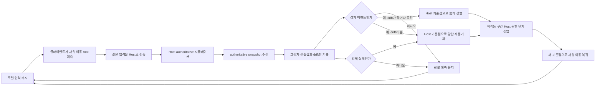

# 🧭 멀티플레이 지연 보정 경계 동기화 제안안

이 문서는 멀티플레이 이동 구조의 **제안안** 을 정리한다.
현재 구현 기준 문서는 아니다.

중요한 구분:

* 현재 구현 경로는 여전히 `PredictionReconciliation` 이다.
* 이 문서는 그 다음 후보 구조인 `Host 최종 권한 + 클라이언트 자유 이동 예측 + 경계 시점 지연 보정` 을 정리한다.
* 따라서 현재 코드 설명과 충돌할 때는 `docs/technical/multiplayer/Multiplayer_Client_Movement.md` 를 현재 구현 기준으로 우선한다.

---

## 1. 문서 목적

이 문서는 아래 질문에 대한 설계 초안을 남기기 위한 문서다.

* 왜 현재 owner 화면에서 jitter가 남을 수 있는가
* correction을 더 늦추면 구조가 어떻게 바뀌는가
* `자유 이동` 과 `전투 / 상태 전환 경계` 를 다른 보정 규칙으로 나누면 어떤 흐름이 되는가

한 줄 요약:

`자유 이동 중에는 클라이언트 화면이 자기 예측 결과를 유지하고, 경계 이벤트나 강제 실패 상황에서만 Host 진실값으로 다시 맞춘다`

---

## 2. 제안 방향

### 2.1. 한 줄 답

현재 제안 방향은 아래와 같다.

`Host 최종 권한 + 클라이언트 자유 이동 예측 + 그림자 authoritative snapshot 저장 + 경계 / 강제 실패 시점 지연 보정`

### 2.2. 현재 구조와 차이

| 항목 | 현재 구현 | 제안안 |
| --- | --- | --- |
| 자유 이동 중 snapshot 처리 | deadzone 뒤 필요 시 reconcile/replay | drift만 기록하고 화면 보정은 미룬다 |
| owner 화면의 root | predict + Host correction 영향 받음 | predict root를 계속 유지 |
| owner camera follow | root follow | 같은 predicted root를 계속 따라간다 |
| owner visual 처리 | root와 visual child를 분리해 render smoothing | 자유 이동 중에는 같은 predicted root 기준을 우선한다 |
| 큰 correction 시점 | 현재는 비교적 빠른 correction | 경계 이벤트 / 강제 실패 중심 |

핵심 차이:

* 현재 경로: `예측 -> 비교 -> 비교적 빠른 보정`
* 제안 경로: `예측 -> 비교 -> 대기 -> 필요한 시점에만 보정`

---

## 3. 핵심 개념

### 3.1. 자유 이동

`MoveState + buttons == 0` 인 순수 locomotion 구간에서는:

* 클라이언트가 자기 root를 바로 예측한다.
* camera는 그 predicted root를 그대로 따른다.
* Host snapshot은 `그림자 진실값` 으로 저장한다.
* 작은 drift / 중간 drift는 즉시 correction하지 않는다.

### 3.2. 경계 이벤트

아래 이벤트가 발생하면 correction 판단을 다시 한다.

* attack 입력 시작 시점
* dash 입력 시작 시점
* `MoveState -> non-move state`
* grounded 상태 반전
* hit / stun / death
* teleport / 강제 위치 이동

### 3.3. 강제 실패

아래 상황에서는 자유 이동 중이어도 즉시 correction한다.

* position error가 강제 실패 기준 초과
* yaw error가 강제 실패 기준 초과
* authoritative snapshot age가 오래된 snapshot 기준 초과
* Host가 중요한 불일치를 알리는 경우

---

## 4. 지연 보정 동기화 흐름

흐름 요약:

`클라이언트는 먼저 예측하고 화면도 그 예측을 유지한다 -> Host는 같은 입력으로 진실값을 계산한다 -> 클라이언트는 drift만 재고 자유 이동 중에는 화면을 바로 고치지 않는다 -> 경계 이벤트나 강제 실패에서만 다시 맞춘다`

---

## 5. 단계별 로직 스케치

### 5.1. 자유 이동 예측 단계

목표:

* owner 자유 이동 화면을 최대한 안정적으로 유지한다.
* correction spam을 줄인다.

동작:

1. 입력 프레임에서 move/look 입력을 읽는다.
2. owner network tick에서 local prediction을 실행한다.
3. 같은 입력을 Host로 보낸다.
4. Host는 같은 locomotion을 authoritative하게 시뮬레이션한다.
5. owner는 Host snapshot을 받으면 drift meter만 갱신한다.
6. 화면에 보이는 correction은 하지 않는다.

핵심 문장:

`자유 이동 중에는 클라이언트가 자기 예측 root를 그대로 화면에 유지한다`

### 5.2. 경계 동기화 단계

목표:

* action 경계에서 gameplay truth를 다시 맞춘다.

동작:

1. 경계 이벤트가 발생한다.
2. latest authoritative snapshot을 확인한다.
3. drift가 작거나 중간이면 짧게 정렬한다.
4. drift가 크면 강하게 재동기화한다.
5. 동기화 후 다음 state로 들어간다.

핵심 문장:

`클라이언트와 Host가 다시 만나는 기본 지점은 자유 이동 중간이 아니라 경계 이벤트다`

### 5.3. 전투 권한 단계

목표:

* non-locomotion 구간에서는 Host truth를 더 강하게 유지한다.

범위:

* attack
* dash
* hit
* stun
* death

핵심 문장:

`자유 이동은 느슨하게 둘 수 있지만, 전투와 피격 구간은 더 엄격해야 한다`

### 5.4. 자유 이동 복귀 단계

목표:

* action 종료 뒤 자유 이동 예측을 다시 깨끗한 기준점에서 시작한다.

동작:

1. 현재 authoritative state를 기준점으로 삼는다.
2. 쌓여 있던 drift meter를 초기화한다.
3. 자유 이동 prediction을 다시 켠다.

---

## 6. 경계 이벤트 표

| 이벤트 | 보정 필요성 | 기본 처리 |
| --- | --- | --- |
| `Attack` 버튼 시작 시점 | 높음 | 경계 동기화 |
| `Dash` 버튼 시작 시점 | 높음 | 경계 동기화 |
| `MoveState -> non-move` | 높음 | 경계 동기화 |
| grounded `false -> true` 착지 | 중간 | 경계 동기화 후보 |
| grounded `true -> false` 이륙 | 중간 | 경계 동기화 후보 |
| `Hit` / `Stun` / `Death` | 매우 높음 | 즉시 엄격 동기화 |
| teleport / 강제 위치 이동 | 매우 높음 | 즉시 엄격 동기화 |
| 자유 이동 중 작은 drift만 존재 | 낮음 | 무시 |

핵심 규칙:

`자유 이동은 기다릴 수 있지만, 액션 시작과 피해 이벤트는 기다리면 안 된다`

---

## 7. 기준값 초안

이 값들은 현재 구현 값이 아니라 **제안 시작점** 이다.

| 항목 | 초안 값 |
| --- | --- |
| 자유 이동 무시 구간 위치 오차 | `0.20 m` |
| 자유 이동 무시 구간 yaw 오차 | `10 deg` |
| 강제 실패 위치 오차 | `0.65 m` |
| 강제 실패 yaw 오차 | `25 deg` |
| 오래된 snapshot 실패 기준 | `300 ms` |
| 경계 정렬 시간 | `0.08 s` |

해석:

* 무시 구간은 correction 빈도가 아니라 `아무것도 하지 않는 구간` 이다.
* 강제 실패 구간은 비상 correction 기준이다.
* 경계 정렬 시간은 correction이 발생했을 때의 짧은 blend 길이다.

핵심 문장:

`이 숫자들의 목적은 자유 이동 중 correction을 더 자주 하려는 것이 아니라, 더 드물게 하려는 것이다`

---

## 8. 쓰기 권한 규칙

현재 jitter 가설에서 중요한 부분은 `같은 화면 감각` 이다.

제안 규칙:

* 자유 이동에서는 owner screen의 root, camera, body가 같은 predicted truth를 우선 사용한다.
* Host snapshot은 자유 이동 중 `그림자 authoritative state` 로만 저장한다.
* 즉, 자유 이동에서 Host snapshot에 따른 root 위치 보정과 visual child의 별도 smoothing이 동시에 겹쳐, 카메라와 몸통이 서로 다른 타이밍으로 움직이는 구조를 줄인다.

핵심 문장:

`자유 이동 중에는 플레이어가 camera truth와 body truth를 서로 다른 두 시계처럼 느끼지 않아야 한다`

---

## 9. 장점과 리스크

### 9.1. 기대 장점

* owner 화면의 visible correction 빈도를 줄일 수 있다.
* side movement / quick direction change에서 root shake가 줄어들 가능성이 크다.
* current render smoothing layer 의존도를 낮출 수 있다.
* camera-root / visual-child phase mismatch를 줄일 수 있다.

### 9.2. 예상 리스크

* 자유 이동 drift가 더 오래 쌓일 수 있다.
* 경계 correction 때 한 번에 더 큰 settle이 생길 수 있다.
* AoE edge / attack range edge / collision edge에서 Host와 client 체감 차이가 남을 수 있다.
* `CharacterController` 기반 시뮬레이션 특성상 완전한 deterministic sync는 기대하기 어렵다.

핵심 문장:

`이 제안안은 자주 발생하는 작은 correction을 줄이는 대신, 더 적은 횟수의 의미 있는 동기화 지점을 택한다`

---

## 10. 1차 구현 범위

이 문서는 이상형 전체를 설명하지만, 실제 **1차 구현 범위** 는 아래처럼 좁힌다.

### 10.1. 1차 구현에 포함하는 항목

* owner 자유 이동 구간에서 `Host snapshot 즉시 reconcile` 을 멈추고, `그림자 authoritative state 저장 + drift 계산` 으로 바꾼다.
* owner 자유 이동 구간에서 `강제 실패 오차` 와 `오래된 snapshot` 조건만 즉시 동기화한다.
* 경계 이벤트에서는 1차 구현 기준으로 `즉시 엄격 동기화` 를 사용한다.
* owner 자유 이동 화면에서는 extra visual position smoothing을 줄이고, `하나의 root 기준 화면 감각` 을 우선한다.
* Host authoritative simulation, input uplink, current packet shape는 유지한다.

### 10.2. 1차 구현에서 제외하는 항목

* `0.08 s` 경계 정렬 blend
* 신규 패킷 구조 추가
* Host locomotion 수학식 변경
* solo FSM 구조 개편
* camera system 재설계
* client authority 전환
* 상태 클래스(`MoveState`, `DashState`, `AttackState`) 내부에 새 경계 이벤트 코드를 직접 심는 작업

### 10.3. 1차 구현 기준의 해석

즉, 1차 구현은 아래처럼 시작한다.

* 자유 이동 중에는 correction을 최대한 늦춘다.
* 하지만 전투 시작점과 큰 불일치에서는 바로 맞춘다.
* 경계 blend는 2차에서 검토한다.

이유:

* 현재 문제는 먼저 `owner 화면이 calm해지는가` 를 확인하는 것이 더 중요하다.
* 경계 blend까지 한 번에 넣으면 전투 타이밍과 correction 문제가 같이 섞여 원인 분리가 어려워진다.

---

## 11. 수정 대상 코드와 변경 포인트

### 11.1. 주 수정 대상

| 파일 | 수정 이유 | 1차 수정 포인트 |
| --- | --- | --- |
| `Assets/Scripts/Multiplayer/Gameplay/MultiplayerPlayerAvatar.cs` | owner correction 판단이 이 파일에 모여 있다 | 그림자 authoritative state 저장, drift 계산, 경계 대기 플래그, hard fail / stale fail 판단, 자유 이동 지연 보정 분기 추가 |
| `Assets/Scripts/Multiplayer/Gameplay/MultiplayerPlayerPresentationDriver.cs` | owner 화면의 visual smoothing이 이 파일에 모여 있다 | 자유 이동 중 world-position smoothing을 비활성 또는 우회하고, visual child가 root 기준으로 같은 타이밍을 따르도록 정리 |

### 11.2. 보조 수정 가능 대상

| 파일 | 수정 이유 | 제한 |
| --- | --- | --- |
| `Assets/Scripts/Player/PlayerController.cs` | 멀티플레이 보조 헬퍼가 필요할 수 있다 | wrapper / helper 추가까지만 허용하고, solo FSM / locomotion 본문은 건드리지 않는 것을 기본값으로 한다 |

### 11.3. 1차 구현에서 가급적 건드리지 않는 대상

| 파일 | 유지 이유 |
| --- | --- |
| `Assets/Scripts/Player/PlayerLocomotionCore.cs` | 현재 문제는 locomotion 수학식보다 correction timing / presentation timing에 더 가깝기 때문이다 |
| `Assets/Scripts/Player/States/MoveState.cs` | 경계 감지는 owner avatar 쪽에서 처리하고, state 로직은 1차에서 그대로 둔다 |
| `Assets/Scripts/Player/States/DashState.cs` | dash 로직 자체를 바꾸지 않고, 경계 진입 시 sync rule만 바꾼다 |
| `Assets/Scripts/Player/States/AttackState.cs` | attack 로직 자체를 바꾸지 않고, attack 시작 전후 sync rule만 바꾼다 |
| `Assets/Scripts/Camera/ThirdPersonCameraController.cs` | camera는 이미 root를 따르므로, free-move visual smoothing을 줄이면 1차 목표를 먼저 검증할 수 있다 |

---

## 12. 코드 수준 적용 초안

### 12.1. `MultiplayerPlayerAvatar.cs` 변경 방향

현재 이 파일은 authoritative snapshot을 받으면 비교적 빠르게 `baseline / deadzone / reconcile` 로 들어간다.
1차 구현에서는 아래처럼 owner correction decision을 바꾼다.

1. 첫 baseline 수신은 지금처럼 즉시 적용한다.
2. `AllowsPrediction == false` 인 snapshot은 지금처럼 즉시 적용한다.
3. `AllowsPrediction == true` 인 자유 이동 snapshot은 우선 `그림자 authoritative state` 로만 저장한다.
4. 이때 position/yaw drift와 snapshot age를 같이 기록한다.
5. `hard fail` 이거나 `pending boundary sync` 가 켜져 있으면 즉시 sync한다.
6. 둘 다 아니면 owner root에는 바로 적용하지 않는다.

### 12.2. `MultiplayerPlayerAvatar.cs` 에 들어갈 상태값 초안

1차 구현에서 아래 runtime field를 추가하는 방향을 기본값으로 본다.

* latest shadow authoritative state
* latest shadow authoritative receive time
* has shadow authoritative state
* pending boundary sync
* previous tick predictable 여부
* free-move ignore threshold
* hard-fail threshold
* stale snapshot threshold

### 12.3. `MultiplayerPlayerAvatar.cs` 에서 바꿀 함수 범위

주요 수정 범위는 아래 함수들이다.

* `HandleClientPredictionTick()`
* `PushAuthoritativeLocomotionStateClientRpc(...)`
* `ShouldPredictLocomotionThisTick(...)`

추가 helper 후보:

* `RecordShadowAuthoritativeState(...)`
* `ShouldForceHardSync(...)`
* `ShouldTriggerBoundarySync(...)`
* `ApplyImmediateAuthoritativeSync(...)`

### 12.4. 경계 이벤트를 잡는 방식

1차 구현에서는 상태 클래스 안에 새 이벤트를 심기보다,
owner avatar가 `이번 tick은 predict 가능했는가 / 이번 tick은 predict 불가능한가` 를 비교해서 경계를 잡는다.

기본 규칙:

* 이전 tick은 자유 이동 예측 가능
* 이번 tick은 자유 이동 예측 불가
* 이 경우 `pending boundary sync = true`

대표 예:

* attack 입력이 눌린 첫 tick
* dash 입력이 눌린 첫 tick
* `MoveState` 를 벗어난 tick

### 12.5. `MultiplayerPlayerPresentationDriver.cs` 변경 방향

현재 이 파일은 owner visual child position을 world-space smoothing으로 다시 쓴다.
1차 구현에서는 자유 이동 구간에 한해 아래 방향으로 바꾼다.

* visual child의 별도 world position smoothing을 멈추거나 우회한다.
* visual child는 기본 local position을 유지하게 한다.
* root가 움직이면 body도 같은 타이밍으로 따라오게 한다.
* trace / reset / binding 로직은 유지한다.

즉:

* 현재: `root movement + visual child extra smoothing`
* 1차 목표: `free move에서는 root movement 중심`

### 12.6. 1차 구현 후 기대 확인 포인트

1차 구현 뒤에는 아래를 먼저 본다.

* owner 자유 이동 좌우 이동에서 jitter가 줄었는가
* camera / body timing mismatch가 줄었는가
* attack / dash 진입 시 correction이 과하게 튀지 않는가
* hard fail sync가 rare case에서만 동작하는가

### 12.7. 1차 런타임 검증에서 확인된 known issue

2-peer 수동 smoke test와 `docs/temp_console_log.txt` 기준으로,
현재 1차 구현은 목표한 만큼 `lazy` 하게 동작하지 않는 구간이 확인됐다.

확인된 현상:

* normal free move에서도 `phase=hardFailShadow` 가 자주 반복됐다.
* 특히 좌우 이동, 급회전, 방향 반전에서 `posError=0.8~0.9m` 수준의 sync가 반복됐다.
* 이 값은 실제 큰 drift라기보다, `현재 client predicted state` 와 `몇 tick 지난 shadow authoritative state` 를 바로 비교하면서 커진 경우가 많았다.

해석:

* current `hardFailShadow` 는 `same-sequence authoritative compare` 가 아니라 `latest shadow compare` 에 더 가깝다.
* `TickRate = 60`, move speed `6.0` 기준에서는 shadow snapshot이 `8~9 tick` 정도만 늦어도 `0.8~0.9m` 차이가 쉽게 나온다.
* 그래서 current 1차 구현은 `큰 불일치가 생겼다` 기보다 `오래된 snapshot과 비교했다` 때문에 hard fail이 너무 자주 발동할 수 있다.

즉:

`현재 1차 구현의 남은 핵심 문제는 locomotion 수학식 자체보다, hardFailShadow가 old shadow snapshot에 너무 예민하게 반응하는 점이다`

후속 수정 방향:

* free move에서는 `hardFailShadow` 를 제거하거나 더 강하게 제한한다.
* hard fail 판단은 가능하면 `authoritative packet arrival 시 same-sequence compare` 쪽으로 옮긴다.
* `boundary sync` 와 `stale sync` 는 유지한다.
* shadow snapshot 기반 hard fail을 유지한다면, raw distance 비교 대신 `pending tick lead allowance` 를 먼저 고려한다.

후속 적용 메모:

* current follow-up code에서는 위 검증 결과를 반영해 `tick-side hardFailShadow` 경로를 제거했다.
* 즉, free move tick에서 `current predicted` 와 `latest shadow authoritative state` 를 바로 비교해 즉시 sync하던 분기는 더 이상 current code path에 없다.
* current runtime의 immediate sync 경로는 다시 `fallback / boundary sync / hard fail / stale sync` 중심으로 돌아갔다.
* 추가 follow-up으로, medium drift가 `defer` 로만 오래 남지 않도록 `idleSettle` 경로를 넣었다.
* 현재 규칙은 `움직이는 동안에는 lazy`, `양쪽 planar speed가 거의 0인데도 medium drift가 남으면 settle` 이다.
* 다만 이 follow-up 뒤의 2-peer runtime 재검증에서, correction spam은 줄었어도 owner 화면 jitter 설명은 아직 충분하지 않다는 점이 드러났다.

### 12.8. current 측정 한계와 추가 trace

후속 로그를 읽으면서 아래 한계가 확인됐다.

* `[MultiplayerClientMoveTrace]` 의 `posError / yawError` 는 `same-sequence predicted vs authoritative` 비교값이다.
* 그래서 `posError=0` 은 correction correctness를 뜻할 수는 있어도, `현재 화면 root가 부드럽다` 는 뜻은 아니다.
* `[MultiplayerPredictedRenderTrace]` 의 `visualTargetOffset=0` 도 `visual child가 root target과 다시 벌어지지 않는다` 는 뜻에 더 가깝다.
* 즉, current 두 trace만으로는 `raw predicted root가 render frame에서 몇 frame 멈췄다가 tick에서 튀는가` 를 직접 보기 어렵다.

그래서 current follow-up code에는 아래 추가 계측을 넣었다.

* `Assets/Scripts/Camera/ThirdPersonCameraController.cs`
  * `[MultiplayerCameraFollowTrace]` 추가
  * predicted owner일 때만 기록
  * `anchor / desired / camera` 와 `anchorPlanarDelta / cameraPlanarDelta / anchorStillFrames / cameraToDesired` 를 기록

이 trace의 목적은 다음 한 줄이다.

`남은 jitter가 correction spam 때문인지, raw root tick-step을 camera가 그대로 보고 있어서인지 분리해서 본다.`

### 12.9. current 측정 결과와 다음 구현 답

새 `docs/temp_console_log.txt` 기준으로 현재 결론은 아래와 같다.

* `hardFail / defer / staleSync / idleSettle` 는 거의 보이지 않았다.
* 대신 `[MultiplayerCameraFollowTrace]` 에서 `anchorStillFrames=7~8` 뒤 `anchorPlanarDelta=0.100` 이 반복됐다.
* 이는 `move speed 6.0 / tick rate 60 = 0.1m per tick` 과 거의 같다.

즉, 현재 남은 jitter의 중심은 아래 한 줄로 정리된다.

`지금 남은 owner 화면 jitter는 correction spam보다 raw predicted root tick-step이 camera/body 화면에 그대로 보이는 문제에 더 가깝다.`

그래서 current follow-up 구현 답은 아래로 좁힌다.

* gameplay truth는 raw root에 둔다.
* owner 화면은 `render proxy` 를 별도로 둔다.
* visual child와 camera가 둘 다 같은 `render proxy` surface를 본다.
* body만 smoothing하고 camera는 raw root를 보는 구조는 다시 채택하지 않는다.

현재 코드 follow-up 메모:

* `Assets/Scripts/Multiplayer/Gameplay/MultiplayerPlayerPresentationDriver.cs`
  * predicted presentation smoothing을 다시 active path로 사용
  * `GetPreferredCameraFollowPosition()` 이 raw root 대신 같은 proxy root를 반환
* 이 follow-up의 검증 질문은 이제 하나다.
  * `[MultiplayerCameraFollowTrace]` 에서 `0.1m step after 7~8 still frames` 패턴이 줄어드는가

추가 current follow-up 메모:

* render proxy 도입 뒤에도 fast look/orbit change에서 `cameraToDesired` lag가 남을 수 있다.
* 그래서 `Assets/Scripts/Camera/ThirdPersonCameraController.cs` 에 predicted owner 전용 direct orbit follow를 추가했다.
* current 기본값은 predicted owner일 때 `posSmooth=0`, `rotSmooth=0` 이고, active 값은 `[MultiplayerCameraFollowTrace]` 에 그대로 찍힌다.

---

## 13. 문서 상태 메모

이 문서는 이제 `제안안 + 1차 구현 검증 메모` 를 함께 담는다.
즉, 이상형 설계만 적어 둔 문서가 아니라, current 1차 구현이 어디까지 왔고 어디서 어긋났는지도 같이 남긴다.

현재 코드 동기화 문서는 아래 문서들에 이미 반영되어 있다.

* `docs/technical/System_Blueprint.md`
* `docs/technical/Technical_Glossary.md`
* `docs/Progress_Log/2026-03-30.md`

다만 주의:

* 위 문서들은 `current 1차 구현 상태` 와 `known issue` 를 반영한 것이다.
* 아직 `final lazy boundary correction answer` 가 확정됐다는 뜻은 아니다.
* next code follow-up이 끝나면 current docs도 다시 한 번 갱신해야 한다.

---

## 14. 짧은 설명용 문장

면접이나 설명용으로 짧게 말하면:

`Host가 최종 권한을 유지하되, 자유 이동 중에는 owner 화면을 매번 바로 고치지 않는다. 클라이언트는 자기 예측 화면을 유지하고, Host snapshot은 그림자 진실값으로만 쌓아 두었다가 경계 이벤트나 강제 실패에서만 다시 맞춘다.`
