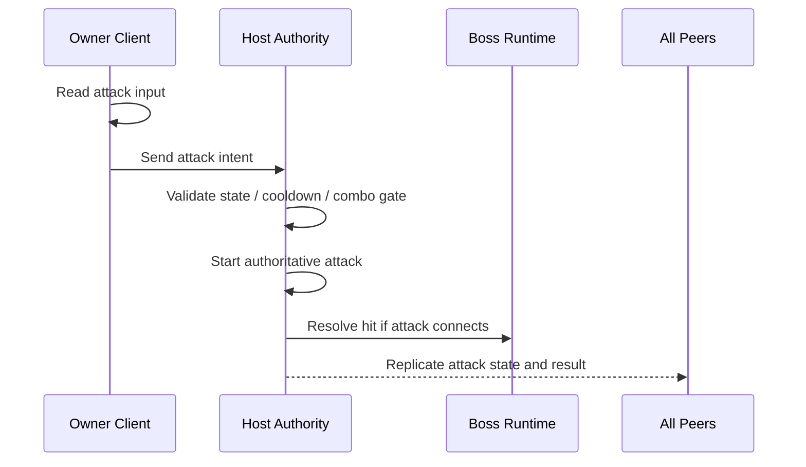
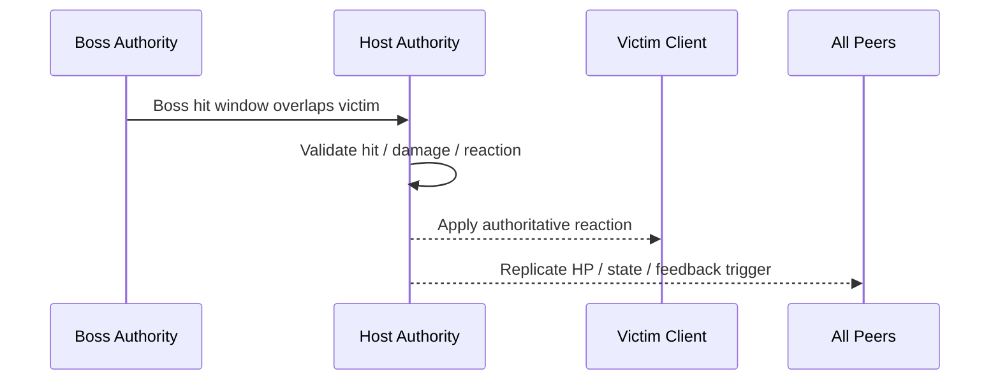
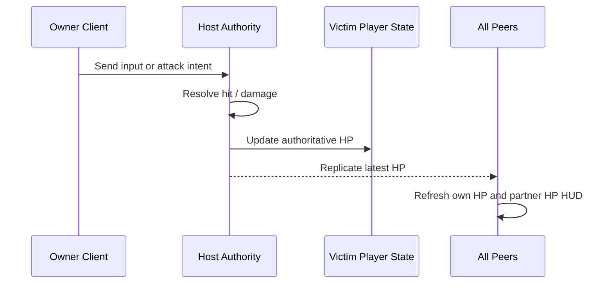
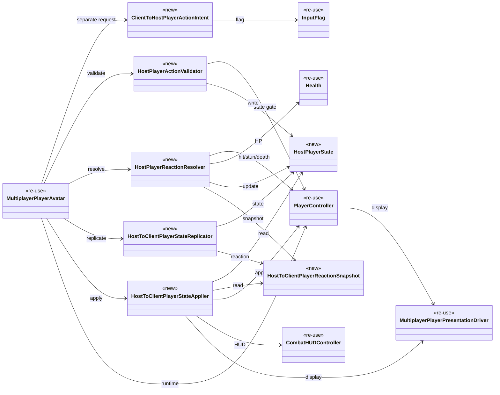

# 🕹️ 멀티플레이 플레이어 액션 권한 문서

이 문서는 boss multiplayer 구현 전에,
player-side `special movement / combat movement`가 어떤 권한 규칙을 따라야 하는지 정리한 기준 문서다.

현재 `docs/technical/multiplayer/Multiplayer_Client_Movement.md`가
`normal locomotion prediction + Host reconcile`를 정리한다면,
이 문서는 그 바깥에 있는 `dash / attack / got hit / stun` 같은
`non-locomotion gameplay action`을 정리한다.

---

## 1. 목적 (Purpose)

이 문서의 목적은 아래 3가지를 먼저 고정하는 것이다.

* free locomotion과 combat action을 authority 관점에서 분리한다.
* `client sends intent, Host decides result` 규칙을 액션 계층에 적용한다.
* boss multiplayer가 의존할 player reaction rule을 먼저 안정화한다.

---

## 2. 현재 결론 (Current Conclusion)

2026-04-03 기준 현재 결론은 아래와 같다.

* normal locomotion은 기존처럼 `client prediction + Host authoritative reconcile`를 유지한다.
* action start는 owner client가 intent를 보내고, Host가 시작 가능 여부와 최종 시작 tick을 판정한다.
* dash start는 `local anticipation + Host correction`을 기본값으로 둔다.
* 첫 구현 단계에서는 locomotion input packet과 별도로 `separate action-intent path`를 둔다.
* attack authority의 첫 구현 범위는 `start + hit + damage result`로 둔다.
* initial slice freeze는 `Attack1 only`로 시작했지만, 2026-04-03 same-day combat follow-up 기준 current runtime은 Host-approved `Attack2 / Attack3` combo continuation과 attack-cancel dash까지 포함한다.
* 첫 구현 단계에서는 `attack local anticipation`을 두지 않고, dash만 local anticipation을 허용한다.
* forced reaction의 첫 범위는 `hit + stun only`로 둔다.
* attack 중 피격되면 현재 공격은 즉시 종료되고, Host가 hit/stun 전환을 판정한다.
* `got hit`는 `client -> Host`가 아니라 `Host -> client` 성격이 강하다.
* dash는 `damage immunity`가 없더라도 combat timing과 거리 판정에 영향을 줄 수 있으므로, 단순 locomotion과 같은 급으로 취급하지 않는다.
* Host local player도 network hop만 생략할 뿐, 같은 action validator 경로를 따른다.
* invalid `Attack` / `Dash` input은 첫 구현 단계에서 queue하지 않고 즉시 drop한다.
* 첫 구현 단계에서 client HP는 mirrored runtime value가 아니라 `HUD-only`로 반영한다.
* owner client도 `HostToClientPlayerStateApplier` 경로를 통해 Host 결과를 적용한다.
* remote client는 `display-only` 경로로 두고, runtime gameplay apply는 하지 않는다.
* remote client의 display-only 범위에는 partner의 `dash / Attack1 / Attack2 / Attack3 / hit / stun / death` 표현이 포함된다.
* `damage contribution record`는 첫 구현 단계에서 `server tick` 기준의 `raw hit log` 형태로 시작한다.
* death도 첫 구현 단계의 Host authoritative damage flow 범위에 포함한다.
* display layer는 새 클래스를 바로 추가하지 않고, 기존 `MultiplayerPlayerPresentationDriver`를 먼저 확장한다.

중요한 정정:

* `attack`은 input-driven action이다.
* `got hit`는 result-driven reaction이다.
* 둘 다 client local-only로 닫으면 안 되지만, network direction은 서로 다르다.

---

## 3. 범위 (Scope)

| 항목 | 이 문서에서의 분류 | 기본 권한 규칙 |
| --- | --- | --- |
| walk / run / turn | free locomotion | client prediction + Host truth |
| dash | special movement action | local anticipation + Host correction |
| attack start / hit / damage result | combat action | separate action intent + Host start/hit/damage authority |
| got hit | forced reaction | Host decides |
| stun | forced reaction | Host decides |
| HP (self / partner) | replicated gameplay state | Host decides, client displays |
| death | combat result | Host decides |
| camera / HUD | local presentation | local-only |

메모:

* `dash does not make player immune to damage`를 현재 기준선으로 둔다.
* 즉, dash 중에도 Host는 보스 공격 피격 여부를 그대로 판정할 수 있어야 한다.
* initial `Attack1 only` 문구는 first slice freeze를 가리키는 historical note로 읽고, current runtime follow-up은 Host-approved combo continuation과 attack-cancel dash까지 포함한다.
* 추가 피격 반응은 현재 범위에 포함하지 않는다.

---

## 4. 권한 규칙 (Authority Rule)

### 4.1. 큰 분류

이 문서는 player-side action을 아래 3층으로 나눈다.

| 층 | 설명 | 판정 주체 |
| --- | --- | --- |
| Free Movement | walk / run / rotate 같은 기본 이동 | Host final, client predicts |
| Action Flow | dash / attack 같은 action 요청과 시작/결과 | Host validates, starts, and resolves hit/damage result |
| Forced Reaction | hit / stun / death | Host decides and pushes result |

### 4.2. 세부 기준표

| 기능 | Client 역할 | Host 역할 | 비고 |
| --- | --- | --- | --- |
| walk / run | input capture, local prediction, render smoothing | same input authoritative sim, reconcile source | current active path 유지 |
| dash | dash press intent 전송 + immediate local anticipation | cooldown / state gate / authoritative start tick / final displacement authority | local feel 우선, no damage immunity by default |
| attack | locomotion input과 분리된 action intent 전송, local direct confirm 없음 | initial slice는 `Attack1` 기준으로 시작했고, current runtime은 Host가 `Attack1 / Attack2 / Attack3` start, hit window, damage result authority를 가진다 | combo continuation도 same action-intent path로 확장 |
| got hit | local hit flash, local camera shake 같은 presentation | hit valid check, damage amount, reaction type, control lock 시작 | `Host -> victim client` 성격 |
| stun | 받은 결과를 보여 줌 | stun start / duration / recover timing 결정 | first scope forced reaction |
| HP (self / partner) | replicated HP 값을 받아 HUD 갱신 | damage 적용 후 현재 HP를 authoritative하게 기록하고 복제 | client는 자기 HP 기준값을 보내지 않는다 |
| death | result UI / local feedback | HP 0 판단, death state, respawn/restart eligibility | 첫 구현 단계 범위에 포함 |
| HUD / camera | local-only | 없음 | replicated gameplay object가 아님 |

### 4.3. HP 권한 규칙

player HP는 `owner client`가 직접 쓰는 값이 아니라, Host가 관리하는 게임플레이 기준값이다.

즉, 아래처럼 정리한다.

* Host는 `host player HP`와 `client player HP`를 모두 authoritative하게 가진다.
* client는 자기 HP를 `결과값`으로 Host에 보내지 않는다.
* client는 입력, 공격 의도, dash 의도만 보낸다.
* Host가 피격/데미지 판정을 끝낸 뒤 최신 HP를 각 peer에 복제한다.
* 첫 구현 단계에서는 client mirrored `Health`를 따로 두지 않고, 각 peer가 복제된 HP를 기준으로 `내 HP`, `상대 HP` HUD만 갱신한다.

화면 기준으로 보면:

* host 화면: `host own HP` + `client partner HP`
* client 화면: `client own HP` + `host partner HP`

두 화면 모두 `누구의 HP 바인지`는 다르지만,
값의 출처는 항상 Host authoritative HP다.

### 4.3.1. 현재 구현 상태 (2026-04-03 verify)

현재 `#7 Health` 구현/검증 결과는 아래처럼 정리한다.

* `Health`는 solo-safe default를 유지한다. 즉, solo play에서는 기존 HP 쓰기 흐름이 그대로 동작한다.
* multiplayer에서는 `MultiplayerPlayerAvatar`의 runtime role configure에 따라 `Host owned player`와 `Host authority replica`만 HP write가 가능하다.
* `client owner`와 `client replica`는 HP 최종값을 직접 쓰지 못하고, Host authoritative 결과를 받는다.
* Host/Client 두 화면 모두 Host가 기록한 `current HP / max HP` 기준값으로 self/partner HUD를 갱신한다.
* viewer-side label은 아래처럼 검증됐다.
  * Host screen: `Host(me)` / `Client`
  * Client screen: `Client(me)` / `Host`
* verify hit test를 위해 current boss target rule은 temporary하게 `closest live player`를 사용한다.
  later boss aggro 단계에서는 이 규칙이 바뀔 수 있다.

### 4.4. 핵심 금지 규칙

아래는 client가 최종 결정하면 안 된다.

* `I hit the boss for 20 damage.`
* `I am stunned now.`
* `I am safe because I dashed.`
* `My HP is now 70.`
client는 위 결과를 확정하지 않는다.
client는 오직 intent를 보내거나, Host 결과를 화면에 재생한다.

---

## 5. 흐름 (Flow)

### 5.1. 공격 시작

이 흐름에서 client는 locomotion input과 분리된 `공격 입력 의도`만 보내고,
실제 공격 시작과 적중 판정은 Host가 담당한다.
initial slice는 `Attack1 only`, `attack local anticipation off`를 기준으로 시작했다.
2026-04-03 same-day combat follow-up 기준 current runtime은 same separate action-intent path로 `Attack2 / Attack3` combo continuation과 attack-cancel dash도 Host-approved start로 확장한다.

### 5.2. 보스에게 맞음 (Got Hit)

이 흐름에서 피격 client는 `내가 맞았다`를 스스로 확정하지 않고,
Host가 보낸 결과를 적용한다.
현재 규칙에서는 피격이 확정되면 진행 중인 공격도 즉시 종료한다.

### 5.3. 플레이어 HP 갱신

이 흐름의 핵심은 `client가 자기 HP 숫자를 Host에 올리는 구조가 아니다`라는 점이다.
피격 결과와 HP 변경은 Host가 계산하고, client는 그 결과를 받아 UI를 갱신한다.

---

## 6. 구현 기준 메모 (Implementation Note Before Boss)

boss multiplayer 전에 아래 계약을 먼저 정리하는 것이 좋다.

| 항목 | 이유 |
| --- | --- |
| separate action intent packet | attack / dash 같은 시작 요청을 locomotion input packet과 분리하기 |
| reaction snapshot | hit / stun / death 같은 Host result를 한 묶음으로 보내기 |
| health snapshot or NetworkVariable | self HP / partner HP HUD를 같은 기준값으로 묶기 |
| raw hit log with server tick | 이후 boss aggro가 damage time window를 계산하기 쉽게 만들기 |
| movement lock flag | 공격/피격 중 locomotion prediction 허용 범위를 줄이기 |
| authoritative start tick | animation / hit window / 상태 종료시점을 같은 기준으로 맞추기 |

중요한 방향:

* `normal locomotion slice`와 `action/reaction slice`를 분리해서 생각한다.
* full character prediction을 처음부터 다 열지 않는다.
* 첫 구현 단계에서는 `separate action-intent path`를 먼저 고정한다.
* Host local player도 같은 validator / resolver 규칙을 따르고, network hop만 생략한다.
* remote client는 display-only apply만 담당하고, runtime gameplay apply는 하지 않는다.
* 먼저 `Host authoritative action + Host authoritative reaction`을 고정한다.

---

## 7. dash 규칙 메모 (Dash Note)

현재 사용자 확인 기준:

* dash는 `damage immunity`를 주지 않는다.
* dash start는 `local anticipation + Host correction`을 기본값으로 둔다.

이 전제에서는 dash를 아래처럼 보는 것이 안전하다.

* dash는 `free locomotion`보다 `special movement action`에 가깝다.
* dash 중에도 보스 hit check는 Host에서 그대로 유효하다.
* local player 화면에서는 즉시 dash를 시작해 feel을 살린다.
* 하지만 authoritative start tick, final displacement, hit truth는 Host가 잡는다.
* correction이 필요하면 Host truth 쪽으로 정렬한다.

---

## 8. 현재 확정 규칙

현재 문서 기준으로 아래 항목은 확정된 규칙으로 본다.

1. attack 중 피격 시 현재 공격은 즉시 종료되고, Host가 hit/stun 전환을 판정한다.
2. forced reaction의 첫 범위는 `hit + stun only`이며, 추가 피격 반응은 현재 범위에 포함하지 않는다.

---

## 9. 다이어그램

### 9.1. 흐름도 초안

아래 다이어그램은 `owner client -> Host -> client apply/display` 흐름을 넓게 보는 용도다.
Host local player도 같은 validator / resolver 경로를 따르지만, network hop만 생략한다.

```mermaid
%%{init: {
  "themeVariables": {
    "fontSize": "16px"
  },
  "flowchart": {
    "useMaxWidth": false,
    "nodeSpacing": 20,
    "rankSpacing": 25,
    "diagramPadding": 4
  }
}}%%


flowchart LR
    subgraph OwnerClient["Owner Client"]
        Avatar["MultiplayerPlayerAvatar"]
        Intent["ClientToHostPlayerActionIntent"]
        OwnerApplier["HostToClientPlayerStateApplier"]
        OwnerController["PlayerController"]
        OwnerHud["CombatHUDController"]
        OwnerDisplay["MultiplayerPlayerPresentationDriver"]
    end

    subgraph Host["Host"]
        Validator["HostPlayerActionValidator"]
        Resolver["HostPlayerReactionResolver"]
        HostState["HostPlayerState"]
        Snapshot["HostToClientPlayerReactionSnapshot"]
        Replicator["HostToClientPlayerStateReplicator"]
        HostController["PlayerController"]
        HostHealth["Health"]
    end

    subgraph RemoteClient["Remote Client"]
        RemoteApplier["HostToClientPlayerStateApplier"]
        RemoteHud["CombatHUDController"]
        RemoteDisplay["MultiplayerPlayerPresentationDriver"]
    end

    Avatar -->|send separate action intent| Intent
    Intent -->|request| Validator
    Validator -->|validate start| HostController
    Validator -->|write action result| HostState

    HostController -->|runtime result| Resolver
    Resolver -->|apply HP| HostHealth
    Resolver -->|update gameplay state| HostState
    Resolver -->|create reaction event| Snapshot

    HostState -->|state| Replicator
    Snapshot -->|reaction| Replicator

    Replicator -->|replicate owner result| OwnerApplier
    Replicator -->|replicate remote result| RemoteApplier

    OwnerApplier -->|apply state| OwnerController
    OwnerApplier -->|update HUD| OwnerHud
    OwnerApplier -->|trigger reaction display| OwnerDisplay

    RemoteApplier -->|update HUD| RemoteHud
    RemoteApplier -->|partner dash/Attack1/Attack2/Attack3/hit/stun/death display| RemoteDisplay

    Avatar -->|dash local anticipation only| OwnerDisplay
```

### 9.2. 클래스 관계도 초안

아래 다이어그램은 `request -> validate -> resolve -> replicate -> apply -> display` 흐름을 기준으로 정리한다.

